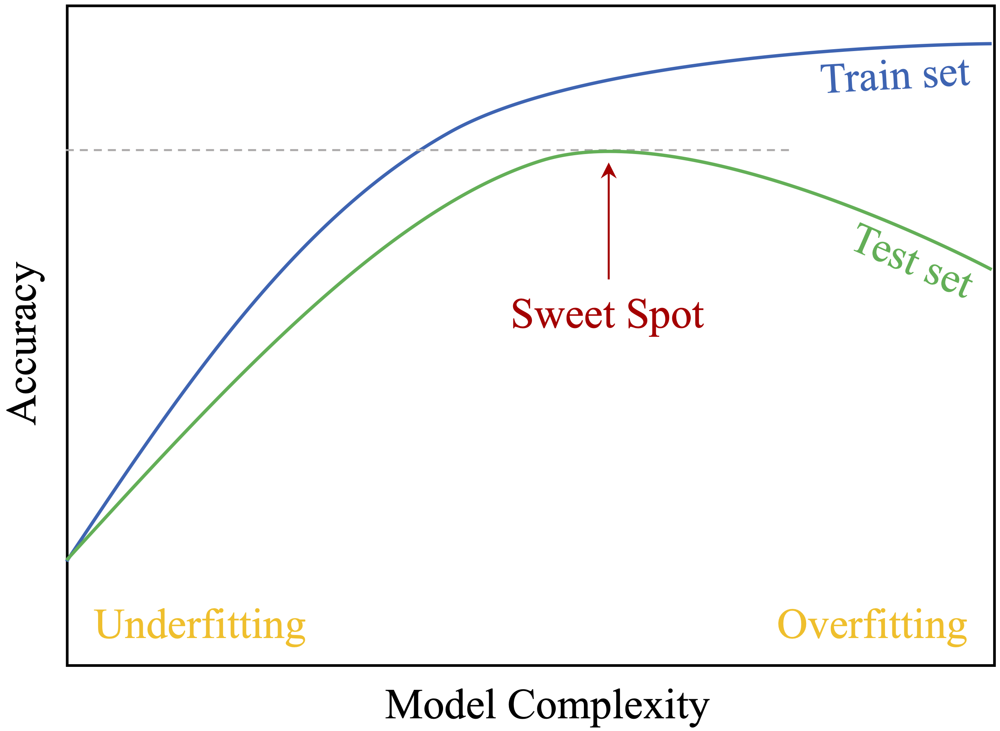
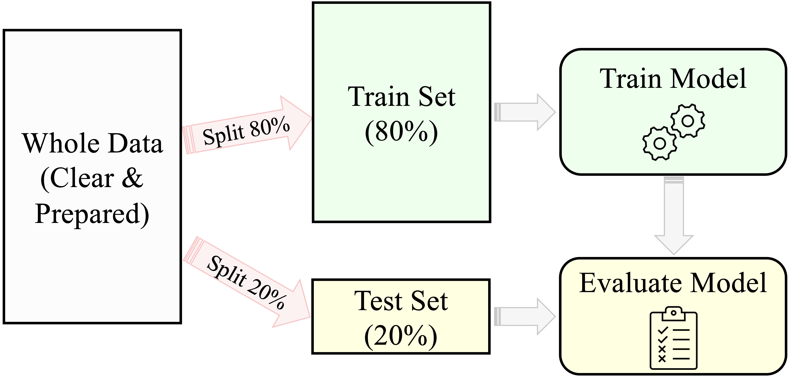

# Preparing Data to Model {#chapter-modeling}

Before we can build reliable machine learning models, we must ensure our data is well-prepared. The previous chapters established a foundation by addressing key steps in the Data Science Workflow (Figure \@ref(fig:CRISP-DM)). Now, we focus on transitioning from data exploration to model building.

In Section \@ref(problem-understanding), we discussed defining the problem and aligning objectives with data-driven strategies. Chapter \@ref(chapter-data-prep) addressed handling missing values, outliers, and data transformations to create a clean dataset. In Chapter \@ref(chapter-EDA), we visualized data to uncover patterns, while Chapter \@ref(chapter-statistics) introduced statistical inference, including hypothesis testing and feature selection—tools that will help us validate our data partitioning.

Before diving into machine learning, we must complete the *Setup Phase*, which ensures that our dataset is structured for robust model development. This phase involves three essential steps:

1. **Partitioning the Data**: Splitting the dataset into training and testing sets to create a clear separation between model learning and evaluation.  
2. **Validating the Partition**: Ensuring that the split is representative and unbiased so that insights from training generalize to new data.  
3. **Balancing the Training Dataset**: Addressing potential class imbalances in categorical targets to prevent biased models.

Although often overlooked, these steps are critical in ensuring that the modeling process is rigorous, fair, and effective. Students often ask, *"Why is it necessary to partition the data?"* or *"Why do we need to follow these specific steps?"* These are important questions, and we will address them throughout this chapter. But before we do, it’s useful to briefly examine how the data science process aligns with and diverges from statistical inference. Understanding these similarities and differences helps bridge traditional statistics with the practical demands of modern machine learning.

## Statistical Inference in the Context of Data Science

Although statistical inference remains a fundamental tool in data science, its role shifts when preparing data for modeling, as the goals and applications differ. While traditional inference focuses on drawing conclusions about populations from sample data, machine learning prioritizes predictive accuracy and generalization.

Statistical inference and data science diverge in two key ways when applied to modeling tasks:

1. *From Significance to Practicality*: With large datasets containing thousands or even millions of observations, nearly any detected relationship can become statistically significant. However, statistical significance does not always translate into practical importance. A machine learning model might identify a minute effect size that is statistically valid but has negligible impact on decision-making. In modeling, the focus shifts from statistical significance to assessing whether an effect is strong enough to meaningfully influence predictions.

2. *Exploration vs. Hypothesis Testing*: Traditional statistical inference begins with a predefined hypothesis, such as testing whether a new treatment improves outcomes compared to a control. In contrast, data science often adopts an exploratory approach, using data to uncover patterns, relationships, and predictive features without rigid hypotheses. Rather than testing predefined relationships, machine learning practitioners iteratively refine datasets and evaluate which features contribute most to predictive accuracy.

Despite these differences, statistical inference remains crucial in key stages of data preparation, particularly in:

- *Partition Validation*: When dividing data into training and testing sets, statistical tests help ensure the subsets are representative of the original dataset.
- *Feature Selection*: Hypothesis testing can aid in selecting features that have strong relationships with the target variable, enhancing model performance.

By understanding these differences and applying statistical inference strategically, we can ensure that data preparation supports building robust, interpretable, and generalizable models. Throughout this chapter, we will see how inference techniques continue to play a role in refining datasets for machine learning.

## Why Is It Necessary to Partition the Data?

Partitioning the dataset is a crucial step in preparing data for modeling. A common question students ask is, *Why do we need to partition the data?* The answer lies in *generalization*—the ability of a model to perform well on unseen data. Without proper partitioning, models may fit the training data exceptionally well but fail to make accurate predictions in real-world scenarios. Partitioning ensures that performance is evaluated on data the model has not seen before, providing an unbiased measure of its ability to generalize effectively.

Partitioning involves dividing the dataset into two subsets: the *training set*, used to build the model, and the *testing set*, used to evaluate performance. This separation simulates real-world conditions, where the model must make predictions on new data. It helps detect and address two common pitfalls in machine learning: *overfitting* and *underfitting*. These trade-offs are illustrated in Figure \@ref(fig:model-complexity), which highlights the balance between model complexity and performance on training and testing datasets.

```{r model-complexity, echo = FALSE, out.width = "65%", fig.align = 'center', fig.cap = "The trade-off between model complexity and accuracy on the training and test sets. It highlights the optimal model complexity (sweet spot), where the test set accuracy reaches its highest value for unseen data."}

```

**Overfitting** occurs when a model memorizes the training data, including noise and random fluctuations, instead of capturing general patterns. Such models achieve high accuracy on the training set but perform poorly on unseen data. For instance, a churn prediction model might memorize specific customer IDs rather than recognizing broader behavioral trends, making it ineffective for new customers.

**Underfitting**, in contrast, occurs when a model is too simplistic to capture underlying patterns. This might happen if the model lacks complexity or if preprocessing removes too much useful information. An underfitted churn model, for example, might predict a constant churn rate for all customers without considering individual differences, leading to poor performance.

Partitioning mitigates these risks by allowing us to evaluate performance on unseen data. Comparing accuracy on the training and testing sets helps determine whether the model is overfitting (high training accuracy but low testing accuracy) or underfitting (low accuracy on both). This evaluation enables iterative refinements to strike the right balance between complexity and generalization.

Partitioning also prevents *data leakage*, a critical issue where information from the testing set inadvertently influences training. Data leakage inflates performance metrics, creating a false sense of confidence in the model’s ability to generalize. Strictly separating the testing set from the training process ensures a more realistic assessment of model performance.

Beyond a simple train-test split, *cross-validation* further enhances robustness. In cross-validation, the dataset is divided into multiple subsets (*folds*). The model is trained on one subset and tested on another, repeating this process across all folds. The results are averaged to provide a more reliable estimate of model performance. Cross-validation is particularly useful when working with small datasets or tuning hyperparameters, as it minimizes bias introduced by a single train-test split.

Partitioning isn’t just a technical step—it’s fundamental to building models that generalize well. By addressing overfitting, underfitting, and data leakage, and by leveraging techniques like cross-validation, we ensure that models are both accurate and reliable in real-world applications.

To summarize, the general strategy for supervised machine learning consists of three key steps, illustrated in Figure \@ref(fig:modeling):

1. **Partitioning** the dataset into training and testing sets, followed by validating the partition.
2. **Building** machine learning models on the training data.
3. **Evaluating** the performance of models on the testing data to select the most effective approach.

```{r modeling, echo = FALSE, out.width = "80%", fig.align = 'center', fig.cap = "A general predictive machine learning process for building and evaluating models. The 80-20 split ratio is an example and may vary based on the dataset and task."}

```

By following this structured process, we build models that are both robust and capable of making accurate predictions on unseen data. This chapter focuses on the first step: partitioning the data effectively, validating the partition, and preparing a balanced training dataset—key steps for developing reliable and interpretable machine learning models.

## Partitioning the Data {#sec-partitioning}

Partitioning the dataset is a fundamental step in preparing data for machine learning. The most common approach is the *train-test split*, also known as the holdout method, where the dataset is divided into two subsets: a *training set* used to build the model and a *testing set* reserved for evaluating its performance. This separation ensures that the model is assessed on unseen data, providing an unbiased estimate of how well it generalizes. 

A typical train-test split ratio is 70-30, 80-20, or 90-10, depending on the dataset size and modeling needs. The training set contains all available features, including the target variable, which is used to teach the model patterns in the data. The testing set, however, has the target variable temporarily hidden to simulate real-world conditions. The trained model is then applied to the testing set to predict these hidden values, and its predictions are compared to the actual target values to assess performance.

### Example: Train-Test Split in R {-}  

To illustrate the process of data partitioning, we revisit the *churn* dataset from Section \@ref(EDA-sec-churn), where the goal is to predict customer churn. Since this dataset is included in the **liver** package, we begin by loading the package and dataset:  

```{r}
library(liver)

data(churn) 
```

In R, there are multiple ways to split a dataset into training and test sets. A simple and efficient method is to use the `partition()` function from the [**liver**](https://CRAN.R-project.org/package=liver) package. This function allows for random partitioning of a dataset according to a specified ratio. The following example demonstrates how to split the *churn* dataset into training (80%) and test (20%) sets:  

```{r}
set.seed(43)

data_sets = partition(data = churn, ratio = c(0.8, 0.2))

train_set = data_sets$part1
test_set  = data_sets$part2

test_labels = test_set$churn
```

The process begins with `set.seed(43)`, ensuring **reproducibility** by generating the same random partition every time the code is run. This is crucial for consistency in model evaluation and collaborative work. The `partition()` function then divides the dataset into two subsets: 

- `train_set` (80% of the data) – used for model training,  
- `test_set` (20% of the data) – reserved for evaluating model performance.  

Additionally, `test_labels` stores the *true labels* from the test set, which will later be used to assess the model’s predictive accuracy.  

Reproducibility is a fundamental principle in machine learning. By setting a seed, we ensure that the dataset split remains consistent across different runs, allowing for precise comparisons and validation of results. While the seed value itself is arbitrary, choosing one guarantees that the partitioning process remains stable.   
### Why Partitioning Matters {-}

The primary reason for partitioning is to prevent *data leakage*—a situation where information from the testing set influences training, leading to overly optimistic performance estimates. By strictly separating these sets, we ensure that performance metrics reflect the model’s ability to generalize to new data rather than just memorizing training patterns.

Beyond a simple train-test split, *cross-validation* can further enhance robustness by training and testing the model on multiple subsets of the data. This method is particularly useful when working with small datasets or tuning hyperparameters.

Partitioning lays the groundwork for reliable machine learning models. However, a well-executed split alone does not guarantee that the training and testing sets are representative of the original dataset. In the next section, we will validate the partition to confirm that both subsets retain key statistical properties, ensuring fair and unbiased model evaluation.

## Validating the Partition {#sec-validate-partition}

The success of the entire modeling process depends on the quality of the data partition. Validating the partition ensures that both the training and testing sets are representative of the original dataset, enabling the model to learn from diverse examples and generalize effectively to unseen data. Without validation, the modeling process risks bias—either the model fails to generalize because the training set isn’t representative, or the testing set doesn’t provide an accurate evaluation of real-world performance.

Validation involves comparing the training and testing sets to confirm that their distributions are statistically similar, particularly for key variables. Since datasets often include many variables, this step typically focuses on a small set of randomly selected features or features of particular importance, such as the target variable. The choice of statistical test depends on the type of variable being compared, as shown in Table \@ref(tab:partition-test).

Table: (\#tab:partition-test) Suggested hypothesis tests for validating partitions, based on the type of target variable.

| Type of Variable                          | Suggested Test (from Chapter \@ref(chapter-statistics)) |
|-------------------------------------------|---------------------------------------------------------|
| Numerical variable                        | Two-sample t-test                                       |
| Binary/Flag variable                      | Two-sample Z-test                                       |
| Categorical variable (with > 2 categories)| Chi-square test                                         |

Validating the partition is more than a procedural step—it is a safeguard against biased modeling. If the training and testing sets differ significantly, the model’s performance could be compromised. If the training set is not representative of the original dataset, the model may fail to generalize effectively. Conversely, if the testing set does not reflect the population, model evaluation could be misleading. Ensuring that the split retains the characteristics of the original dataset allows for fair and reliable model assessment.

### Example: Validating the Target Variable *churn* {-}

Let’s consider the *churn* dataset introduced in the previous section. The target variable, *churn* (whether a customer has churned or not), is binary. According to Table \@ref(tab:partition-test), the appropriate statistical test to validate the partition for this variable is a *Two-Sample Z-Test*, which compares the proportion of churned customers in the training and testing sets. Thus, the hypotheses for the test are:  
\[
\begin{cases}
H_0:  \pi_{\text{churn, train}} = \pi_{\text{churn, test}} \quad \text{(Proportions are equal)} \\
H_a:  \pi_{\text{churn, train}} \neq \pi_{\text{churn, test}} \quad \text{(Proportions are not equal)}
\end{cases}
\]

Here’s how it can be implemented in **R**:

```{r}
x1 <- sum(train_set$churn == "yes")
x2 <- sum(test_set$churn == "yes")

n1 <- nrow(train_set)
n2 <- nrow(test_set)

test_churn <- prop.test(x = c(x1, x2), n = c(n1, n2))
test_churn
```
Here, \(x_1\) and \(x_2\) represent the number of churned customers in the training and testing sets, respectively, while \(n_1\) and \(n_2\) denote the total number of observations in each set. The `prop.test()` function is used to compare the proportions of churned customers between the two subsets.

The test result provides a *p*-value = `r round(test_churn$p.value, 2)`. Since the *p*-value is greater than the significance level (\(\alpha = 0.05\)), we fail to reject the null hypothesis (\(H_0\)). This indicates no statistically significant difference in the proportions of churned customers between the training and testing sets. By failing to reject \(H_0\), we confirm that the partition is valid with respect to the target variable *churn*. The proportions of churned customers are consistent across both subsets, ensuring that the model will be trained and tested on representative data.

While validating the target variable is crucial, extending this process to key predictors such as `customer.calls` or `day.mins` ensures that both subsets remain representative across all important features. For example, numerical features can be validated using a two-sample t-test, while categorical features with multiple levels can be assessed using a Chi-square test. This broader validation ensures that important variables retain their statistical properties across training and testing sets.

### What If the Partition Is Invalid? {-}

If statistical tests reveal significant differences between the training and testing sets, adjustments are necessary to ensure the partition remains representative. Several strategies can be applied:

- *Revisiting the partitioning process*: Changing the random seed or adjusting the split ratio can sometimes lead to a more balanced split.
- *Stratified sampling*: Ensuring that key categorical variables, such as the target variable, are proportionally represented in both subsets.
- *Cross-validation*: Using k-fold cross-validation instead of a single train-test split to provide a more robust evaluation of model performance.

Additionally, if the dataset is small or highly variable, minor differences between training and testing sets might be inevitable. In such cases, alternative approaches like bootstrapping can help validate model performance more effectively.

Validating the partition is a critical step in the data preparation process. It ensures that the modeling process is fair, reliable, and capable of producing generalizable results. By addressing potential discrepancies early, we set the stage for robust machine learning models that perform effectively on real-world, unseen data.

## Balancing the Training Dataset  

In many real-world classification problems, one class of the target variable is significantly underrepresented. This imbalance can lead to biased models that perform well for the majority class but fail to predict the minority class accurately. For example, in fraud detection, fraudulent transactions are rare compared to legitimate ones, and in churn prediction, the majority of customers may not churn. Without addressing this issue, models may appear to perform well based on accuracy alone but fail to identify rare yet important events.

Imbalanced datasets pose a challenge because most machine learning algorithms optimize for overall accuracy, which can favor the majority class. A churn prediction model trained on an imbalanced dataset, for example, might classify nearly all customers as non-churners, leading to high accuracy but failing to detect actual churners. This is problematic when the minority class (e.g., fraud cases, churners, or patients with a rare disease) is the key focus of the analysis.

### Techniques for Addressing Class Imbalance {-}

Balancing the training dataset ensures that both classes are adequately represented during model training, improving the model’s ability to generalize. Several techniques can be used to address class imbalance:

- *Oversampling*: Increasing the number of minority class examples by duplicating existing observations or generating synthetic samples. The *Synthetic Minority Over-sampling Technique (SMOTE)* is a popular approach that generates synthetic examples instead of simple duplication.
- *Undersampling*: Reducing the number of majority class examples by randomly removing observations.
- *Hybrid Methods*: Combining oversampling and undersampling to achieve a balanced dataset.
- *Class Weights*: Modifying the algorithm to penalize misclassifications of the minority class more heavily.

The choice of technique depends on factors such as dataset size, the severity of imbalance, and the specific machine learning algorithm used.

### Example: Balancing the *Churn* Dataset {-}

First, we examine the distribution of the target variable (*churn*) in the training dataset:

```{r}
# Check the class distribution
table(train_set$churn)
prop.table(table(train_set$churn))
```

Suppose the output shows that churners (`churn = "yes"`) constitute only `r round(prop.table(table(train_set$churn))[1], 2)`, while non-churners (`churn = "no"`) make up `r round(prop.table(table(train_set$churn))[2], 2)`. This significant imbalance suggests that balancing may be necessary, particularly if churn prediction is a business priority.

To address this, we use the **ROSE** package in R to oversample the minority class (`churn = "yes"`) so that it constitutes 30% of the training dataset:

```{r}
# Load the ROSE package
library(ROSE)

# Oversample the training set to balance the classes with 30% churners
balanced_train_set <- ovun.sample(churn ~ ., data = train_set, method = "over", p = 0.3)$data

# Check the new class distribution
table(balanced_train_set$churn)
prop.table(table(balanced_train_set$churn))
```

In this example, the `ovun.sample()` function increases the proportion of churners to 30% of the training dataset. The formula notation `churn ~ .` specifies that the balancing is applied based on the target variable (*churn*). After oversampling, the new class distribution is checked to ensure the desired balance.

### Key Considerations for Balancing {-}

Balancing should be performed *only on the training dataset*, not the test dataset. The test dataset should remain representative of the original class distribution to provide an unbiased evaluation of model performance. Modifying the test set would introduce bias and make the model’s performance appear artificially better than it would be in real-world scenarios.

Furthermore, balancing must be applied *after partitioning* the dataset. If balancing is done before splitting, information from the test set may influence the training process (*data leakage*), leading to misleadingly high performance.

That said, balancing is *not always necessary*. Many modern machine learning algorithms, such as random forests and gradient boosting, incorporate class weighting or ensemble learning to handle imbalanced datasets effectively. Additionally, alternative evaluation metrics such as *precision, recall, F1-score, and AUC-ROC* can provide better insights into model performance when dealing with imbalanced classes.

In summary, balancing the training dataset can improve model performance, especially when the minority class is the primary focus. However, it is not always required and should be used selectively. If balancing is necessary, it must be applied *only after partitioning* to maintain the validity of model evaluation. By ensuring that both classes are adequately represented during training, we help machine learning models make more accurate and fair predictions.
    
## Exercises

### Conceptual Questions {-}

1. Why is partitioning the dataset crucial before training a machine learning model? Explain its role in ensuring generalization.  
2. What is the main risk of training a model without separating the dataset into training and testing subsets? Provide an example where this could lead to misleading results.  

3. Explain the difference between *overfitting* and *underfitting*. How does proper partitioning help address these issues?  

4. Describe the role of the *training set* and the *testing set* in machine learning. Why should the test set remain unseen during model training?  

5. What is *data leakage*, and how can it occur during data partitioning? Provide an example of a scenario where data leakage could lead to overly optimistic model performance.  

6. Compare and contrast *random partitioning* and *stratified partitioning*. When would stratified partitioning be preferred?  

7. Why is it necessary to validate the partition after splitting the dataset? What could go wrong if the training and test sets are significantly different?  

8. How would you validate that numerical variables, such as `customer.calls` in the *churn* dataset, have similar distributions in both the training and testing sets?  

9. If a dataset is highly imbalanced, why might a model trained on it fail to generalize well? Provide an example from a real-world domain where class imbalance is a serious issue.  

10. Compare *oversampling*, *undersampling*, and *hybrid methods* for handling imbalanced datasets. What are the advantages and disadvantages of each?  

11. Why should balancing techniques be applied *only* to the training dataset and *not* to the test dataset?  

12. Some machine learning algorithms are robust to class imbalance, while others require explicit handling of imbalance. Which types of models typically require class balancing, and which can handle imbalance naturally?  

13. When dealing with class imbalance, why is *accuracy* not always the best metric to evaluate model performance? Which alternative metrics should be considered?  

14. Suppose a dataset has a rare but critical class (e.g., fraud detection). What steps should be taken in the *data partitioning and balancing phase* to ensure an effective model?  

### Hands-On Practice {-}

For the following exercises, use the *churn*, *bank*, and *risk* datasets available in the **liver** package. We have previously used the *churn* and *bank* datasets in this and earlier chapters. In Chapter \@ref(chapter-bayes), we will introduce the *risk* dataset. Load the datasets using:

```{r}
library(liver)

# Load datasets
data(churn)
data(bank)
data(risk)
```

#### Partitioning the Data {-}

15. Using the `partition()` function, split the *churn* dataset into 75% training and 25% testing. Ensure reproducibility by setting a seed value before partitioning.

16. Perform a *90-10 train-test split* on the *bank* dataset. Report the number of observations in each subset.

17. Apply *stratified sampling* to partition the *churn* dataset, ensuring that the proportion of churners (`churn == "yes"`) remains the same in both training and test sets.  

18. In the *risk* dataset, partition the data using a *60-40* split and store the training and test sets as `train_risk` and `test_risk`.  

19. Compare the distribution of `income` in the training and test sets of the *bank* dataset using *density plots*. Do they appear similar?  

#### Validating the Partition {-}

20. In the *churn* dataset, test whether the proportion of churners is *statistically different* between the training and test sets. Use a *two-sample Z-test*.

21. In the *bank* dataset, test whether the *average age* of customers differs significantly between the training and test sets using a *two-sample t-test*.

22. Perform a *Chi-square test* to validate whether the distribution of marital status (`marital`) in the *bank* dataset is similar between the training and test sets.

23. Suppose the *churn* dataset was partitioned incorrectly, resulting in the training set having *30% churners* and the test set having *15% churners*. What statistical test could confirm this issue, and how could it be corrected?

24. Select three numerical variables from the *risk* dataset and validate whether their distributions differ between the training and test sets using appropriate statistical tests.

#### Balancing the Training Dataset {-}

25. In the *churn* dataset, check whether churners (`churn = "yes"`) are underrepresented in the training dataset. Report the class proportions.

26. Use *random oversampling* to increase the number of churners (`churn = "yes"`) in the training set to *40%* of the dataset using the *ROSE* package.

27. Apply *undersampling* in the *bank* dataset so that the proportion of customers with `deposit = "yes"` and `deposit = "no"` is *equal* in the training set.

28. Compare the class distributions *before and after balancing* the *churn* dataset. Use *bar plots* to visualize the change.


