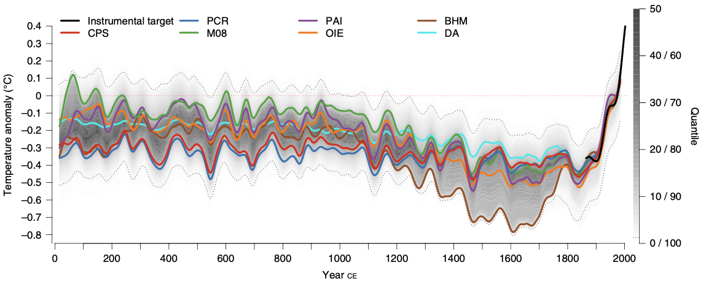
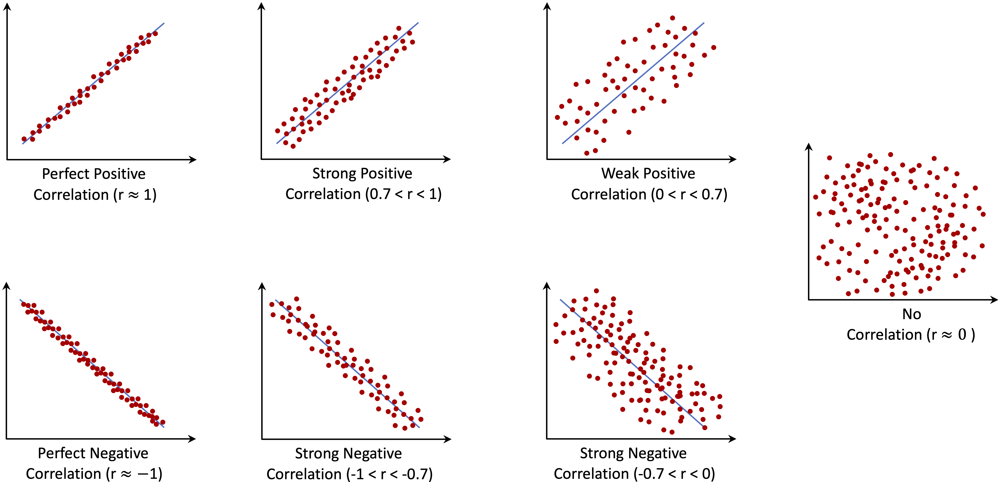

# Exploratory Data Analysis {#chapter-EDA}  

Exploratory Data Analysis (EDA) is a fundamental step in data science that helps uncover insights, detect patterns, and understand relationships within a dataset. Before applying statistical models or machine learning algorithms, it is essential to explore and visualize data to identify inconsistencies, anomalies, and potential predictors. EDA provides a structured yet flexible approach to data exploration, allowing data scientists to make informed decisions before proceeding with modeling.

EDA is an iterative process rather than a rigid sequence of steps. It encourages curiosity and adaptability, as different datasets may present unique challenges or insights. Some exploratory paths may lead to inconclusive findings, while others uncover valuable patterns that shape the direction of analysis. As familiarity with the data increases, analysts can refine their focus, identifying the most relevant features and variables for modeling.

The primary goal of EDA is to explore and summarize data rather than to perform hypothesis testing or confirm specific relationships. By using summary statistics, visualizations, and preliminary correlation analysis, EDA provides a foundational understanding of the dataset. However, these insights remain preliminary and require further validation through statistical testing or predictive modeling. Recognizing this distinction ensures that exploratory findings are interpreted cautiously and do not lead to premature conclusions.

Another key consideration in EDA is balancing statistical significance with practical relevance. Large datasets often reveal statistically significant relationships that may lack meaningful real-world implications. For example, a weak correlation between customer engagement and churn might be statistically significant yet offer little actionable insight for business decision-making. EDA encourages analysts to integrate domain expertise and practical considerations when interpreting patterns in data.

EDA also plays a crucial role in data cleaning and preparation. Missing values, inconsistencies, and outliers often become apparent during exploration, requiring careful handling to ensure data quality. While data cleaning is a distinct process, it is closely linked to EDA, as identifying and resolving data issues early helps establish a solid foundation for further analysis and modeling.

Selecting appropriate tools and techniques for EDA depends on the nature of the dataset and the specific analytical questions. Histograms and box plots help visualize distributions, while scatter plots and correlation matrices assess relationships between variables. The following sections will demonstrate these techniques through practical applications, including an in-depth analysis of the churn dataset to illustrate how EDA can uncover patterns relevant to customer retention.

The key objectives of EDA are:  

1. **Understanding the structure of the data** – Determine data types, variable ranges, the number of observations, and the presence of missing values or anomalies.  
2. **Analyzing individual variable distributions** – Examine numerical and categorical variables to assess their distribution, central tendency, and spread.  
3. **Exploring relationships between variables** – Identify correlations, dependencies, or interactions that may influence predictive modeling.  
4. **Detecting patterns and outliers** – Identify unusual data points and assess whether they result from data errors or represent meaningful trends.  

These objectives ensure a comprehensive understanding of the dataset, forming a strong foundation for subsequent modeling and analysis.

## Guiding Questions for EDA

Exploratory data analysis is most effective when structured around key questions that help uncover meaningful patterns and relationships. These questions generally fall into two broad categories: univariate and multivariate analysis.

Univariate analysis examines individual variables to assess their distributions, central tendencies, variability, and potential data quality issues such as missing values or outliers. Typical univariate questions include:  

- What is the distribution of the target variable?  
- How are numerical variables, such as income or age, distributed?  
- Are there missing values, and how are they distributed across the dataset?  

This analysis helps detect skewness, irregularities, and unexpected patterns that may impact later modeling. Common tools for univariate analysis include histograms, box plots, and summary statistics such as the mean, median, quartiles, and standard deviation.  

Multivariate analysis explores relationships between two or more variables, identifying dependencies, interactions, or correlations that could influence predictive modeling. Key multivariate questions include:  

- How does the target variable relate to predictor variables?  
- Are some predictors highly correlated, suggesting potential multicollinearity?  
- How do categorical and numerical variables interact?  

To analyze these relationships, data scientists commonly use scatter plots, correlation matrices, and pairwise comparisons, which help visualize dependencies between variables and guide feature selection.

A common challenge in EDA is choosing the most appropriate visualization or statistical summary for a given analysis. The selection depends on both the type of data and the insight being sought. The table below provides a structured guide to selecting the most effective tools for various exploratory tasks:

```{r EDA-table-tools, echo=FALSE}
eda_tools <- data.frame(
  "EDA Objective" = c(
    "Understand the distribution of a variable",
    "Examine a categorical variable's distribution",
    "Identify outliers",
    "Detect missing values",
    "Analyze the relationship between two numerical variables",
    "Compare a numerical variable across categories",
    "Explore interactions between two categorical variables",
    "Assess correlation among multiple numerical variables",
    "Investigate complex multivariate relationships"
  ),
  "Data Type" = c(
    "Numerical (continuous/discrete)",
    "Categorical",
    "Numerical",
    "Any",
    "Numerical & numerical",
    "Categorical & numerical",
    "Categorical & categorical",
    "Multiple numerical",
    "Multiple variables"
  ),
  "Recommended Tools" = c(
    "Histogram, box plot, density plot, summary statistics",
    "Bar chart, frequency table",
    "Box plot, histogram, Z-score analysis",
    "Heatmap, summary statistics, missing data patterns",
    "Scatter plot, correlation coefficient, regression line",
    "Box plot, violin plot, grouped bar chart",
    "Stacked bar chart, mosaic plot, contingency table",
    "Correlation matrix, pair plot (scatterplot matrix)",
    "Facet grid, parallel coordinates, principal component analysis (PCA)"
  )
)

kable(eda_tools, caption = "EDA Tool Selection Guide.", booktabs = TRUE)
```

By systematically addressing these univariate and multivariate questions with appropriate EDA techniques, we gain a deeper understanding of the dataset’s structure and key patterns. This process not only improves data quality but also provides valuable insights that inform subsequent modeling and decision-making.
   
## EDA as Data Storytelling  

Exploratory Data Analysis is more than just a technical step; it is a way to uncover and communicate meaningful insights from data. Beyond summarizing numbers and visualizing patterns, EDA helps shape the narrative hidden within the data. Effective data storytelling integrates data, visuals, and context, making findings more accessible and actionable. Whether communicating with data scientists, business professionals, or decision-makers, presenting insights clearly is essential.  

While summary statistics provide an overview, visualizations reveal patterns, relationships, and anomalies that might otherwise go unnoticed. Different types of visualizations serve distinct purposes. Scatter plots and correlation matrices highlight relationships between numerical variables, while histograms and box plots illustrate distributions and potential skewness. Categorical data is best explored with bar charts or stacked visualizations, allowing comparisons across different groups. Choosing the right visualization ensures insights are both accurate and intuitive.  

A strong narrative connects data insights with real-world significance. Rather than simply presenting a correlation coefficient or a distribution plot, a well-structured EDA report explains why a pattern matters and how it informs decision-making. Instead of stating that customers with high daytime phone usage have a higher churn rate, it is more impactful to provide context:  

*"Customers with extensive daytime usage are significantly more likely to churn, possibly due to pricing concerns or dissatisfaction with service quality. Targeted retention strategies, such as customized discounts or flexible pricing plans, may help mitigate this risk."*  

This approach goes beyond numerical reporting, framing insights as actionable strategies.

Data storytelling is widely used in business, scientific research, and journalism. Consider the following examples that illustrate how visual storytelling enhances understanding.  

One example comes from climate science. Figure \@ref(fig:EDA-fig-1) presents global mean surface temperature changes over the Common Era, highlighting long-term warming trends. Adapted from @neukom2019no, this visualization provides a historical perspective on climate change, illustrating temperature anomalies over time.  

```{r EDA-fig-1, echo = FALSE, out.width = "100%", fig.align = 'center', fig.cap = "Global mean surface temperature history over the Common Era. Temperature anomalies with respect to 1961–1990 CE. The colored lines represent 30-year low-pass-filtered ensemble medians for different reconstruction methods."}

```

Another example focuses on global health and demographics. Figure \@ref(fig:EDA-fig-2) illustrates the relationship between fertility rate and life expectancy across world regions from 1960 to 2015. Adapted from Hans Rosling’s TED Talk ["New insights on poverty"](https://www.ted.com/talks/hans_rosling_new_insights_on_poverty), this visualization effectively conveys trends in population health and economic development over time.

```{r EDA-fig-2, echo = FALSE, out.width = "100%", fig.cap = "Animated scatter plot of fertility rate and life expectancy at birth for different world regions from 1960 to 2015."}
# Animation Code Block
library(ggplot2)
library(forcats)
library(dplyr)
library(dslabs)

The_West = c("Western Europe", "Northern Europe", "Southern Europe",
             "Northern America", "Australia and New Zealand")
Asia = c("Eastern Asia", "South-Eastern Asia", "Central Asia", 
         "Southern Asia", "Western Asia")
Latin_America = c("Caribbean", "Central America", "South America")
Africa = c("Eastern Africa", "Middle Africa", "Northern Africa", 
           "Southern Africa", "Western Africa")
Others = c("Eastern Europe", "Melanesia", "Micronesia", "Polynesia")

gapminder$group = gapminder$region
gapminder$group = fct_collapse(gapminder$group, "The West"      = The_West)
gapminder$group = fct_collapse(gapminder$group, "Asia"          = Asia)
gapminder$group = fct_collapse(gapminder$group, "Latin America" = Latin_America)
gapminder$group = fct_collapse(gapminder$group, "Africa"        = Africa)
gapminder$group = fct_collapse(gapminder$group, "Others"        = Others)

if(knitr::is_html_output()) {
    library(gganimate)
    p = filter(gapminder, year %in% c(1960:2015) & !is.na(fertility) & !is.na(life_expectancy)) |>
        ggplot(aes(x = fertility, y = life_expectancy, col = group, size = population / 10 ^ 6)) +
        geom_point(alpha = 0.8) + 
        guides(size = "none") +
        coord_cartesian(ylim = c(30, 85)) + 
        labs(x = 'Fertility rate, total (births per woman)', y = 'Life expectancy at birth') +
        ggtitle('{frame_time}') +
        transition_time(year) +   
        ease_aes('linear') + 
        theme_minimal()
    
    animate(p, fps = 7, end_pause = 25)
}
```

These examples highlight how well-designed visualizations can make complex data more accessible and engaging.  

When conducting EDA, it is essential to consider the broader narrative. Instead of just reporting statistical results, think about what a trend reveals, why it is relevant, and how it can inform decision-making. Integrating storytelling techniques ensures that EDA serves not only as a data exploration step but also as a communication tool that connects technical analysis with practical application.

## EDA in Practice: The *Churn* Dataset {#EDA-sec-churn}

To illustrate the exploratory data analysis process, we will use the *churn* dataset, which contains information about customer behavior, including whether a customer has churned (i.e., left the service) and various demographic and behavioral attributes.  

EDA will help us understand this dataset by identifying patterns related to customer churn, determining which features influence retention, and establishing a structured approach for predictive modeling. By examining summary statistics and visualizations, we can extract meaningful insights before moving on to machine learning techniques in later chapters.

### Problem Understanding  {-}

Companies seek to minimize customer churn by identifying factors that influence customer decisions. Key business questions include:  

- **Why** are customers leaving?  
- **What** are the primary factors contributing to churn?  
- **How** can we take action to improve retention?  

EDA helps answer these questions by uncovering trends and patterns in customer behavior. In Chapter \@ref(chapter-knn), we will build a predictive model to identify customers likely to churn. Before doing so, it is essential to explore the data and understand its structure.

### Data Understanding  {-}

The *churn* dataset comes from IBM Sample Data Sets and contains 5000 customer records across 20 variables. This dataset is available in the **liver** package. The target variable, `churn`, indicates whether a customer has left the company. The dataset includes a mix of categorical and numerical variables:

- `state`          : Categorical, state in the U.S. (51 states + D.C.).
- `area.code`      : Categorical, area code assigned to the customer.
- `account.length` : Numerical (discrete), duration of account activity (days).
- `voice.plan`     : Categorical (binary), subscription to a voice mail plan (yes/no).
- `voice.messages` : Numerical (discrete), number of voice mail messages.
- `intl.plan`      : Categorical (binary), subscription to an international calling plan (yes/no).
- `intl.mins`      : Numerical (continuous), total international call minutes.
- `intl.calls`     : Numerical (discrete), total international calls made.
- `intl.charge`    : Numerical (continuous), total international call charges.
- `day.mins`       : Numerical (continuous), total daytime call minutes.
- `day.calls`      : Numerical (discrete), total daytime calls made.
- `day.charge`     : Numerical (continuous), total daytime call charges.
- `eve.mins`       : Numerical (continuous), total evening call minutes.
- `eve.calls`      : Numerical (discrete), total evening calls made.
- `eve.charge`     : Numerical (continuous), total evening call charges.
- `night.mins`     : Numerical (continuous), total nighttime call minutes.
- `night.calls`    : Numerical (discrete), total nighttime calls made.
- `night.charge`   : Numerical (continuous), total nighttime call charges.
- `customer.calls` : Numerical (discrete), number of customer service calls made.
- `churn`          : Categorical (binary), indicates whether the customer churned (yes/no).
  
To use this dataset, we first load the **liver** package and then import the dataset into **R**:

```{r}
library(liver)
data(churn)  
```

To examine the structure of the dataset, we use:

```{r}
str(churn)  
```

This command reveals that the dataset is stored as a `data.frame` with `r nrow(churn)` observations and `r ncol(churn)` variables. The target variable, `churn`, categorizes whether a customer has left the service.

To summarize the dataset, we use:

```{r}
summary(churn)
```

This function provides a high-level overview of all variables, including their distributions and any potential missing values. The dataset is clean and ready for exploratory data analysis. In the next sections, we will explore its structure using visualizations and statistical summaries. This will help us identify key variables influencing churn and ensure the dataset is well-prepared for predictive modeling.

One notable observation is that there are `r length(table(churn$state))` unique states represented in the dataset, yet only `r length(table(churn$area.code))` unique area codes. This suggests that area codes do not correspond directly to state locations, which is worth investigating further.

## Investigating Categorical Variables {#chapter-EDA-categorical}

Categorical variables represent discrete values such as labels, names, or binary indicators. In the *churn* dataset, key categorical features include `state`, `area.code`, `voice.plan`, and `intl.plan`. Understanding their distributions and relationships with the target variable helps uncover trends that may influence customer retention.  

To begin, we examine the distribution of the target variable `churn` to determine whether the dataset is balanced:

```{r}
ggplot(data = churn, aes(x = churn, label = scales::percent(prop.table(stat(count))))) +
  geom_bar(fill = c("palevioletred1", "darkseagreen1")) + 
  geom_text(stat = 'count', vjust = 0.2, size = 6)
```

The bar plot reveals that the dataset is imbalanced, with more customers staying (`churn = "no"`) than leaving (`churn = "yes"`). The proportion of churners is approximately `r round(summary(churn$churn)[1] / nrow(churn), 2) * 10` percent, while the proportion of non-churners is `r round(summary(churn$churn)[2] / nrow(churn), 2) * 10` percent. Since imbalanced data can impact predictive modeling, understanding churn patterns is essential for improving retention strategies.

### Relationship Between Churn and Subscription Plans  {-}

We first analyze `intl.plan`, which indicates whether a customer has an international calling plan. As a binary variable, it allows for a straightforward comparison of churn rates between subscribed and non-subscribed customers.  

```{r fig.align = 'default', fig.show = "hold", out.width = "50%"}
ggplot(data = churn) + 
  geom_bar(aes(x = intl.plan, fill = churn)) +
  scale_fill_manual(values = c("palevioletred1", "darkseagreen1")) 

ggplot(data = churn) + 
  geom_bar(aes(x = intl.plan, fill = churn), position = "fill") +
  scale_fill_manual(values = c("palevioletred1", "darkseagreen1")) 
```

The first plot (left) compares the raw counts of churners and non-churners among customers with and without an international plan. The second plot (right) normalizes the proportions, revealing that customers with an international plan have a significantly higher churn rate.

To quantify this relationship, we generate a contingency table:

```{r}
addmargins(table(churn$churn, churn$intl.plan, 
                 dnn = c("Churn", "International Plan")))
```

The results confirm that churn is more prevalent among customers subscribed to an international plan. This suggests that international service offerings may not be meeting customer expectations, leading to higher attrition. Companies may need to investigate whether pricing, service quality, or competition is influencing this trend.

### Relationship Between Churn and Voice Mail Plan {-}

Next, we examine `voice.plan`, which indicates whether a customer has subscribed to a voice mail plan.

```{r fig.align = 'default', fig.show = "hold", out.width = "50%"}
ggplot(data = churn) + 
  geom_bar(aes(x = voice.plan, fill = churn)) +
  scale_fill_manual(values = c("palevioletred1", "darkseagreen1")) 

ggplot(data = churn) + 
  geom_bar(aes(x = voice.plan, fill = churn), position = "fill") +
  scale_fill_manual(values = c("palevioletred1", "darkseagreen1")) 
```

Customers without a voice mail plan appear to churn at a slightly higher rate. This is confirmed using a contingency table:

```{r}
addmargins(table(churn$churn, churn$voice.plan, dnn = c("Churn", "Voice Mail Plan")))
```

While the difference is less pronounced than for `intl.plan`, it suggests that customers who actively use voice mail services may be more engaged and therefore less likely to leave.

#### Key Insights {-} 

- Customers subscribed to an international plan have a **significantly higher** churn rate, indicating a potential issue with service expectations, pricing, or customer satisfaction. This variable is likely to be an important predictor in churn models.
- Customers with a voice mail plan have a **slightly lower** churn rate, suggesting that engagement with additional services may contribute to customer retention.
- These insights highlight the importance of investigating product-specific factors when analyzing churn, as different subscription plans may have varying impacts on customer behavior.

By exploring categorical variables in this way, we uncover actionable insights that can inform both predictive modeling and business decisions aimed at reducing customer churn. In the next section, we will examine numerical variables to further refine our understanding of customer behavior.

## Investigating Numerical Variables {#EDA-sec-numeric}

We now turn to numerical variables in the churn dataset, examining their distributions and relationships with the target variable. Summary statistics provide an initial understanding, but visualizations such as histograms, box plots, and density plots help reveal patterns and potential predictors of churn.

### Customer Service Calls and Churn {-}

The variable `customer.calls` represents the number of calls a customer makes to customer service. Since this is a discrete numerical variable, we use a histogram to examine its distribution:

```{r, out.width = "70%"}
ggplot(data = churn) +
  geom_histogram(aes(x = customer.calls), 
                 bins = 10, fill = "skyblue", color = "black")
```

The histogram shows that most customers make only a few service calls, while a smaller group contacts customer service frequently. The right-skewed distribution suggests that a few customers make an unusually high number of calls, potentially signaling dissatisfaction.  

To further investigate, we overlay churn status:

```{r fig.align = 'default', fig.show = "hold", out.width = "50%"}
ggplot(data = churn) +
  geom_histogram(aes(x = customer.calls, fill = churn), position = "stack") +
  scale_fill_manual(values = c("palevioletred1", "darkseagreen1")) 
  
ggplot(data = churn) +
  geom_histogram(aes(x = customer.calls, fill = churn), position = "fill") +
  scale_fill_manual(values = c("palevioletred1", "darkseagreen1")) 
```

The normalized histogram (right) reveals a striking trend: customers making *four or more* service calls have a significantly higher churn rate. This suggests that frequent service interactions may indicate unresolved issues, leading to customer dissatisfaction.

Key Insights and Business Implications: 

- Customers making frequent service calls are at higher risk of churning.  
- Companies could implement proactive retention strategies when a customer makes multiple calls, such as escalating issues or offering incentives after the third call.  
- This variable is likely to be a strong predictor in churn models and should be included in further analysis.  

### Daytime Minutes and Churn {-} 

Next, we examine `day.mins`, which represents the number of minutes a customer spends on daytime calls. We use box plots and density plots to compare distributions between churners and non-churners.

```{r fig.align = 'default', fig.show = "hold", out.width = "50%"}
ggplot(data = churn) +
    geom_boxplot(aes(x = churn, y = day.mins), 
                 fill = c("palevioletred1", "darkseagreen1"))

ggplot(data = churn) +
    geom_density(aes(x = day.mins, fill = churn), alpha = 0.3)
```

The box plot (left) shows that customers who churn tend to have higher daytime call usage. The density plot (right) confirms this, with a noticeable peak in churners at higher `day.mins` values.

Key Insights and Business Implications:

- High `day.mins` usage is associated with increased churn.  
- Customers with extensive daytime usage may be dissatisfied with pricing or service quality.  
- Targeted retention offers, such as flexible rate plans for heavy users, could help mitigate churn.  

### Evening and Nighttime Minutes {-} 

To investigate whether evening and nighttime call patterns also relate to churn, we plot `eve.mins` and `night.mins`.

```{r fig.align = 'default', fig.show = "hold", out.width = "50%"}
ggplot(data = churn) +
    geom_boxplot(aes(x = churn, y = eve.mins), fill = c("palevioletred1", "darkseagreen1"))

ggplot(data = churn) +
    geom_density(aes(x = eve.mins, fill = churn), alpha = 0.3)
```

While a slight trend suggests that churners have higher `eve.mins`, the effect is weaker than for `day.mins`. Similarly, analysis of `night.mins` does not reveal a clear distinction between churners and non-churners.

```{r fig.align = 'default', fig.show = "hold", out.width = "50%"}
ggplot(data = churn) +
    geom_boxplot(aes(x = churn, y = night.mins), fill = c("palevioletred1", "darkseagreen1"))

ggplot(data = churn) +
    geom_density(aes(x = night.mins, fill = churn), alpha = 0.3)
```

The similar distributions suggest that nighttime call usage is not a strong churn indicator.

Key Insights and Business Implications:

- Unlike daytime calls, evening and nighttime minutes do not strongly predict churn.  
- Focusing on daytime usage and service call patterns may yield better predictive power.  
- Further statistical testing (e.g., t-tests or logistic regression) could confirm whether subtle differences exist.  

Your subsection is **well-structured** and provides a **clear** overview of the analysis. However, there are a few **areas for improvement** in terms of **clarity, conciseness, and flow**. Below is an improved version that maintains the **same structure and meaning** while enhancing **readability and coherence**.

### International Calls and Churn {-}

We now examine `intl.calls`, which represents the total number of international calls made by customers. To explore its relationship with churn, we visualize the distribution using box plots and density plots.

```{r fig.align = 'default', fig.show = "hold", out.width = "50%"}
ggplot(data = churn) +
    geom_boxplot(aes(x = churn, y = intl.calls), 
                 fill = c("palevioletred1", "darkseagreen1"))

ggplot(data = churn) +
    geom_density(aes(x = intl.calls, fill = churn), alpha = 0.3)
```

The box plot (left) indicates that churners (`churn=yes`) tend to make slightly fewer international calls than non-churners. The density plot (right) further supports this, showing a minor difference in distribution between the two groups.

Although there is a slight trend suggesting that churners make fewer international calls on average, the difference does not appear substantial. This suggests that `intl.calls` is not a strong predictor of churn. To confirm whether this relationship is statistically significant, further testing—such as a two-sample t-test or logistic regression—would be required. In Section \@ref(two-sample-t-test) of the next chapter, we demonstrate how to formally test this relationship using statistical methods.

#### Final Takeaways {-}

- `customer.calls` and `day.mins` are *strongly associated* with churn and should be key predictors in churn models.  
- *Customers making four or more service calls* are at high risk of leaving.  
- *High daytime minute usage* is another important churn indicator, possibly due to pricing concerns.  
- Evening and nighttime call usage shows *no strong relationship* with churn, suggesting it may not be an essential predictive feature.  

By focusing on service calls and daytime minutes, companies can take targeted action to reduce churn, such as optimizing customer support escalation processes and offering personalized rate plans. These findings also guide the feature selection process for future predictive modeling efforts.

## Investigating Multivariate Relationships {#EDA-sec-multivariate}

While univariate analysis provides insights into individual variables, multivariate analysis helps uncover interactions that may influence churn. Examining variable relationships can reveal behavioral patterns that might not be evident when analyzing each feature in isolation.

A useful example is the relationship between `day.mins` (Day Minutes) and `eve.mins` (Evening Minutes), visualized in the scatter plot below:

```{r}
ggplot(data = churn) +
    geom_point(aes(x = eve.mins, y = day.mins, color = churn), size = 0.7, alpha = 0.8) +
    scale_color_manual(values = c("palevioletred1", "darkseagreen1")) +
    geom_abline(intercept = 400, slope = -0.6, color = "blue", size = 1)
```

The diagonal line, represented by the equation:

\[
\text{day.mins} = 400 - 0.6 \times \text{eve.mins}
\]

separates the dataset into two regions. Customers in the upper-right region, where both day and evening minutes are high, exhibit a noticeably higher churn rate. This pattern was not apparent in the univariate analysis of `eve.mins`, demonstrating how feature interactions can provide deeper insights.

To quantify this effect, we isolate the high-churn segment:

```{r}
sub_churn = subset(churn, (day.mins > 400 - 0.6 * eve.mins))

ggplot(data = sub_churn, aes(x = churn, label = scales::percent(prop.table(stat(count))))) +
    geom_bar(fill = c("palevioletred1", "darkseagreen1")) + 
    geom_text(stat = 'count', vjust = 0.2, size = 6)
```

Within this subset, the churn rate is significantly higher than in the overall dataset, reinforcing the importance of considering variable interactions. The combination of high day and evening usage may indicate a specific customer behavior pattern that correlates with dissatisfaction.

Another key relationship exists between `customer.calls` and `day.mins`:

```{r}
ggplot(data = churn) +
  geom_point(aes(x = day.mins, y = customer.calls, color = churn), alpha = 0.8) +
  scale_color_manual(values = c("palevioletred1", "darkseagreen1"))
```

This scatter plot reveals an interesting high-churn region in the upper left, where customers make frequent customer service calls but have low day-minute usage. This group may represent dissatisfied customers who are not heavy users but are still experiencing service-related frustrations. By contrast, high-minute users who also make frequent service calls show a lower churn rate, possibly indicating that engaged customers are more tolerant of service issues.

#### Key Takeaways {-}

- Multivariate analysis reveals that customers with both high day and evening call usage have a much higher churn rate.
- Customers making frequent customer service calls but using few daytime minutes are also at a higher risk of leaving.
- The interaction between frequent customer service calls and high call usage suggests that dissatisfaction alone does not always drive churn—usage patterns also play a role.
- Identifying customers in high-churn regions of these scatter plots can help in targeted retention efforts.

In Chapter \@ref(chapter-statistics), we will move from exploratory insights to formal statistical analysis, applying techniques to quantify these relationships and assess their predictive value.

### Investigating Correlated Variables  

Correlation measures the degree to which two variables move together. A positive correlation means that as one variable increases, the other also increases. A negative correlation indicates that when one variable rises, the other decreases. If two variables have no correlation, changes in one provide no information about changes in the other.  

A common misconception is that correlation implies causation. For example, if an analysis finds that customers who make more calls to customer service tend to have higher churn rates, it does not necessarily mean that calling customer service causes churn. It could be that dissatisfied customers are more likely to call for assistance before leaving, making the number of service calls a symptom rather than a cause.  

The strength and direction of a correlation are measured by the correlation coefficient, denoted as \( r \), which ranges from -1 to 1. A value of 1 indicates a perfect positive relationship, while -1 represents a perfect negative correlation. A value near zero suggests no linear relationship. In large datasets, even small correlations may be statistically significant, but practical significance must also be considered. A correlation of 0.05 might be significant in a dataset with thousands of observations, but it is unlikely to provide meaningful predictive power.  

Below, Figure \@ref(fig:correlation) shows examples of different correlation coefficients.

```{r correlation, echo = FALSE, out.width = "100%", fig.align = 'center', fig.cap = "Example scatterplots showing different correlation coefficients."}

```

When multiple variables are highly correlated, redundancy can become a problem. Including both variables in a model may not add much new information and can lead to instability, particularly in regression-based models where multicollinearity makes it difficult to determine the effect of individual predictors. Instead of automatically removing correlated variables, a more thoughtful approach involves assessing their practical relevance and whether they provide distinct information.  

To examine correlations in the churn dataset, we compute the correlation matrix for the numerical variables and visualize it using a heatmap.  

```{r out.width = "100%"}
library(ggcorrplot)  
variable_list = c("intl.mins",  "intl.calls",  "intl.charge", 
                  "day.mins",   "day.calls",   "day.charge",
                  "eve.mins",   "eve.calls",   "eve.charge",
                  "night.mins", "night.calls", "night.charge")

cor_matrix = cor(churn[, variable_list])

ggcorrplot(cor_matrix, type = "lower", lab = TRUE, lab_size = 3)
```

The correlation matrix highlights some key relationships. The charge variables are perfectly correlated with their corresponding minutes variables because charges are calculated directly from call duration. Including both would introduce redundancy. To avoid this, the charge variables should be removed, keeping only the minutes variables.  

Another notable observation is that the number of calls within each time period is not strongly correlated with total minutes. One might expect that customers who make more calls would also spend more time on the phone, but the data does not support this assumption. This suggests that call frequency and call duration may capture different aspects of customer behavior, making it valuable to retain both types of variables for modeling.  

By addressing correlations during exploratory data analysis, the dataset can be refined to ensure that only the most informative variables are used in predictive modeling. Removing redundant features reduces complexity while retaining meaningful signals, improving the interpretability and performance of models.

## Key Findings and Insights  

The exploratory data analysis of the churn dataset has provided a deeper understanding of the factors influencing customer attrition. By examining individual variables and their interactions, we identified several key trends that will inform predictive modeling and business strategy.  

One of the most striking findings is the role of customer service interactions in churn. Customers who have made four or more calls to customer service are significantly more likely to leave. This suggests that frequent interactions may indicate unresolved complaints, leading to dissatisfaction. Additionally, customers with both high daytime and evening call usage exhibit churn rates up to six times higher than average, indicating that high usage may correlate with dissatisfaction—perhaps due to service quality concerns or pricing issues.  

The international calling plan also appears to be a strong predictor of churn. Customers who subscribe to this plan are leaving at a much higher rate, suggesting that the plan may not be delivering sufficient value. In contrast, customers with a voice mail plan show a lower churn rate, indicating that this feature may contribute to customer retention.  

Several variables, while not directly linked to churn in univariate analysis, could still provide value when combined with other features in predictive modeling. For example, customers with relatively low daytime usage but frequent customer service calls show a higher likelihood of leaving, a pattern that suggests service dissatisfaction among lower-usage customers.  

From a modeling perspective, some variables introduce redundancy. The charge variables (day, evening, night, and international) are perfectly correlated with their corresponding minute variables, as they are derived directly from them. Retaining only the minute variables will avoid multicollinearity while preserving all relevant information. Similarly, the area code and state fields may not contribute much to predictive power, as they do not show strong relationships with churn in this dataset.  

### Strategic Recommendations {-}

These findings present opportunities for targeted interventions to improve customer retention. Given that frequent customer service calls are a strong indicator of churn, companies should implement proactive escalation strategies. Customers making their third service call should receive priority attention, potentially with issue resolution specialists or targeted retention offers.  

For high-usage customers, personalized plans and loyalty incentives could help reduce churn. Offering flexible pricing or additional benefits for high daytime and evening callers may address concerns that drive them to switch providers. Similarly, a review of the international plan is necessary to assess whether its pricing, service quality, or features are leading to dissatisfaction.  

While some variables, such as night minutes and certain demographic features, do not show strong direct correlations with churn, they may still contribute when combined with other predictors in a machine learning model. Further analysis will determine their importance in a predictive framework.  

By identifying these churn-related patterns early, businesses can take proactive steps to improve customer satisfaction and reduce attrition, strengthening overall retention efforts before relying on predictive modeling. These insights will serve as a foundation for the next stage of analysis, where machine learning models will be applied to quantify these relationships more precisely.  

## Exercises  

### Conceptual Questions {-}  

1. Why is it important to perform exploratory data analysis before proceeding to the modeling phase? What are the potential risks of skipping EDA and directly applying data mining techniques?  

2. If a predictor does not exhibit a clear relationship with the target variable during exploratory data analysis, should it be omitted from the modeling stage? Justify your answer by considering potential interactions, hidden patterns, and the role of feature selection.  

3. What does it mean for two variables to be correlated? Explain the concept of correlation, including its direction and strength, and discuss how it differs from causation. Provide an example to illustrate your explanation.  

4. How can you identify and address correlated variables during exploratory data analysis? Describe the steps you would take to manage correlated predictors effectively and explain the benefits of this approach for predictive modeling.  

5. What are the consequences of including highly correlated variables in a predictive model? Discuss the impact of multicollinearity on model performance, interpretability, and stability, and explain how it can be detected and addressed.  

6. Is it always advisable to remove one of two correlated predictors from a model? Discuss the advantages and drawbacks of this approach, and explain under what circumstances keeping both predictors might be beneficial.  

7. For each of the following descriptive methods, determine whether it applies to categorical data, continuous numerical data, or both. Provide a brief explanation of how each method is used in exploratory data analysis.  

   - Histograms  
   - Box plots  
   - Density plots  
   - Scatter plots  
   - Summary statistics  
   - Correlation analysis  
   - Contingency tables  
   - Bar plots  
   - Heatmaps  

8. A telecommunications company is analyzing customer data to identify factors influencing churn. During exploratory data analysis, they discover that customers with both high day minutes and high evening minutes have a significantly higher churn rate. What actionable insights could the company derive from this finding, and how might they use this information to reduce customer attrition?  

9. Suppose you are conducting exploratory data analysis on a dataset with 20 predictor variables. After examining the correlation matrix, you find that several pairs of variables are highly correlated (r > 0.9). How would you address these correlations to ensure the reliability and interpretability of your predictive models? Describe the steps you would take to manage these correlated variables effectively.  

10. Discuss the importance of considering both statistical and practical implications when evaluating correlations during exploratory data analysis. Provide an example of a statistically significant correlation that may not have real-world significance, and explain why it is essential to consider both aspects in data analysis.  

11. Why is it important to investigate multivariate relationships rather than relying only on univariate analysis? Provide an example where an interaction between two variables reveals a pattern that would be missed in separate univariate analyses.  

12. How does data visualization aid in the exploratory data analysis process? Discuss at least two specific examples where visualizations provide insights that summary statistics alone cannot reveal.  

13. Suppose you discover that customers who have high daytime call usage and make frequent customer service calls are more likely to churn. What business actions could be taken based on this insight?  

14. Outliers can be influential in statistical modeling. What are some possible causes of outliers in a dataset? How would you decide whether to keep, modify, or remove an outlier?  

15. In the context of exploratory data analysis, explain why missing values are a critical issue. What are the different strategies for handling missing values, and under what circumstances would each be appropriate?  

### Hands-On Practice: Exploring the Bank Dataset {-}  

For hands-on practice, we will explore the *bank* dataset available in the **R** package **liver**. The *bank* dataset is related to direct marketing campaigns of a Portuguese banking institution. The campaigns were conducted via phone calls, with multiple contacts sometimes needed to determine whether a client would subscribe to a term deposit. The goal of this dataset is to predict whether a client will subscribe to a term deposit, which will be explored using classification techniques in Chapters \@ref(chapter-knn) and \@ref(chapter-nn).  

More details on this dataset can be found at: [https://rdrr.io/cran/liver/man/bank.html](https://rdrr.io/cran/liver/man/bank.html).  

We can import the dataset in **R** as follows:  
```{r}
library(liver)
data(bank)      
```
To examine the dataset’s structure, we use:
```{r}
str(bank)
```

16. *Dataset Overview*: Report the summary statistics of the dataset, including the types of variables. What can you infer from the structure of the data?  

17. *Target Variable Analysis*: Generate a bar plot for the target variable `deposit` using the `ggplot()` function from **ggplot2**. What is the proportion of clients who subscribed to a term deposit?  

18. *Binary Variable Exploration*: Investigate the binary categorical variables `default`, `housing`, and `loan`. Create contingency tables and bar plots to visualize their distributions. What insights can you draw from these variables?  

19. *Exploring Numerical Variables*: Analyze the numerical variables in the dataset. Create histograms and box plots to visualize their distributions. Identify any patterns, skewness, or unusual observations.  

20. *Outlier Detection*: Identify whether any numerical variables contain outliers. How would you handle these outliers to maintain data integrity while ensuring robust analysis?  

21. *Correlation Analysis*: Compute the correlation matrix for the numerical variables. Identify pairs of highly correlated variables. What strategies would you use to handle these correlations to avoid redundancy and multicollinearity in predictive modeling?  

22. *Key EDA Findings*: Summarize the key findings from your exploratory data analysis based on the exercises above. If you were preparing a formal report, how would you highlight notable patterns, relationships, or anomalies?  

23. *Business Implications*: Based on your findings, what actionable insights could the bank derive from this exploratory analysis? How could these insights help in optimizing marketing strategies and improving customer targeting?  

24. *Multivariate Analysis*: Investigate the relationship between the number of previous marketing campaign contacts (`campaign`) and term deposit subscriptions (`deposit`). Does higher contact frequency correlate with increased subscriptions? Use a box plot or bar chart to support your findings.  

25. *Feature Engineering Insight*: Based on your EDA, propose at least one new feature that could improve the predictive power of a classification model for term deposit subscriptions. Justify your reasoning.  

26. *Seasonality Effects*: Investigate whether the time of year influences term deposit subscriptions by analyzing the `month` variable. Do certain months have a higher success rate? Visualize this pattern and discuss its potential business implications.  

27. *Effect of Employment Type*: Examine how the `job` variable relates to term deposit subscriptions. Which job categories have higher success rates? Present your findings using a suitable visualization and discuss how banks could use this insight for targeted marketing.  

28. *Interaction Effects*: Analyze whether interactions between different predictors, such as `education` and `job`, influence the likelihood of subscribing to a term deposit. Use appropriate visualizations or statistical summaries to support your findings.  

29. *Effect of Contact Duration*: Investigate whether the duration of the last contact (`duration` variable) has a strong relationship with term deposit subscription. Visualize the distribution and discuss whether longer calls are associated with higher success rates.  

30. *Comparison of Campaign Outcomes*: Compare the subscription rates (`deposit` variable) across different types of marketing campaigns (`campaign` variable). What trends emerge, and how could they inform future marketing strategies?  
  