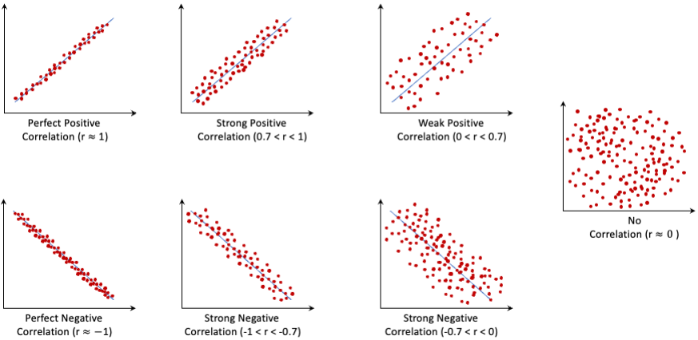

```{r, echo = F}
# To use this link: 
# https://rafalab.dfci.harvard.edu/dsbook-part-1/dataviz/intro-dataviz.html
# https://r4ds.hadley.nz/eda
# https://bookdown.org/ronsarafian/IntrotoDS/eda.html
# https://www.modernstatisticswithr.com/eda.html#clustering
```

# Exploratory Data Analysis {#chapter-EDA} 

**Exploratory Data Analysis (EDA)** is the process of examining and exploring data to gain insights, identify patterns, and understand relationships between variables—all before applying formal hypotheses or machine learning algorithms. This critical step allows us to “get to know” the data, using a mix of summary statistics, visualizations, and preliminary analysis to reveal structure and potential insights. EDA is foundational to data science because it helps generate hypotheses and informs the decisions we’ll make in later stages of analysis.

EDA is not a rigid process with strict rules; rather, it is a flexible, iterative approach that encourages curiosity and open-ended exploration. At this stage, it’s important to remain open to investigating any ideas that arise. Some explorations may lead to dead ends, but others can uncover valuable insights that guide the rest of the project. Over time, as you become more familiar with the data, you’ll naturally focus on the most promising leads, which will help shape your final analysis and conclusions.

EDA is primarily about exploration and discovery—it’s a way to find clues and patterns in the data rather than proving any particular theory. Using tools like summary statistics, visualizations, and basic correlations, we can generate hypotheses and start to understand the underlying structure of the data. However, these insights are just preliminary observations, not formal conclusions; they provide direction for further analysis, where more rigorous testing can confirm or refine what we uncover during EDA.

When interpreting patterns in EDA, it’s essential to balance statistical significance with practical relevance. In large datasets, even small correlations or patterns may be statistically significant, but they might not have meaningful implications for the problem at hand. For example, a variable might show a slight but statistically significant association with churn; however, if this association is weak, it may not be actionable in a real-world context. EDA encourages us to consider both perspectives: while statistical tests can highlight interesting relationships, we also need to interpret these findings in a way that aligns with practical goals and domain knowledge.

EDA also overlaps significantly with data preparation and cleaning. For example, you may notice missing values during EDA and decide to address them by imputing or removing data points. While this is technically part of data cleaning, it’s also an aspect of exploration, as we examine the data to make the best decision for handling these issues. Identifying these issues early on allows us to refine the data and set a strong foundation for analysis.

EDA involves choosing the appropriate tools and techniques to answer each question we pose about the data. The choice of visualization or statistical summary depends on the type of data and the specific aspect of the data we’re examining. For example, histograms and box plots are helpful for understanding distributions of individual variables, while scatter plots and correlation matrices are better for exploring relationships between pairs of variables. In the following sections, we’ll see examples of visualizations and summaries that help answer different types of questions within EDA. We’ll also apply these techniques to our churn dataset, which will help illustrate how to use EDA to uncover patterns relevant to customer retention.

## Key Areas of Focus in EDA

During EDA, our primary goals are to:
    
1. **Understand the structure of the data**: Determine the data types, range, and number of observations, and identify any missing values or anomalies.
2. **Analyze individual variable distributions**: Explore each variable to understand its distribution, central tendency, and spread.
3. **Explore relationships between variables**: Identify correlations, dependencies, or interactions that may exist between features.
4. **Identify patterns and outliers**: Spot unusual data points and decide whether they require special handling or removal.

These objectives serve as a guide to ensure that we gain a comprehensive understanding of the dataset before moving on to modeling. 

## Types of EDA Questions

When performing EDA, it’s helpful to approach the data with specific questions in mind. These questions typically fall into two broad categories: **univariate questions** and **multivariate questions**.

1. **Univariate Questions**: These questions focus on understanding the distribution of individual variables. Examples include:

- What is the distribution of the target variable?
- How are predictor variables like **age**, **income**, or **education** distributed?
- Are there any missing values, and how are they distributed across variables?
    
Answering univariate questions helps you understand each variable in isolation, which is essential for detecting skewness, outliers, and data ranges. You can use **histograms**, **box plots**, and **summary statistics** to explore these characteristics.

2. **Multivariate Questions**: These questions examine the relationships between multiple variables. Examples include:

- What is the relationship between the target variable and predictors?
- Are certain predictors correlated with each other, indicating potential multicollinearity?
- Is there any relationship between missing values in different variables?
    
To answer multivariate questions, use **scatter plots**, **correlation matrices**, and **pair plots** to visualize relationships. These tools reveal interactions between features and can help you detect patterns that could be important for building predictive models.

These questions guide the exploratory process and allow you to uncover insights that will inform later analysis. Keep in mind that EDA is primarily about exploration—finding clues rather than proving theories.

Note that to answer to these types of questions we can use different types of visualizations and statistical summaries. But _how to we know which visualization to use?_ This is a question that I hear a lot from my students and the answer it: _It depends on the type of data you have and the question you want to answer_. To be more specific, in the following sections we will see some examples of visualizations and statistical summaries that can be used to answer univariate and multi-variate questions. And we will also see how to use them in practice with the churn dataset. And at the end of this chapter we have a guide line to specificity answer this question. 

## EDA as Data Storytelling

EDA is not only a technical exercise but also a form of **data storytelling**. Data storytelling combines data, visuals, and narrative to communicate insights in a structured, compelling way. This skill is invaluable in data science, as it enables you to present complex findings to audiences in an accessible manner.

Many scientific reports, journalistic pieces, and public presentations rely on data storytelling to convey insights effectively. Figures like the ones below demonstrate how data visualization can bring a narrative to life:
    
- **Figure \@ref(fig:EDA-fig-1)** illustrates global mean surface temperature changes over the Common Era, using visual cues to communicate a story about temperature anomalies over time. This visualization, taken from @neukom2019consistent, shows how data can be transformed into a compelling visual narrative.

```{r EDA-fig-1, echo = FALSE, out.width = "100%", fig.align = 'center', fig.cap = "Global mean surface temperature history over the Common Era. Temperature anomalies with respect to 1961–1990 CE. The coloured lines represent 30-year low-pass-filtered ensemble medians for the individual reconstruction methods."}
knitr::include_graphics("images/EDA_fig_1.png")
```

- **Figure \@ref(fig:EDA-fig-2)** shows an animated scatter plot of fertility rate versus life expectancy at birth for different world regions between 1960 and 2015. Adapted from Hans Rosling’s TED Talk ["New insights on poverty"](https://www.ted.com/talks/hans_rosling_new_insights_on_poverty?subtitle=en), this visualization effectively illustrates trends in global health and demography through dynamic, multi-dimensional storytelling.

```{r EDA-fig-2, echo = FALSE, warning = FALSE, out.width = "80%", fig.cap = "Animated scatter plot of fertility rate and life expectancy at birth for different regions of the world from 1960 to 2015."}
# Animation Code Block
library(ggplot2)   # To load "ggplot2" package
library(forcats)  # For the "fct_collapse()" function
library(dplyr)    # for mutate function
library(dslabs)   # for gapminder dataset

The_West = c("Western Europe", "Northern Europe", "Southern Europe",
             "Northern America", "Australia and New Zealand")
Asia = c("Eastern Asia", "South-Eastern Asia", "Central Asia", 
         "Southern Asia", "Western Asia")
Latin_America = c("Caribbean", "Central America", "South America")
Africa = c("Eastern Africa", "Middle Africa", "Northern Africa", 
           "Southern Africa", "Western Africa")
Others = c("Eastern Europe", "Melanesia", "Micronesia", "Polynesia")

gapminder$group = gapminder$region
gapminder$group = fct_collapse(gapminder$group, "The West"    = The_West   )
gapminder$group = fct_collapse(gapminder$group, "Asia"    = Asia   )
gapminder$group = fct_collapse(gapminder$group, "Latin America"    = Latin_America   )
gapminder$group = fct_collapse(gapminder$group, "Africa"    = Africa   )
gapminder$group = fct_collapse(gapminder$group, "Others"    = Others   )

if(knitr::is_html_output()) {
    library(gganimate)
    p = filter(gapminder, year %in% c(1960:2015) & !is.na(fertility) & !is.na(life_expectancy)) |>
        ggplot(aes(x = fertility, y = life_expectancy, col = group, size = population / 10 ^ 6)) +
        geom_point(alpha = 0.8) + 
        guides(size = "none") +
        coord_cartesian(ylim = c(30, 85)) + 
        labs(x = 'Fertility rate, total (births per woman)', y = 'Life expectancy at birth') +
        ggtitle('{frame_time}') +
        transition_time(year) +   
        ease_aes('linear') + 
        theme(title = element_text( size = 14, face = "bold" ),
              legend.title = element_blank(), plot.margin = unit(c(-.19, 0, .03, .1), "null"),
              plot.title = element_text(hjust = 1, vjust = -5, color = "#eddee4", size = 60, 
                                        face = "bold.italic"))
    
    animate(p, fps = 7, end_pause = 25) #, rewind = TRUE)
}else{
    years <- c(1962, 2015)
    p <- filter(gapminder, year %in% years & !is.na(group) & 
                    !is.na(fertility) & !is.na(life_expectancy)) |>
        ggplot(aes(x = fertility, y = life_expectancy, col = group, size = population / 10 ^ 6)) +
        geom_point(alpha = 0.8) +
        guides(size = "none") +
        theme(plot.title = element_blank(), legend.title = element_blank()) + 
        coord_cartesian(ylim = c(30, 85)) + 
        xlab("Fertility rate (births per woman)") +
        ylab("Life Expectancy") + 
        geom_text(aes(x = 6, y = 80, label = year), cex = 17, color = "#eddee4") +
        facet_grid(. ~ year) 
    
    p + theme(strip.background = element_blank(),
              strip.text.x = element_blank(),
              strip.text.y = element_blank(),
              legend.position = "top")
}
```

By learning to interpret and create such visualizations, you’ll be better equipped to uncover key insights and communicate your findings persuasively.

## EDA in Practice: Working with the *Churn* Dataset

In this book, we will use the **churn** dataset to illustrate the EDA process. The churn dataset contains information on customer behavior, including whether a customer has "churned" (i.e., left the service) and various demographic and behavioral attributes.

Through EDA, we aim to:
    
1. Uncover patterns related to customer churn.
2. Identify important predictors that influence customer retention.
3. Gain insights into the structure of the data that will guide us in building predictive models.

In the next sections, we’ll walk through specific techniques for exploring the churn dataset, from calculating summary statistics to creating visualizations. By following these steps, you’ll be able to turn raw data into actionable insights, building a strong foundation for further analysis and modeling. But before we shortly the frist and second steps of Data Science workflow.

### Problem/Business Understanding

Companies are interested to know who is gonna get churned so they can proactively go to the customer to provide them better services and turn customers' decisions in the opposite direction. Companies are interested to know:

* **Why** are we losing them?
* **What** are the causes or reasons of losing customers?
* **How** do we stop them from leaving the company?

EDA will help us to answer these questions and provide insights to the company to take actions.

### Data Understanding 

This dataset comes from IBM Sample Data Sets. The data set contains 5000 rows (customers) and 20 columns (features). The "churn" column is our target which indicates whether the customer churned (left the company) or not.
The 20 variables are:

> 1. `state`: Categorical, for the 51 states and the District of Columbia.
> 2. `area.code`: Categorical.
> 3. `account.length`: count, how long account has been active.
> 4. `voice.plan`: Categorical, yes or no, voice mail plan.
> 5. `voice.messages`: Count, number of voice mail messages.
> 6. `intl.plan`: Categorical, yes or no, international plan.
> 7. `intl.mins`: Continuous, minutes customer used service to make international calls.
> 8. `intl.calls`: Count, total number of international calls.
> 9. `intl.charge`: Continuous, total international charge.
> 10. `day.mins`: Continuous, minutes customer used service during the day.
> 11. `day.calls`: Count, total number of calls during the day.
> 12. `day.charge`: Continuous, total charge during the day.
> 13. `eve.mins`: Continuous, minutes customer used service during the evening.
> 14. `eve.calls`: Count, total number of calls during the evening.
> 15. `eve.charge`: Continuous, total charge during the evening.
> 16. `night.mins`: Continuous, minutes customer used service during the night.
> 17. `night.calls`: Count, total number of calls during the night.
> 18. `night.charge`: Continuous, total charge during the night.
> 19. `customer.calls`: Count, number of calls to customer service.
> 20. `churn`: Categorical, yes or no. Indicator of whether the customer has left the company (yes or no).

We import the dataset in **R** as follows:
```{r}
library(liver)

data(churn) # load the "churn" dataset
``` 

To see the overview of the dataset in **R** we are using function `str()` as follows:
```{r}
str(churn)   # Compactly display the structure of the data
```

It shows that data are as a *data.frame* object in **R** with `r nrow(churn)` observations and `r ncol(churn)` variables. The last column (with name *churn*) is the *target variable* that indicates whether customers churned (left the company) or not.

By using the function `summary()` in **R**, we can see the summary of the dataset as follows

```{r}
summary(churn)
# skim(churn)
```

It shows the summary of all the `r ncol(churn)` variables. The dataset has `r ncol(churn) - 1` predictors along with the target variable `churn`. The type of variables are as follows:

|     Variable     |  R Datatype  |  Statistical Datatype   |
|        :-        |      :-:     |          :-             |
| `state`          | `Factor`     | categorical - nominal   |
| `area.code`      | `Factor`     | categorical - nominal   |
| `account.length` | `int`        | numerical - discrete    |
| `voice.plan`     | `Factor`     | categorical - binary    |
| `voice.messages` | `int`        | numerical - discrete    |
| `intl.plan`      | `Factor`     | categorical - binary    |
| `intl.mins`      | `num`        | numerical - continuous  |
| `intl.calls`     | `int`        | numerical - discrete    |
| `intl.charge`    | `num`        | numerical - continuous  |
| `day.mins`       | `num`        | numerical - continuous  |
| `day.calls`      | `int`        | numerical - discrete    |
| `day.charge`     | `num`        | numerical - continuous  |
| `eve.mins`       | `num`        | numerical - continuous  |
| `eve.calls`      | `int`        | numerical - discrete    |
| `eve.charge`     | `num`        | numerical - continuous  |
| `night.mins`     | `num`        | numerical - continuous  |
| `night.calls`    | `int`        | numerical - discrete    |
| `night.charge`   | `num`        | numerical - continuous  |
| `customer.calls` | `int`        | numerical - discrete    |
| `churn`          | `Factor`     | categorical - binary    |

This dataset is clean and ready for EDA. In the upcoming chapter, we’ll dive into Exploratory Data Analysis (EDA), where we’ll use visualizations and summary statistics to gain insights into the structure and relationships within the data. By combining the prepared data with EDA techniques, we can better understand which features may hold predictive value for our model and set the stage for successful machine learning outcomes.

We wonder how it can be that there are `r length(table(churn$state))` states in the dataset with just `r length(table(churn$area.code))` area codes! We are still just getting to know the data set. 

## Investigating Categorical Variables {#chapter-EDA-categorical}

Categorical variables are those that represent discrete values, such as names, labels, or categories. In the churn dataset, the variables `state`, `area.code`, `voice.plan`, and `intl.plan` are categorical. To explore these variables, we can use bar plots, pie charts, and frequency tables to visualize their distributions. Here we start with the target variable `churn` as follows:

```{r}
ggplot(data = churn, aes(x = churn, label = scales::percent(prop.table(stat(count))))) +
  geom_bar(fill = c("palevioletred1", "darkseagreen1")) + 
  geom_text(stat = 'count', vjust = 0.2, size = 6)
```

The bar plot above presents the distribution of the target variable `churn`, which indicates whether a customer has churned (left the company). The plot reveals that the dataset is imbalanced, with more customers staying (`churn = "no"`) than leaving (`churn = "yes"`); It presents that the proportion of churner (`churn = "yes"`) is `r round(summary(churn$churn)[1] / nrow(churn), 2) * 10` percent while the proportion of non-churner (`churn = "yes"`) is `r round(summary(churn$churn)[2] / nrow(churn), 2) * 10` percent. This information is crucial for building predictive models, as imbalance can affect model performance and accuracy. Besides, one of our objective is _to reduce the proportion of churners_. For this we need _to identify patterns in the data related to customer churn_, so we need to investigate the relationship between the target variable and other predictors. 

The primary purpose of exploratory data analysis (EDA) is to gain a thorough understanding of the variables in the dataset by examining the distributions of categorical variables, analyzing histograms of numerical variables, and exploring relationships between variables. While EDA focuses on uncovering patterns and understanding data structure, our ultimate goal for this data mining project is to develop a predictive model that identifies customers likely to churn, or switch to a competitor. Today’s data analysis tools allow us to familiarize ourselves with the dataset and investigate potential associations with churn, helping us explore the data while keeping the project’s objective in mind. We begin by examining the categorical variables and their relationship to churn, as this foundational analysis will guide us in building an effective predictive model.

We begin our analysis with the `intl.plan` (International Plan) variable, which indicates whether a customer has subscribed to an international calling plan. As a binary variable, it provides two categories—those with an international plan and those without. To explore the relationship between this feature and customer churn, we can use bar plots to visualize the distribution of churners and non-churners based on the international plan selection:

```{r fig.align = 'default', fig.show = "hold", out.width = "50%"}
ggplot(data = churn) + 
  geom_bar(aes(x = intl.plan, fill = churn)) +
  scale_fill_manual(values = c("palevioletred1", "darkseagreen1")) 

ggplot(data = churn) + 
  geom_bar(aes(x = intl.plan, fill = churn), position = "fill") +
  scale_fill_manual(values = c("palevioletred1", "darkseagreen1")) 
```

The first plot (on the left) shows the distribution of churners and non-churners across the two categories of the international plan. This plot allows us to directly compare the raw counts of churners and non-churners among customers with and without the plan. The second plot (on the right) displays the proportions of churners and non-churners within each category, with the y-axis scaled from 0 to 1. This proportion plot is particularly useful for comparing churn rates, as it normalizes for differences in group sizes. From these plots, we observe that customers with the international plan have a noticeably higher churn rate than those without it, suggesting a potential link between the international plan and customer attrition.

To quantify this relationship, we can examine a contingency table, which provides a detailed breakdown of churners and non-churners by international plan status. Since both `intl.plan` and `churn` are categorical variables, this table helps us summarize and compare the distribution across categories:

```{r}
addmargins(table(churn$churn, churn$intl.plan, 
                 dnn = c("Churn", "International Plan")))
```

This contingency table shows the count of churners and non-churners for customers with and without the international plan. If we wish to view these counts as proportions, we can use the `prop.table()` function, which converts the counts into percentages and provides a clearer view of the relative churn rates within each category.

In summary, our exploratory analysis of the International Plan variable suggests two key takeaways:

1. There is a clear association between having an international plan and an increased likelihood of churn. This may warrant further investigation to understand what aspects of the international plan could be driving customers away.
2. We can expect that the international plan variable will likely play an important role in any predictive model for churn, as it shows a strong relationship with the target variable. Whatever data mining algorithm we choose, it’s probable that the model will include this feature as a significant predictor of customer churn.

By examining the relationship between the international plan and churn, we’ve taken an important first step toward understanding the dataset and identifying potential predictors of customer attrition. This initial analysis lays the groundwork for building predictive models that can help companies proactively address factors influencing churn and ultimately improve customer retention.

Next, we’ll continue our exploration by investigating the `voice.plan` (Voice Mail Plan) variable and its relationship to churn. Applying a similar approach—visualizing and summarizing the data—will provide additional insights into customer behavior and allow us to refine our understanding of the dataset. To start, we visualize the distribution of churners and non-churners based on the Voice Mail Plan with the following bar plots:

```{r fig.align = 'default', fig.show = "hold", out.width = "50%"}
ggplot(data = churn) + 
  geom_bar(aes(x = voice.plan, fill = churn)) +
  scale_fill_manual(values = c("palevioletred1", "darkseagreen1")) 

ggplot(data = churn) + 
  geom_bar(aes(x = voice.plan, fill = churn), position = "fill") +
  scale_fill_manual(values = c("palevioletred1", "darkseagreen1")) 
```

The first plot (on the left) shows the raw counts of churners and non-churners among customers with and without a Voice Mail Plan, while the second plot (on the right) displays the proportions. From these plots, we observe that customers without a Voice Mail Plan appear more likely to churn than those who have opted in for this feature. 

To quantify this observation, we can create a contingency table to summarize the counts of churners and non-churners by Voice Mail Plan status:

```{r}
addmargins(table(churn$churn, churn$voice.plan, dnn = c("Churn", "Voice Mail Plan")))
```

This table shows the number of churners and non-churners for customers with and without a Voice Mail Plan. For example, it reveals that `r table(churn$churn, churn$voice.plan)[1, 1]` customers with a Voice Mail Plan did not churn, while `r table(churn$churn, churn$voice.plan)[2, 1]` did. Similarly, we can see the counts for customers without a Voice Mail Plan. The higher proportion of churners among those without a Voice Mail Plan suggests that this feature may indeed be a relevant predictor of customer attrition.

In summary, this EDA on the Voice Mail Plan variable suggests two key takeaways:

1. Enhancing the Voice Mail Plan or encouraging more customers to subscribe to it may help improve customer retention, as the plan seems to be associated with lower churn rates.
2. We can expect that the Voice Mail Plan variable will likely contribute meaningfully to any predictive model we develop for churn, though its influence may not be as strong as that of the International Plan.

These insights reinforce the importance of EDA in uncovering patterns that inform both strategic decisions and model-building efforts, helping companies address churn more effectively.

## Investigating Numerical Variables {#EDA-sec-numeric}

Next, we turn to an exploration of the numeric predictive variables. Refer back to summary statistics of the various predictors. We start with the variable `service.calls` (Customer Service Calls), which represents the number of calls made to customer service. This variable is numerical and discrete, making it suitable for histogram analysis. We can use histograms to visualize the distribution of customer service calls as follows:

```{r}
ggplot(data = churn) +
  geom_histogram(aes(x = customer.calls), 
                 bins = 10, fill = "skyblue", color = "black")
```

The histogram above displays the distribution of customer service calls, with the x-axis representing the number of calls and the y-axis showing the count of customers. This visualization allows us to observe the frequency of different call counts. For example, we can see that the range of calls is between `r min(churn$customer.calls)` and maximum `r max(churn$customer.calls)` with the majority of customers calls to customer service `r mode(churn$customer.calls)` times and that the distribution is right-skewed, with a long tail to the right. This skewness indicates that a few customers made a large number of calls, potentially signaling dissatisfaction or issues that need to be addressed.  

The initial histogram gives a basic overview of the distribution of customer service calls, but to investigate its association with churn, we need to incorporate the target variable in the visualization. Overlaying the histogram with the target variable provides a clearer picture of how this predictor relates to churn. By coloring the histogram bars according to churn status, we can better discern patterns that might suggest a relationship between customer service calls and the likelihood of churn. Here’s the code to create these overlay histograms:

```{r fig.align = 'default', fig.show = "hold", out.width = "50%"}
ggplot(data = churn) +
  geom_histogram(aes(x = customer.calls, fill = churn), position = "stack") +
  scale_fill_manual(values = c("palevioletred1", "darkseagreen1")) 
  
ggplot(data = churn) +
  geom_histogram(aes(x = customer.calls, fill = churn), position = "fill") +
  scale_fill_manual(values = c("palevioletred1", "darkseagreen1")) 
```

The first plot (left) shows the distribution of churners and non-churners for each level of customer service calls, while the second plot (right) presents these values as proportions within each call count. In the left plot, there is a suggestion that churn is more prevalent among customers with higher call counts, but the pattern isn't immediately clear. The normalized histogram on the right, however, makes the relationship much more apparent by standardizing each bar to a height of 1, allowing us to easily compare the relative proportions of churners within each call level.

From the normalized plot, we can see a striking pattern: customers who have made three or fewer calls to customer service have a notably lower churn rate than those who have made four or more calls. This visualization indicates that frequent customer service interactions are a strong indicator of churn risk.

This analysis of the customer service calls variable suggests the following actionable insights:
    
1. **Customer Retention Strategy**: Monitor the number of customer service calls closely. By the third call, it may be beneficial to offer specialized retention incentives, as the likelihood of churn increases significantly after the fourth call.
2. **Predictive Modeling**: We should expect that the number of customer service calls will be an important predictor in any model designed to forecast churn, as it appears to be highly indicative of customer dissatisfaction.

Let’s now examine the remaining numerical variables in the dataset, starting with `day.mins` (Day Minutes). Since `day.mins` is a continuous variable, we can visualize its distribution using both a box plot and a density plot, each providing different insights. Below, we present these two plots side by side:
    
```{r fig.align = 'default', fig.show = "hold", out.width = "50%"}
ggplot(data = churn) +
    geom_boxplot(aes(x = churn, y = day.mins), 
                 fill = c("palevioletred1", "darkseagreen1"))

ggplot(data = churn) +
    geom_density(aes(x = day.mins, fill = churn), alpha = 0.3)
```

The box plot on the left allows us to compare the distribution of `day.mins` between churners and non-churners, highlighting any differences in median, spread, and potential outliers. The density plot on the right provides a smooth visualization of the distribution, making it easier to spot patterns in day usage across both groups.

From these plots, we observe that high day-minute users are more likely to churn. The density plot, in particular, shows a noticeable peak among churners at higher `day.mins` values, suggesting that heavy daytime usage may be linked to customer dissatisfaction or unmet needs.

This analysis suggests the following actions:
    
1. **Monitor High Day-Minute Users**: Track customers whose day-minute usage exceeds 200 minutes, as these high-usage customers appear to be at greater risk of churning.
2. **Investigate Reasons for Churn Among Heavy Users**: Explore why heavy daytime users are more inclined to leave. Are they experiencing issues with service quality, pricing, or value?
3. **Include `day.mins` in Churn Prediction Models**: Given its apparent predictive power, `day.mins` should be considered as a key feature in any churn prediction model, as it may help identify high-risk customers.

In summary, analyzing `day.mins` has provided valuable insights into customer behavior, highlighting an opportunity to improve customer retention by focusing on heavy daytime users. By including this variable in predictive models, we can enhance the model’s accuracy and take proactive steps to reduce churn among high-usage customers.

To examine the relationship between the `eve.mins` (Evening Minutes) variable and churn, we can use both a box plot and a density plot to visualize the distribution of evening minutes for churners and non-churners:
    
```{r fig.align = 'default', fig.show = "hold", out.width = "50%"}
ggplot(data = churn) +
    geom_boxplot(aes(x = churn, y = eve.mins), fill = c("palevioletred1", "darkseagreen1"))

ggplot(data = churn) +
    geom_density(aes(x = eve.mins, fill = churn), alpha = 0.3)
```

The box plot (left) and density plot (right) offer different perspectives on the distribution of evening minutes across the churn and non-churn groups. The box plot provides a summary of the median, interquartile range, and potential outliers, while the density plot shows the overall shape of the distribution for each group.

From these plots, we observe a slight tendency for customers with higher evening minutes to have a greater likelihood of churning. However, this pattern is subtle, and the graphical evidence alone is not strong enough to make a definitive conclusion about the relationship between evening usage and churn. In situations like this, where the visual trends are ambiguous, it’s prudent to withhold policy recommendations until we have more robust evidence from statistical analyses or predictive models.

In summary, while there may be an association between evening usage and churn, we need additional evidence before drawing conclusions. Proceeding with caution is essential in data analysis, particularly when visual trends are weak or uncertain. A data-driven approach will allow us to validate these findings before making any data-backed recommendations for policy or customer retention strategies.

To explore the relationship between `night.mins` (Night Minutes) and churn, we can visualize the data using a box plot and a density plot:
    
```{r fig.align = 'default', fig.show = "hold", out.width = "50%"}
ggplot(data = churn) +
    geom_boxplot(aes(x = churn, y = night.mins), fill = c("palevioletred1", "darkseagreen1"))

ggplot(data = churn) +
    geom_density(aes(x = night.mins, fill = churn), alpha = 0.3)
```

The box plot (on the left) and density plot (on the right) both suggest that there is little to no discernible association between churn and night minutes. The distributions of night minutes for churners and non-churners are quite similar, with no significant differences in median, spread, or overall shape. This lack of variation implies that `night.mins` may not be a strong predictor of customer churn.

In fact, this pattern of minimal association with churn appears to hold for several of the remaining numeric variables in the dataset. While we have examined only a subset of variables in detail, you may wish to further investigate others to confirm whether they exhibit any meaningful relationship with churn. Identifying variables with little or no predictive value is a valuable part of the EDA process, as it allows us to focus on features that are more likely to enhance our model’s accuracy.

Ultimately, EDA serves as a guide to prioritize which features are worth closer examination and inclusion in predictive modeling. For features like `night.mins`, where EDA indicates no obvious link to churn, we might consider excluding them from our final model or keeping them as secondary variables.

**Note:** The absence of an obvious association between a predictor and the target variable during EDA is not, on its own, a sufficient reason to exclude that predictor from our model. For instance, although the box plot and density plot for `night.mins` (Night Minutes) show no clear visual relationship with churn, this does not necessarily mean that `night.mins` lacks predictive value. Data mining models may still uncover useful patterns involving this variable, particularly if it interacts with other features or contributes to complex, higher-dimensional associations. Therefore, unless there is a compelling reason to discard a variable outright, it is generally best to include it in the initial stages of modeling and allow the model itself to determine its predictive importance.

As an example, while `night.mins` does not display a strong association with churn in the EDA visuals, further analysis using statistical tests may reveal otherwise. A t-test, for instance, could show a statistically significant difference in the mean number of Night Minutes between churners and non-churners (see Chapter 3 for details). This finding would suggest that `night.mins` may indeed have predictive power for identifying churn, even though this was not immediately apparent in the visualizations. Excluding the variable based solely on its lack of obvious association at the EDA stage could lead to a less accurate model, as subtle but meaningful patterns might go unrecognized.

To confirm whether any observed differences are statistically significant, we will delve into hypothesis testing and other statistical techniques in the next chapter. These methods fall under the domain of statistical inference and model building, extending beyond the scope of exploratory data analysis. We mention them here to emphasize that EDA is only one step in the modeling process; some variables may reveal their importance only under more formal analysis. For this reason, it’s essential not to prematurely discard predictors simply because their relationship with the target variable isn’t immediately apparent in EDA.

## Envestigating Multivarate Relationships {#EDA-sec-multivariate}

We examine potential multivariate associations between numeric variables and churn using scatter plots. While univariate exploration gives us insights into individual variables, multivariate graphics can reveal interaction effects that may not be apparent when examining variables in isolation.

For instance, consider the scatter plot of `day.mins` (Day Minutes) versus `eve.mins` (Evening Minutes), with churn overlaid:
    
```{r}
ggplot(data = churn) +
    geom_point(aes(x = eve.mins, y = day.mins, color = churn), size = 0.7, alpha = 0.8) +
    scale_color_manual(values = c("palevioletred1", "darkseagreen1")) +
    geom_abline(intercept = 400, slope = -0.6, color = "blue", size = 1)
```

Notice the diagonal line partitioning the plot. This line, represented by the equation:
    
\[
\text{day.mins} = 400 - 0.6 \times \text{eve.mins}
\]

separates the upper-right section of the graph, where we observe a higher concentration of churners. This region, encompassing customers with both high day minutes and high evening minutes, appears to be a high-churn zone compared to the rest of the data. 

To further investigate, we isolate this high-churn region and visualize the churn distribution within it:
    
```{r}
sub_churn = subset(churn, (day.mins > 400 - 0.6 * eve.mins))

ggplot(data = sub_churn, aes(x = churn, label = scales::percent(prop.table(stat(count))))) +
    geom_bar(fill = c("palevioletred1", "darkseagreen1")) + 
    geom_text(stat = 'count', vjust = 0.2, size = 6)
```

In this high-churn subset, the churn rate is approximately `r round(summary(sub_churn$churn)[2] / nrow(sub_churn), 2) * 100`%, which is significantly higher than the churn rate of `r round(summary(churn$churn)[2] / nrow(churn), 2) * 100`% observed across the entire dataset—around five times the overall churn rate. This stark increase in churn rate among customers with both high day and evening usage suggests a strong interaction effect that wasn't fully apparent in the univariate analyses.

Interestingly, while the univariate exploration of `eve.mins` alone did not clearly indicate a high churn rate, this multivariate analysis reveals that evening minutes do play a role in churn—particularly when combined with high day minutes. This demonstrates the value of multivariate exploration in uncovering hidden patterns and interactions, providing us with more nuanced insights into the factors influencing customer churn.

We can further investigate multivariate relationships by examining the scatter plot of `customer.calls` versus `day.mins`, with churn status overlaid:

```{r}
ggplot(data = churn) +
  geom_point(aes(x = day.mins, y = customer.calls, color = churn), alpha = 0.8) +
  scale_color_manual(values = c("palevioletred1", "darkseagreen1"))
```

This plot reveals an interesting high-churn region in the upper left section, where customers have made numerous calls to customer service but have relatively low day minutes. This group of customers, characterized by frequent customer service interactions yet low usage, might represent a dissatisfied segment prone to leaving. Such insights would be difficult to uncover through univariate analysis alone, as they stem from the interaction between two variables rather than the behavior of any one variable in isolation.

In summary, our previous univariate analysis showed that customers who make many calls to customer service tend to have a higher churn rate. However, this scatter plot adds nuance to that finding. Among the high-call customers, those with high day minutes seem somewhat “protected” from churning—they are more likely to stay compared to those with lower day minutes. In other words, the upper right area of the plot, where day minutes are high and customer calls are also high, shows a lower churn rate than the upper left, where high customer calls coincide with low day minutes. 

This interaction suggests that high usage (indicated by high day minutes) may offset the negative effect of frequent customer service calls, perhaps reflecting a more engaged or "sticky" customer segment. But how do we quantify these observations from the scatter plot? 

In the next chapter, we’ll delve into statistical techniques that allow us to rigorously test and quantify these multivariate relationships, determining whether they have significant predictive value for our churn model. This will help us transition from exploratory insights to actionable, data-driven decisions.

### Investigating Correlated Variables

In data analysis, **correlation** measures the relationship between two variables—specifically, the extent to which one variable changes in relation to another. Correlation helps us understand whether increases or decreases in one variable are associated with increases or decreases in another. There are three main types of correlation outcomes: **positive correlation** (both variables move in the same direction), **negative correlation** (one variable increases as the other decreases), and **no correlation** (no clear relationship between the variables).

For example, if you've ever wondered whether the number of hours you study is related to your exam scores, you’re thinking about correlation. A positive correlation would mean that more hours of studying are associated with higher scores, while a negative correlation would imply that more studying is associated with lower scores (which would be unusual, but not impossible). Correlation doesn’t imply causation, but it can reveal interesting associations worth exploring.

The strength and direction of a linear relationship between two variables \( x \) and \( y \) can be quantified using the **correlation coefficient** \( r \). This value ranges from -1 to 1:
- **\( r = 1 \)** indicates a perfect positive correlation, where increases in \( x \) are always associated with proportional increases in \( y \).
- **\( r = -1 \)** indicates a perfect negative correlation, where increases in \( x \) are always associated with proportional decreases in \( y \).
- **\( r = 0 \)** suggests no linear relationship between \( x \) and \( y \).

Below, Figure \@ref(fig:correlation) shows examples of different correlation coefficients.

```{r correlation, echo = FALSE, out.width = "100%", fig.align = 'center', fig.cap = "Example scatterplots showing different correlation coefficients."}

```

In large datasets—common in data science—even small values of \( r \) may be statistically significant. For datasets with over 1000 records, weak correlations (e.g., \( -0.1 \leq r \leq 0.1 \)) can still hold statistical significance, though they may not always have practical importance. When evaluating correlations during exploratory data analysis (EDA), it’s essential to consider both statistical and practical implications.

Using highly correlated predictors in a model can lead to several issues:
- **Overemphasis on Certain Data Patterns**: Strongly correlated predictors can cause certain patterns in the data to dominate the model’s learning, potentially leading to biased outcomes.
- **Instability and Multicollinearity**: Highly correlated predictors introduce redundancy, which can destabilize models and make interpretation difficult. This problem, known as **multicollinearity**, is especially problematic in linear models and can result in unreliable coefficient estimates.

However, just because two variables are correlated doesn’t mean that one should be automatically excluded from the model. Instead, during EDA, it’s helpful to adopt a systematic approach for managing correlated variables.

To handle correlated variables effectively during EDA, consider the following strategies:
    
1. **Identify Perfectly Correlated Variables**: If two variables have a perfect correlation (i.e., \( r = 1.0 \) or \( r = -1.0 \)), they contain identical information. Including both in the model would be redundant, so retaining only one is sufficient.

2. **Group Highly Correlated Variables**: Identify clusters of variables that are strongly correlated with each other. Later, during the modeling phase, you can apply **dimension reduction** techniques, such as **Principal Component Analysis (PCA)**, to combine these correlated variables into a smaller set of uncorrelated components. This approach reduces redundancy while retaining essential information.

3. **Consider Practical Relevance**: Correlation alone should not dictate variable inclusion or exclusion. For example, if two predictors are highly correlated but both have practical significance (e.g., `age` and `years of experience`), you may choose to retain both and evaluate their impact during the modeling phase.

> **Note**: This strategy applies to correlations among predictor variables, not between predictors and the target variable. Strong correlations between a predictor and the target variable are often desirable, as they suggest that the predictor may be informative for modeling the target.

By following these steps, you can reduce the risk of multicollinearity and redundancy, helping to ensure that your models are both reliable and interpretable. This approach allows EDA to inform a thoughtful, data-driven selection of variables as you move into the modeling phase.

Let’s apply this process to our dataset. For each of the categories **day**, **evening**, **night**, and **international**, we have three variables: **minutes**, **calls**, and **charge**. According to the data description, the **charge** variables are likely calculated based on **minutes** and **calls** for each time period, which would naturally result in high correlations between them. To verify this, we’ll compute the correlation matrix for these variables and visualize it using a correlation plot.

```{r message = FALSE, warning = FALSE, fig.align='center' }
library(ggcorrplot) # For correlation plots (ggcorrplot)
variable_list = c("intl.mins",  "intl.calls",  "intl.charge", 
                  "day.mins",   "day.calls",   "day.charge",
                  "eve.mins",   "eve.calls",   "eve.charge",
                  "night.mins", "night.calls", "night.charge")

cor_matrix = cor(churn[, variable_list])

ggcorrplot(cor_matrix, type = "lower", lab = TRUE, lab_size = 3)
```

The correlation matrix reveals several key insights:
    - **Perfect Correlations**: We observe perfect correlations (r = 1) between `day.mins` and `day.charge`, `eve.mins` and `eve.charge`, `night.mins` and `night.charge`, and `intl.mins` and `intl.charge`. This indicates that each **charge** variable is a direct linear function of the corresponding **minutes** variable.
- **No Correlation Between Minutes and Calls**: Interestingly, there is no significant correlation between **minutes** and **calls** within each time period (e.g., `day.mins` and `day.calls` are uncorrelated). While one might expect that customers making more calls would also spend more minutes on the phone, the data does not support this assumption.

Since `day.charge`, `eve.charge`, `night.charge`, and `intl.charge` are perfectly correlated with their respective **minutes** variables, we should remove one of each pair to avoid redundancy. We’ll retain the **minutes** variables and eliminate the **charge** variables, thus reducing the number of predictors from 20 to 16. This helps prevent issues with multicollinearity and reduces the dimensionality of the data, which can improve model efficiency.

Had we proceeded to the modeling phase without identifying and addressing these correlations, our models could have produced unreliable results due to multicollinearity. High multicollinearity can distort the relationships between variables in a model, making it challenging to determine the true effect of each predictor. By removing redundant variables, we streamline the model and focus on the most meaningful predictors, leading to more stable and interpretable results.

> **Important Note on Correlation vs. Causation**: Remember that correlation does not imply causation. Just because two variables are correlated does not mean that one causes the other. Causation implies that changes in one variable directly result in changes in the other, while correlation simply indicates an association. Always be cautious in interpreting correlations, especially when considering them for causal inferences.

In summary, by carefully investigating and addressing correlated variables during EDA, we enhance the reliability and interpretability of our models. This approach ensures that our modeling process is both data-driven and thoughtful, setting a solid foundation for the analyses and insights that follow.

## Key Findings and Insights

Through a thorough exploratory data analysis (EDA) of the churn dataset, we have gained valuable insights into the factors that may influence customer attrition. By examining each variable individually and in combination with others, we identified patterns and relationships that could inform predictive modeling and guide potential strategies for reducing churn. Here are the key takeaways from our analysis:
    
1. **Redundant Variables**: 
- The **charge** fields (day, evening, night, and international) are perfectly correlated with their respective **minute** fields, as they are linear functions of those variables. To avoid redundancy and multicollinearity, we should exclude the charge fields from our analysis, retaining only the minute variables.
- The **area code** and **state** fields appear to add little value and may be redundant or anomalous. Unless further clarification on their purpose is obtained, these fields should be omitted from the model.

2. **Churn Insights**:
- **International Plan**: Customers who have subscribed to the International Plan show a significantly higher churn rate. This suggests that the plan may not be meeting customer expectations, or it may be attracting a customer segment that is more prone to switching providers.
- **Voice Mail Plan**: In contrast, customers with a Voice Mail Plan tend to churn less frequently, indicating that this service may enhance customer loyalty.
- **Customer Service Calls**: A high number of customer service calls (four or more) is strongly associated with higher churn. Customers who have had to contact customer service multiple times may be experiencing unresolved issues or dissatisfaction, which ultimately leads them to leave.
- **High Day and Evening Minutes**: Customers who have both high day minutes and high evening minutes churn at an elevated rate—up to six times the overall churn rate. This suggests that heavy usage during these time periods may correlate with dissatisfaction, possibly due to cost or quality issues.
- **Combination of Low Day Minutes and High Customer Service Calls**: Customers who make frequent customer service calls but have relatively low day minutes also display a higher churn rate. This may indicate dissatisfaction among lower-usage customers who still face issues requiring support.
- **International Calls**: Interestingly, customers with fewer international calls tend to churn more frequently than those who make more international calls. This could suggest that international usage may be a valuable service differentiator for certain customer segments.

3. **Other Variables**:
- For the remaining predictors, no obvious association with churn was identified through EDA. However, these variables are retained as potential inputs for downstream data mining models, as they may still contain useful predictive information in combination with other variables or within specific subsets of the data.

This exploratory analysis has highlighted the power of EDA in uncovering actionable insights before applying advanced modeling techniques. Without any sophisticated data mining algorithms, we have already identified several customer behaviors and attributes that correlate with churn. These findings provide a solid foundation for the next steps in our analysis, which will involve applying predictive modeling techniques to confirm and quantify the relationships we observed.

Additionally, the insights from EDA can be translated into actionable recommendations. For instance:
- The company could investigate the International Plan to understand why it correlates with higher churn and consider adjustments to make it more appealing.
- Specialized retention strategies could be deployed for customers who make frequent customer service calls, potentially offering tailored support to resolve their issues before they decide to leave.
- High-usage customers, particularly those with high day and evening minutes, could be targeted with incentives or loyalty programs to address any dissatisfaction related to cost or service quality.

By identifying and understanding these patterns, the company can take proactive steps to reduce churn and improve customer satisfaction, ultimately leading to a more loyal customer base.
