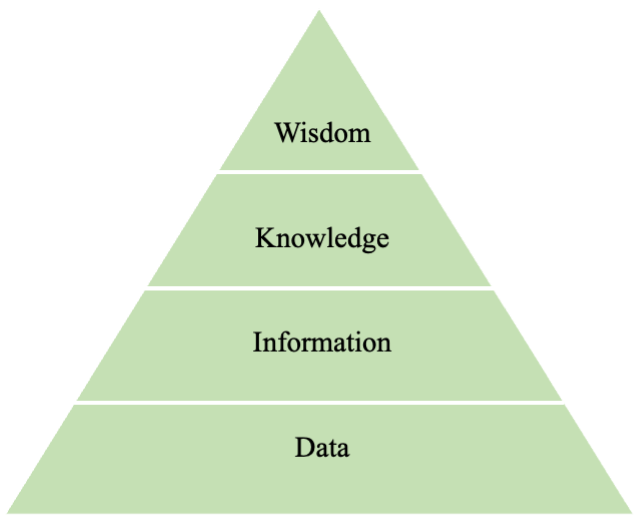

# Introduction to Data Science

 *Data Science* uses tools and techniques to turn data into meaningful business insights. In this regards, data scientists combine data analysis, statistics, machine learning, and related methodology in order to manage and understand the data deluge associated with the emergence of information technology. 
 
## Data science methodology
 
Data Science Methodology is a phased, adaptive, iterative, approach within a scientific framework to turn data to Information, Knowledge, and Wisdom. See Figure \@ref(fig:DIKW-Pyramid).

This is a cyclic process that undergoes a critic behaviour guiding data scientists to act accordingly. 

* Business Understanding.
* Data Preparation.
* Exploratory Data Analysis.
* Preparing Data to Model.
* Modeling.
* Evaluation.
* Deployment.

### Business Understanding

For data-driven business-making, it is vital to understand the problem to be solved. This may seem obvious, but business projects seldom come pre-packaged as clear and unambiguous data mining problems. 

The Business Understanding stage represents a key part of the craft where the analysts' creativity plays a large role. Data Science has some things to say, as we will describe, but often the key to a great success is a creative problem formulation by some analyst regarding how to cast the business problem as one or more data science problems. High-level knowledge of the fundamentals helps creative business analysts see novel formulations. The Business Understanding stage can be done by following steps:

1. First, clearly enunciate the project objectives and requirements in terms of the business or research unit as a whole.
2. Then, translate these goals and restrictions into the formulation of a problem that can be solved using data science.
3. Finally, prepare a preliminary strategy for achieving these objectives.

### Data Preparation

Raw data from data repositories are seldom ready for the algorithms straight out of the box. Instead, it needs to be cleaned or "prepared for analysis". 

* Check for the type of variables in the dataset.
* Check for missing values and determine what to do about them. 
* Identifying outliers and determining what to do about them.

For the data understanding part:

* Report some important information about the dataset. For example, how and where the dataset is collected.
* Report a summary of the dataset.

### Exploratory Data Analysis

Now that your data are nice and clean, you can begin to explore the data, and learn some basic information. Graphical exploration is the focus here. Here is not the time for complex algorithms. Rather, we can use simple exploratory methods to help us gain some preliminary insights. You might find that you can learn quite a bit just by using these simple methods. Here are some of the ways we can do this.

* Exploring the univariate relationships between predictors and the target variable.
* Explore multivariate relationships among the variables.

### Data Preparation

At this point, we are nearly ready to begin modeling the data. In this stage, we want to prepare the dataset for modeling.

* Partition the dataset to *train set* and *test set*.
* Validate the partition.

### Modeling

The modeling phase represents the opportunity to apply state-of-the-art algorithms to uncover some seriously profitable relationships lying hidden in the data. The modeling phase is the heart of your data scientific investigation and includes the following:

* Select and apply appropriate modeling techniques.
* Calibrate model settings to optimize results.
* Often, several different techniques may be applied for the same data analytics problem.
* May require looping back to the data preparation phase, in order to bring the form of the data into line with the specific requirements of a particular data analytics technique.

### Evaluation

they are making any money, or whether we need to go back and try to improve our prediction models.

* The modeling stage has delivered one or more models. These models must be evaluated for quality and effectiveness before we deploy them for use in the field.
* Also, determine whether the model, in fact, achieves the objectives set for it in stage 1.
* Establish whether some important facet of the business or research problem has not been sufficiently accounted for.
* Finally, come to a decision regarding the use of the data mining results.

### Deployment

As the model is effectively evaluated it is made ready for deployment in the business market. Deployment phase checks how much the model can withstand in the external environment and perform superiority as compared to others.
 

