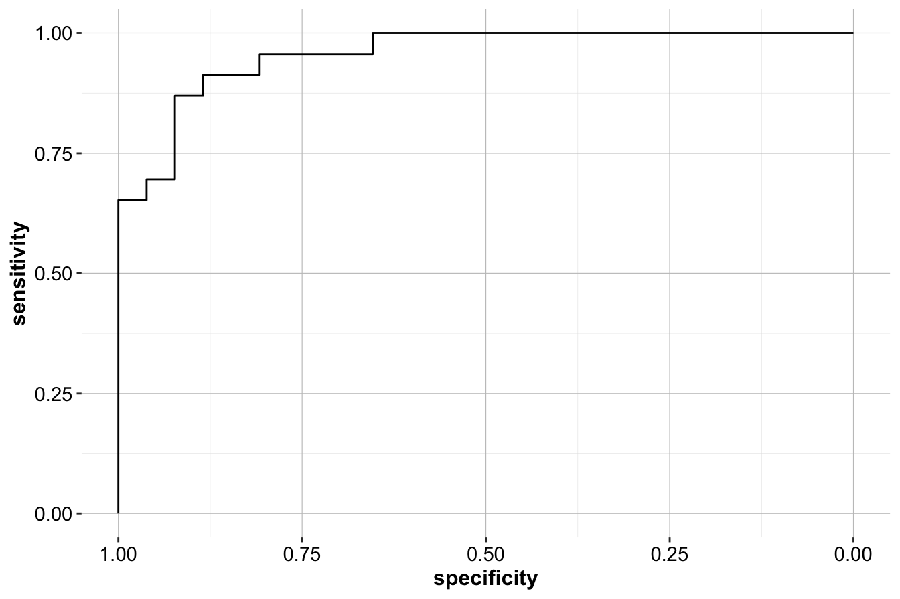

# Naive Bayes Classifier {#chapter-bayes}

The **Naive Bayes Classifier** is one of the simplest yet surprisingly powerful algorithms in machine learning. This family of probabilistic classifiers is based on **Bayes' Theorem**, with the key assumption—often referred to as "naive"—that all features are conditionally independent given the target class. Despite this oversimplified assumption, Naive Bayes often delivers strong performance in practice, especially in domains like text classification, spam detection, sentiment analysis, and medical diagnosis.

Naive Bayes is celebrated for its **speed, scalability, and interpretability**. It is efficient during both the training and prediction phases, making it suitable for large-scale datasets with high-dimensional feature spaces. For example, in text classification tasks, where thousands of features (e.g., words or tokens) may be involved, Naive Bayes can classify data points in milliseconds. Its simplicity and ease of implementation make it a foundational tool for beginners and a go-to algorithm for many real-world tasks.  

The roots of this algorithm lie in **Bayes' Theorem** [^1], a principle introduced by 18th-century mathematician Thomas Bayes. This theorem provides a mathematical framework for updating the probability of a hypothesis as new evidence is observed. At its core, Bayes' Theorem refines our understanding of an event by combining our prior knowledge (known as the **prior distribution**) with new information from observed data (resulting in the **posterior distribution**). These ideas form the foundation of **Bayesian methods**, which have wide-ranging applications in machine learning, statistics, and beyond.

### Strengths and Limitations {-}

The **strength** of Naive Bayes lies in its simplicity and computational efficiency. It is particularly effective for:

- High-dimensional datasets (e.g., text data with thousands of features).
- Tasks requiring quick predictions, such as real-time spam detection.
- Problems where feature independence is approximately true or where the independence assumption is not a major limitation.

However, its **limitations** are also important to acknowledge:

- The independence assumption often does not hold in real-world data, especially when features are highly correlated.
- Naive Bayes may struggle in scenarios with continuous data unless Gaussian distributions are assumed.
- It tends to underperform on very complex datasets compared to more sophisticated algorithms like random forests or gradient boosting.

Despite these limitations, Naive Bayes remains a reliable, interpretable, and robust algorithm. It is often the first choice for quick prototyping and serves as a benchmark for more advanced models.

### What Will This Chapter Cover? {-}

In this chapter, we will:

1. Explore the mathematical foundations of Naive Bayes, including Bayes' Theorem and its application in classification.
2. Examine how Naive Bayes works, with step-by-step explanations and examples.
3. Discuss different variants of the algorithm, including **Gaussian Naive Bayes**, **Multinomial Naive Bayes**, and **Bernoulli Naive Bayes**, and their use cases.
4. Highlight its strengths, limitations, and practical applications.
5. Provide an implementation guide in R, using real-world datasets (the *risk* dataset from the `liver` package) to demonstrate its effectiveness.

By the end of this chapter, you will have a solid understanding of the Naive Bayes Classifier, its theoretical underpinnings, and its practical applications, enabling you to confidently apply it to real-world problems.

## Bayes’ Theorem and Probabilistic Foundations  

What if we could explain uncertainty and predict outcomes using a single, elegant equation? As presented in Equation \@ref(eq:bayes-theorem), **Bayes’ Theorem** is the cornerstone of probabilistic reasoning, offering a mathematical framework for updating our beliefs in light of new evidence. The author of ["Everything Is Predictable: How Bayesian Statistics Explain Our World"](https://www.goodreads.com/book/show/199798096-everything-is-predictable) argues that Bayesian statistics not only help predict the future but also explain the very fabric of rational decision-making. At the heart of this powerful framework lies the work of **Thomas Bayes**, an 18th-century Presbyterian minister and self-taught mathematician, whose contributions provided a systematic way to refine probabilities as new information becomes available.

### The Essence of Bayes’ Theorem {-} 

Bayes’ Theorem is a formula for calculating the probability of an event (\(A\)) based on prior knowledge and new evidence (\(B\)). It answers the question: *Given what we already know, how should our belief in a hypothesis change when we observe new data?*  

Mathematically, it is expressed as:  

\begin{equation} 
P(A|B) = P(A) \cdot \frac{P(B|A)}{P(B)} 
(\#eq:bayes-theorem)
\end{equation}  

Where:  

- **\(P(A|B)\)**: The **posterior probability**—the probability of event \(A\) (hypothesis) given that event \(B\) (evidence) has occurred.
- **\(P(A)\)**: The **prior probability**—our belief about \(A\) before observing \(B\).  
- **\(P(B|A)\)**: The **likelihood**—the probability of observing \(B\) assuming \(A\) is true.  
- **\(P(B)\)**: The **evidence**—the total probability of observing \(B\).  

Bayes’ Theorem elegantly combines **prior knowledge** with **new evidence** to refine our understanding of uncertainty. It is a foundational principle for probabilistic learning, quantifying how data should adjust our expectations.  

To see Bayes’ Theorem in action, consider a practical example from the `risk` dataset in the **liver** package. Below, we calculate the probability of a customer having a good risk profile (\(A\)) given they have a mortgage (\(B\)).  

::: {.example #ex-bayes-risk}
Suppose we are tasked with estimating the probability of a customer having good risk if they have a mortgage. The `risk` dataset contains the relevant information:  


```r
data(risk)

xtabs(~ risk + mortgage, data = risk)
              mortgage
   risk        yes no
     good risk  81 42
     bad risk   94 29
```

Adding margins to the contingency table for clarity:  


```r
addmargins(xtabs(~ risk + mortgage, data = risk))
              mortgage
   risk        yes  no Sum
     good risk  81  42 123
     bad risk   94  29 123
     Sum       175  71 246
```


Now, define the events:  

- \(A\): Customer has "good risk".  
- \(B\): Customer has a mortgage (`mortgage = yes`).  

The **prior probability** of a customer having good risk is:  

\[
P(A) = \frac{\text{Total Good Risk Cases}}{\text{Total Cases}} = \frac{123}{246} = 0.5
\]

Using Bayes’ Theorem, the probability of having good risk given that a customer has a mortgage is:  

\begin{equation} 
\label{eq1}
\begin{split}
P(\text{Good Risk} | \text{Mortgage = Yes}) & = \frac{P(\text{Good Risk} \cap \text{Mortgage = Yes})}{P(\text{Mortgage = Yes})} \\
 & = \frac{\text{Good Risk with Mortgage Cases}}{\text{Total Mortgage Cases}} \\
 & = \frac{81}{175} \\
 & = 0.463
\end{split}
\end{equation}

This demonstrates that customers with mortgages have a lower probability of being classified as good risk compared to the overall population.  
:::

### How Does Bayes’ Theorem Work? {-} 

Bayes’ Theorem leverages **conditional probability** to describe how the likelihood of an event changes based on specific conditions. For example:  
- In medical diagnostics, it estimates the probability of a disease (\(A\)) given a positive test result (\(B\)), accounting for the test's reliability and disease prevalence.  
- In spam detection, it computes the probability of an email being spam (\(A\)) based on the occurrence of certain keywords (\(B\)).  

Probability theory provides a rigorous mathematical structure for reasoning under uncertainty, and Bayes’ Theorem transforms it into a framework for **learning from data** and making **rational decisions**.

### A Gateway to Naive Bayes {-}

The Naive Bayes Classifier builds directly on Bayes’ Theorem. By assuming that features are **conditionally independent** given the target class, it simplifies the computation of probabilities for large, high-dimensional datasets. While this assumption is often violated in practice, it frequently works well enough to yield highly effective results, especially in applications like text classification and spam filtering.  

As we proceed, we’ll see how Bayes’ Theorem forms the foundation of the Naive Bayes algorithm, enabling it to handle complex datasets efficiently while maintaining simplicity and interpretability.  

## Why is it Called “Naive”?

The "naive" in Naive Bayes reflects the algorithm’s **simplifying assumption** that all features are **conditionally independent** of each other, given the target class. In reality, features are often correlated (e.g., income and age), but this assumption dramatically simplifies the computations, making the algorithm both efficient and scalable.  

To illustrate, consider the `risk` dataset from the **liver** package: 

```r
str(risk)
   'data.frame':	246 obs. of  6 variables:
    $ age     : int  34 37 29 33 39 28 28 25 41 26 ...
    $ marital : Factor w/ 3 levels "single","married",..: 3 3 3 3 3 3 3 3 3 3 ...
    $ income  : num  28061 28009 27615 27287 26954 ...
    $ mortgage: Factor w/ 2 levels "yes","no": 1 2 2 1 1 2 2 2 2 2 ...
    $ nr.loans: int  3 2 2 2 2 2 3 2 2 2 ...
    $ risk    : Factor w/ 2 levels "good risk","bad risk": 2 2 2 2 2 2 2 2 2 2 ...
```
As you can see this dataset includes features such as **age**, **income**, **marital status**, **mortgage**, and **number of loans**. Naive Bayes assumes that these features are independent when conditioned on the target class (`risk`), which can be either `good risk` or `bad risk`. Let’s express this mathematically. The target variable \(Y\) represents `risk`, with possible values \(y_1 = \text{good risk}\) and \(y_2 = \text{bad risk}\), while the predictors are \(X_1, X_2, \dots, X_5\). Using Bayes' Theorem (Equation \@ref(eq:bayes-theorem)), the probability of \(Y = y_1\) given all the features is:

\[
P(Y = y_1 | X_1 \cap \dots \cap X_5) = \frac{P(Y = y_1) \cdot P(X_1 \cap \dots \cap X_5 | Y = y_1)}{P(X_1 \cap \dots \cap X_5)}
\]

However, calculating \(P(X_1 \cap X_2 \cap \dots \cap X_5 | Y = y_1)\) is computationally challenging, especially when the number of predictors grows. For example, datasets with hundreds or thousands of features (common in domains like text classification) would require enormous amounts of memory to store probabilities for all possible combinations of features.

The **naive assumption** of conditional independence simplifies this by treating each feature as independent of the others, given the target class. This allows the joint probability term \(P(X_1 \cap \dots \cap X_5 | Y = y_1)\) to be expressed as the product of individual probabilities:

\[
P(X_1 \cap \dots \cap X_5 | Y = y_1) = P(X_1 | Y = y_1) \cdot \dots \cdot P(X_5 | Y = y_1)
\]

This transformation eliminates the need to compute complex joint probabilities and allows the algorithm to operate efficiently, even with high-dimensional datasets. Instead of handling an exponential number of combinations, Naive Bayes only calculates the conditional probabilities of each feature independently, given the class.

In practice, this independence assumption is rarely true—features often exhibit some degree of correlation. However, Naive Bayes frequently performs surprisingly well despite this limitation. It excels in domains like **text classification**, where the independence assumption approximately holds, or where slight violations of the assumption do not significantly affect predictive accuracy. For example, spam detection systems and sentiment analysis often rely on Naive Bayes due to its simplicity, speed, and effectiveness.

By combining these strengths with its ability to handle high-dimensional data, Naive Bayes strikes a balance between computational efficiency and predictive power, making it a foundational algorithm in machine learning.

## The Laplace Smoothing Technique  

One of the primary challenges with the Naive Bayes algorithm is its vulnerability to **zero probabilities**. This issue arises when a feature category present in the test data is missing from the training data. If this happens, the algorithm assigns a probability of zero to the unseen category, and since Naive Bayes multiplies probabilities during prediction, even a single zero probability results in an overall prediction probability of zero for the affected class. This effectively eliminates the class as a possible prediction and can significantly degrade the classifier’s performance.  

To address this issue, **Laplace Smoothing** (also known as **add-one smoothing**) is employed. Named after the French mathematician [Pierre-Simon Laplace](https://en.wikipedia.org/wiki/Pierre-Simon_Laplace), this technique ensures that every class-feature combination has a **non-zero probability**, even if it is missing in the training data. Laplace smoothing works by adding a small constant (commonly \( k = 1 \)) to each count in the frequency table, ensuring that no category is left with zero probability.

To illustrate the necessity of Laplace smoothing, consider the `marital` variable in the `risk` dataset. Suppose the category `married` is entirely absent for the class `bad risk` in the training data due to imbalance or sampling limitations. Let’s visualize this situation:


```
            risk
   marital   good risk bad risk
     single         21       11
     married        51        0
     other           8       10
```

In this case, the probability \( P(\text{bad risk} | \text{married}) \) would be zero. This creates a significant problem: the Naive Bayes classifier would completely ignore any instance with `marital = married` when predicting the `bad risk` class. However, intuitively, even if such examples are absent in the training data, the probability should still be a small non-zero value to reflect the possibility that this combination could occur in the test data.

Laplace smoothing resolves this by modifying the calculation. It adds a small constant \( k \) (usually \( k = 1 \)) to each count in the frequency table. The smoothed probability is then calculated as:

\[
P(\text{bad risk} | \text{married}) = \frac{\text{count}(\text{bad risk} \cap \text{married}) + k}{\text{count}(\text{bad risk}) + k \cdot \text{total unique categories in } \text{marital}}
\]

This adjustment ensures that:

- **Counts are adjusted**: Each category receives an additional \( k \) count in the numerator.
- **Denominator is expanded**: The total count is increased by \( k \times \text{number of categories} \), ensuring that the probability distribution remains valid.

This guarantees that every feature-class combination has a small, non-zero probability, thus preventing zero probabilities from dominating predictions.

In R, the **`naivebayes`** package provides the `laplace` argument to apply Laplace smoothing. By default, `laplace = 0`, meaning no smoothing is applied. To apply smoothing, simply set `laplace = 1`. For instance:


```r
library(naivebayes)

# Fit Naive Bayes with Laplace smoothing
model <- naive_bayes(risk ~ age + income + marital + mortgage + nr.loans, 
                     data = risk, 
                     laplace = 1)
```

This ensures that no class-feature combination has a zero probability, improving the robustness of the Naive Bayes classifier, especially when dealing with small or imbalanced training datasets. While \( k = 1 \) is most commonly used, the value of \( k \) can be adjusted based on specific domain knowledge or requirements. However, in practice, setting \( k = 1 \) suffices for most use cases.

Laplace smoothing is a simple yet effective technique that highlights how minor adjustments can address critical limitations in machine learning algorithms. By ensuring that probabilities remain non-zero, it enhances the reliability and robustness of Naive Bayes in real-world scenarios.

## Types of Naive Bayes Classifiers  

Naive Bayes is a flexible algorithm with variants tailored to different types of data and problem domains. The choice of the Naive Bayes classifier depends on the nature of the features and the assumptions about their underlying distribution. The three most common types are:  

- **Multinomial Naive Bayes**: Best suited for categorical or discrete count features, such as word frequencies in text data. For example, the `marital` variable in the `risk` dataset is categorical, making it a good fit for this variant.  

- **Bernoulli Naive Bayes**: Designed for binary features (e.g., 0s and 1s). This variant is ideal for datasets with yes/no or presence/absence features. For instance, the `mortgage` variable in the `risk` dataset, which has two categories (`yes` and `no`), fits this variant.  

- **Gaussian Naive Bayes**: Used for continuous features that are assumed to follow a normal (Gaussian) distribution. For example, the `age` and `income` variables in the `risk` dataset are continuous and thus suitable for this variant.  

Each variant is optimized for different data types, making it essential to choose the one that aligns with your dataset’s characteristics. By understanding these distinctions, you can select the most appropriate Naive Bayes classifier to achieve optimal performance. In the following sections, we will delve into each variant, exploring their unique characteristics and use cases.

## Case Study: Predicting Risk Profiles  

In this case study, we apply the **Naive Bayes classifier** to predict financial risk using the real-world `risk` dataset from the [**liver**](https://CRAN.R-project.org/package=liver) package in R. The goal is to classify customers as either "`good risk`" or "`bad risk`" based on several predictors.  

### Overview of the Dataset {-}  

We start by loading the dataset and examining its structure:  


```r
data(risk)

str(risk)
   'data.frame':	246 obs. of  6 variables:
    $ age     : int  34 37 29 33 39 28 28 25 41 26 ...
    $ marital : Factor w/ 3 levels "single","married",..: 3 3 3 3 3 3 3 3 3 3 ...
    $ income  : num  28061 28009 27615 27287 26954 ...
    $ mortgage: Factor w/ 2 levels "yes","no": 1 2 2 1 1 2 2 2 2 2 ...
    $ nr.loans: int  3 2 2 2 2 2 3 2 2 2 ...
    $ risk    : Factor w/ 2 levels "good risk","bad risk": 2 2 2 2 2 2 2 2 2 2 ...
```

The `risk` dataset is a `data.frame` with 6 variables and 246 observations. It contains 5 predictors and a target variable `risk`, which is a binary factor with two levels: "`good risk`" and "`bad risk`." The predictors in this dataset are:  

- **`age`**: Age in years.  
- **`marital`**: Marital status (levels: "`single`," "`married`," "`other`").  
- **`income`**: Yearly income.  
- **`mortgage`**: Whether the customer has a mortgage (levels: "`yes`," "`no`").  
- **`nr_loans`**: Number of loans the customer has.  
- **`risk`**: The target variable (levels: "`good risk`," "`bad risk`").  

For additional details about the dataset, refer to its documentation [here](https://search.r-project.org/CRAN/refmans/liver/html/risk.html).  

### Data Preparation {-}  

To evaluate the model’s performance, we partition the dataset into **training** and **testing** sets, using an 80/20 split. This ensures that the classifier is trained on one subset and tested on unseen data:  


```r
set.seed(5)

data_sets = partition(data = risk, ratio = c(0.8, 0.2))

train_set = data_sets$part1
test_set  = data_sets$part2

actual_test = test_set$risk
```

The `set.seed()` function ensures reproducibility of the data split.  

To validate the partitioning, we test whether the proportions of the `marital` variable are similar in the training and testing sets. We use a chi-squared test to compare the proportions across the three categories of `marital`:  


```r
chisq.test(x = table(train_set$marital), y = table(test_set$marital))
   
   	Pearson's Chi-squared test
   
   data:  table(train_set$marital) and table(test_set$marital)
   X-squared = 6, df = 4, p-value = 0.1991
```

The hypotheses for this test are:  
\[
\begin{aligned}
H_0 &: \text{The proportions of `marital` categories are the same in the training and test sets.} \\
H_a &: \text{At least one category has a different proportion.}
\end{aligned}
\]  

Since the p-value exceeds \(\alpha = 0.05\), we fail to reject \(H_0\). This indicates that the proportions of the `marital` categories are statistically similar between the training and test sets, confirming that the partitioning is valid.

### Applying the Naive Bayes Classifier {-} 

We specify the model formula, with `risk` as the target variable and all other predictors as features:  


```r
formula = risk ~ age + income + mortgage + nr.loans + marital
```

Using the **`naivebayes`** package, we train the Naive Bayes classifier on the training data:  


```r
library(naivebayes)

naive_bayes = naive_bayes(formula, data = train_set)

naive_bayes
   
   ================================= Naive Bayes ==================================
   
   Call:
   naive_bayes.formula(formula = formula, data = train_set)
   
   -------------------------------------------------------------------------------- 
    
   Laplace smoothing: 0
   
   -------------------------------------------------------------------------------- 
    
   A priori probabilities: 
   
   good risk  bad risk 
   0.4923858 0.5076142 
   
   -------------------------------------------------------------------------------- 
    
   Tables: 
   
   -------------------------------------------------------------------------------- 
   :: age (Gaussian) 
   -------------------------------------------------------------------------------- 
         
   age    good risk  bad risk
     mean 46.453608 35.470000
     sd    8.563513  9.542520
   
   -------------------------------------------------------------------------------- 
   :: income (Gaussian) 
   -------------------------------------------------------------------------------- 
         
   income good risk  bad risk
     mean 48888.987 27309.560
     sd    9986.962  7534.639
   
   -------------------------------------------------------------------------------- 
   :: mortgage (Bernoulli) 
   -------------------------------------------------------------------------------- 
           
   mortgage good risk  bad risk
        yes 0.6804124 0.7400000
        no  0.3195876 0.2600000
   
   -------------------------------------------------------------------------------- 
   :: nr.loans (Gaussian) 
   -------------------------------------------------------------------------------- 
           
   nr.loans good risk  bad risk
       mean 1.0309278 1.6600000
       sd   0.7282057 0.7550503
   
   -------------------------------------------------------------------------------- 
   :: marital (Categorical) 
   -------------------------------------------------------------------------------- 
            
   marital    good risk   bad risk
     single  0.38144330 0.49000000
     married 0.52577320 0.11000000
     other   0.09278351 0.40000000
   
   --------------------------------------------------------------------------------
```

The `naive_bayes()` function computes the conditional probabilities for each feature given the target class. For categorical predictors (e.g., `marital`, `mortgage`), it calculates class-conditional probabilities. For continuous predictors (e.g., `age`, `income`, `nr.loans`), it assumes a Gaussian distribution and calculates the mean and standard deviation for each class.  


```r
summary(naive_bayes)
   
   ================================= Naive Bayes ================================== 
    
   - Call: naive_bayes.formula(formula = formula, data = train_set) 
   - Laplace: 0 
   - Classes: 2 
   - Samples: 197 
   - Features: 5 
   - Conditional distributions: 
       - Bernoulli: 1
       - Categorical: 1
       - Gaussian: 3
   - Prior probabilities: 
       - good risk: 0.4924
       - bad risk: 0.5076
   
   --------------------------------------------------------------------------------
```

The summary output provides the following details:  

- **Categorical predictors** (e.g., `marital`, `mortgage`): Class-conditional probabilities.  
- **Continuous predictors** (e.g., `age`, `income`, `nr.loans`): Means and standard deviations for the Gaussian distributions.  

This information forms the basis for making predictions with the trained model.

### Prediction and Model Evaluation {-}  

We now use the trained model to predict the **posterior probabilities** for the test set:  


```r
prob_naive_bayes = predict(naive_bayes, test_set, type = "prob")

round(head(prob_naive_bayes, n = 10), 3)
         good risk bad risk
    [1,]     0.001    0.999
    [2,]     0.013    0.987
    [3,]     0.000    1.000
    [4,]     0.184    0.816
    [5,]     0.614    0.386
    [6,]     0.193    0.807
    [7,]     0.002    0.998
    [8,]     0.002    0.998
    [9,]     0.378    0.622
   [10,]     0.283    0.717
```

The output contains the predicted probabilities for each class:  

- The first column shows the probability of "`good risk`."  
- The second column shows the probability of "`bad risk`."  

For example, if the first row has a probability of 0.995 for "`bad risk`," this indicates a high likelihood that the first customer in the test set belongs to the "`bad risk`" class.

#### Confusion Matrix {-}  

To evaluate the classification performance, we compute the confusion matrix using a cutoff of 0.5:  


```r
prob_naive_bayes = prob_naive_bayes[, 1] # Probability of "good risk"

conf.mat(prob_naive_bayes, actual_test, cutoff = 0.5, 
         reference = "good risk")
              Actual
   Predict     good risk bad risk
     good risk        24        3
     bad risk          2       20

conf.mat.plot(prob_naive_bayes, actual_test, cutoff = 0.5, 
              reference = "good risk")
```


The confusion matrix summarizes the model’s predictions:  

- **True Positives (TP)**: Correctly predicted "`good risk`."  
- **True Negatives (TN)**: Correctly predicted "`bad risk`."  
- **False Positives (FP)**: Predicted "`good risk`" when it was "`bad risk`."  
- **False Negatives (FN)**: Predicted "`bad risk`" when it was "`good risk`."  

The values in the confusion matrix reveal the model’s accuracy and types of errors at a cutoff of 0.5. For example, the classifier makes "24 + 20" correct predictions and "3 + 2" incorrect predictions.

#### ROC Curve and AUC {-}

To further evaluate the model, we compute the **ROC curve** and **AUC** value:  


```r
roc_naive_bayes = roc(actual_test, prob_naive_bayes)

ggroc(roc_naive_bayes)
```



The ROC curve illustrates the trade-off between sensitivity and specificity at different thresholds. The closer the curve is to the top-left corner, the better the model's performance.  

Finally, we calculate the **AUC** value:  


```r
round(auc(roc_naive_bayes), 3)
   [1] 0.957
```

The AUC value, 0.957, quantifies the model’s ability to rank positive instances higher than negative ones. A value closer to 1 indicates excellent performance, while a value of 0.5 represents random guessing.  

By applying the Naive Bayes classifier to the `risk` dataset, we demonstrated its ability to efficiently classify customers as "`good risk`" or "`bad risk`." Through metrics such as the confusion matrix, ROC curve, and AUC, we evaluated the model's predictive power and identified its strengths and limitations. This process highlights the simplicity and interpretability of Naive Bayes, making it a practical choice for many real-world classification problems.  

## Exercises

To do ..

[^1]: Thomas Bayes, *Essay Toward Solving a Problem in the Doctrine of Changes*, Philosophical Transactions of the Royal Society of London, 1793

