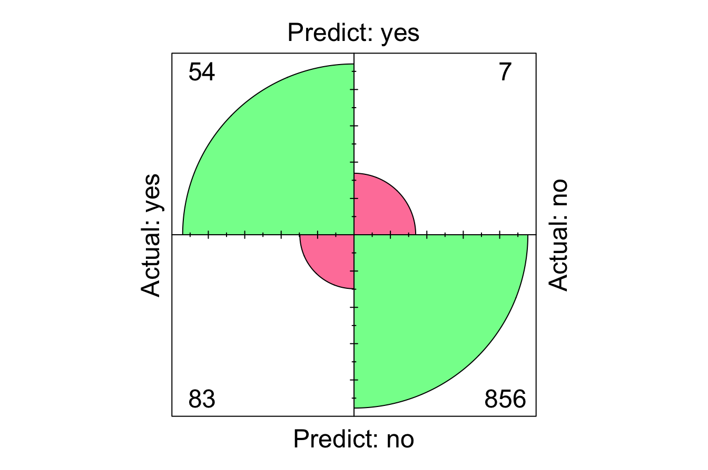
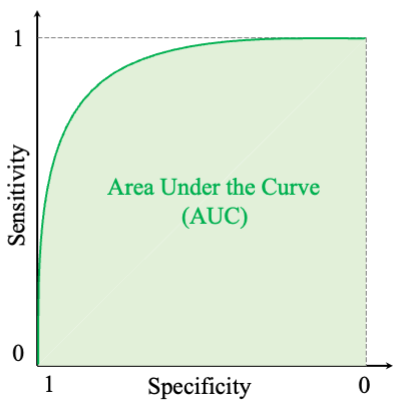

# Model Evaluation {#chapter-evaluation}

As we progress through the Data Science Process, introduced in Chapter \@ref(chapter-intro-DS) and illustrated in Figure \@ref(fig:CRISP-DM), we’ve already completed the first five phases of the Data Science Workflow:  

1. **Problem Understanding**: Defining the problem we aim to solve.  
2. **Data Preparation**: Cleaning, transforming, and organizing the data for analysis.  
3. **Exploratory Data Analysis (EDA)**: Gaining insights and uncovering patterns in the data.  
4. **Preparing Data to Model**: Setting up the data for modeling by scaling, encoding, and partitioning.  
5. **Modeling**: Applying algorithms to make predictions or extract insights—such as the kNN classification method we explored in the previous chapter.  

Now, we arrive at the **Model Evaluation** phase, a pivotal step in the Data Science Process. This phase answers the critical question: *How well does our model perform?*

### Why Is Model Evaluation Important? {-}

Building a model is just the beginning. The true test of a model lies in its ability to generalize to **new, unseen data**. Without proper evaluation, a model may appear successful during development but fail in real-world applications. 

Consider this example:  
You’ve built a model to detect fraudulent credit card transactions, and it achieves 95% accuracy. Impressive, right? But if only 1% of the transactions are actually fraudulent, your model might simply classify every transaction as legitimate, ignoring all fraud cases. This highlights a crucial point: **accuracy alone can be misleading, especially in imbalanced datasets**.  

Model evaluation goes beyond simplistic metrics like accuracy. It provides a nuanced understanding of a model’s: 

- **Strengths**: What the model does well (e.g., detecting true positives).  
- **Weaknesses**: Where it falls short (e.g., missing fraud cases or generating false alarms).  
- **Trade-offs**: The balance between competing priorities, such as sensitivity vs. specificity or precision vs. recall.  

In short, model evaluation ensures that a model aligns with the real-world goals of the problem. It helps answer questions such as:  

- How well does the model handle imbalanced datasets?  
- Is it good at identifying true positives (e.g., detecting cancer)?  
- Does it minimize false positives (e.g., incorrectly flagging legitimate emails as spam)?  

As George Box famously said, *"All models are wrong, but some are useful."* A model is always a simplification of reality. It cannot capture every nuance or complexity, but if properly evaluated, it can provide actionable insights and guide decisions effectively. Evaluation metrics help us judge whether a model is "useful enough" to meet the needs of the problem we’re solving.

In this chapter, we’ll explore how to evaluate classification models, starting with **binary classification**, where the target variable has two categories (e.g., spam vs. not spam). We’ll then discuss metrics for **multi-class classification**, where there are more than two categories (e.g., types of vehicles: car, truck, bike). Finally, we’ll touch on evaluation metrics for **regression models**, where the target variable is continuous (e.g., predicting house prices).

Our goal is to build a strong foundation in model evaluation, helping you confidently assess model performance and make data-driven decisions. Let’s begin with the cornerstone of classification evaluation: the **Confusion Matrix**.

## Confusion Matrix  

The **confusion matrix** is the cornerstone of evaluating classification models. It provides a detailed snapshot of how well a model’s predictions align with actual outcomes by categorizing predictions into four distinct groups. For binary classification problems, the confusion matrix is typically organized as shown in Table \@ref(tab:confusion-matrix).  

In classification tasks, we often focus on the model’s ability to distinguish one class of interest (the **positive class**) from another (the **negative class**). For instance, in a fraud detection scenario, fraudulent transactions might be the positive class, while legitimate ones are the negative class.

Table: (\#tab:confusion-matrix) Confusion matrix summarizing correct and incorrect predictions for binary classification problems. The **positive class** refers to the class of interest, while the **negative class** represents the other category.

| **Predicted**     | Positive   | Negative   |
|--------------------|------------|------------|
| **Actual Positive** | <span style="color: green;"> True Positive (TP) </span> | <span style="color: red;"> False Negative (FN) </span> |
| **Actual Negative** | <span style="color: red;"> False Positive (FP) </span>  | <span style="color: green;"> True Negative (TN) </span> |

Let’s break down these terms:

- **True Positives (TP)**: Cases where the model correctly predicts the positive class (e.g., fraud detected as fraud).  
- **False Positives (FP)**: Cases where the model incorrectly predicts the positive class (e.g., legitimate transactions flagged as fraud).  
- **True Negatives (TN)**: Cases where the model correctly predicts the negative class (e.g., legitimate transactions classified as legitimate).  
- **False Negatives (FN)**: Cases where the model fails to predict the positive class (e.g., fraud classified as legitimate).  

If this structure feels familiar, it’s because it mirrors the concept of **type I and type II errors** introduced in Chapter \@ref(chapter-statistics) on hypothesis testing. The diagonal elements of the confusion matrix (TP and TN) represent correct predictions, while the off-diagonal elements (FP and FN) capture incorrect ones.  

### Calculating Key Metrics {-}

Using the counts from the confusion matrix, we can calculate basic performance metrics for the model, such as **accuracy** (also know as **success rate**) and **error rate**:  

\[
\text{Accuracy} = \frac{\text{TP} + \text{TN}}{\text{TP} + \text{FP} + \text{FN} + \text{TN}}
\]

\[
\text{Error Rate} = 1 - \text{Accuracy} = \frac{\text{FP} + \text{FN}}{\text{TP} + \text{FP} + \text{FN} + \text{TN}}
\]

**Accuracy** is the proportion of correct predictions (both TP and TN) among all predictions made by the model. It gives a general sense of how well the model performs. And conversely, the **Error Rate** is the proportion of incorrect predictions (FP and FN) among all predictions. While accuracy gives an overall sense of model performance, it does not differentiate between types of errors. For example, in imbalanced datasets where one class dominates, accuracy may appear high even if the model performs poorly at detecting the minority class. This is why we need more nuanced metrics, such as sensitivity, specificity, precision, and recall, which we’ll explore in later sections.

::: {.example #ex-confusion-matrix-kNN}
Let’s revisit the k-Nearest Neighbors (kNN) model we built in Chapter \@ref(chapter-knn) to classify the `churn` dataset. Using the confusion matrix, we can evaluate how well this model performs on the test data.  

Here’s how we apply the kNN model and generate the confusion matrix for its predictions:  


```r
# Load the churn dataset
data(churn)

# Partition the data into training and testing sets
set.seed(43)

data_sets = partition(data = churn, ratio = c(0.8, 0.2))
train_set = data_sets$part1
test_set  = data_sets$part2
actual_test = test_set$churn

# Build and predict using the kNN model
formula = churn ~ account.length + voice.plan + voice.messages + 
                  intl.plan + intl.mins + intl.calls + 
                  day.mins + day.calls + eve.mins + eve.calls + 
                  night.mins + night.calls + customer.calls

kNN_predict = kNN(formula = formula, train = train_set, 
                  test = test_set, k = 5, scaler = "minmax")
```

For more details on how the kNN model was built, refer to Section \@ref(sec-kNN-churn).  

Now, we’ll generate the confusion matrix for the predictions using the `conf.mat()` function from the **liver** package:  


```r
conf.mat(kNN_predict, actual_test)
   Setting levels: reference = "yes", case = "no"
          Actual
   Predict yes  no
       yes  54   7
       no   83 856
```


```
   Setting levels: reference = "yes", case = "no"
```

The confusion matrix summarizes the model’s performance. For example:  

- **True Positives (TP)**: 54 cases where churn was correctly predicted.  
- **True Negatives (TN)**: 856 cases where non-churn was correctly predicted.  
- **False Positives (FP)**: 83 cases where the model falsely predicted churn.  
- **False Negatives (FN)**: 7 cases where churn was missed.  

We can also visualize the confusion matrix using the `conf.mat.plot()` function from the **liver** package:


```r
conf.mat.plot(kNN_predict, actual_test)
   Setting levels: reference = "yes", case = "no"
```



Using the confusion matrix, we can calculate the following metrics for our kNN model:  

\[
\text{Accuracy} = \frac{\text{TP} + \text{TN}}{\text{Total Predictions}} = \frac{54 + 856}{1000} = 0.91
\]

\[
\text{Error Rate} = \frac{\text{FP} + \text{FN}}{\text{Total Predictions}} = \frac{83 + 7}{1000} = 0.09
\]

These values give us a sense of the overall performance of the model. However, accuracy and error rate don’t provide insights into specific errors, such as how well the model detects true positives or avoids false positives. For these insights, we need to explore additional metrics like sensitivity, specificity, precision, and recall, which we’ll cover next.
:::

## Sensitivity and Specificity  

In classification, it’s important to evaluate not just how many predictions are correct overall, but how well the model identifies specific classes. **Sensitivity** and **Specificity** are two complementary metrics that focus on the model’s ability to distinguish between positive and negative classes.

### Sensitivity {-}

**Sensitivity** (also called **Recall** in some fields, like information retrieval) measures the model’s ability to correctly identify positive cases. It answers the question:  

> *“Out of all the actual positives, how many did the model correctly predict?”*  

Mathematically, sensitivity is defined as:  

\[
\text{Sensitivity} = \frac{\text{True Positives (TP)}}{\text{True Positives (TP)} + \text{False Negatives (FN)}}
\]

Let’s compute sensitivity for the **k-Nearest Neighbors (kNN)** model built in Chapter \@ref(chapter-knn), where we predicted whether customers churned (`churn = yes`). Sensitivity in this case reflects the percentage of churners correctly identified by the model. Using the confusion matrix from Example \@ref(exm:ex-confusion-matrix-kNN):  

\[
\text{Sensitivity} = \frac{\text{TP}}{\text{TP} + \text{FN}} = \frac{54}{54 + 7} = 0.885
\]

This means that our model has correctly identified 88.5% of actual churners.  

A **perfect model** would achieve a sensitivity of **1.0 (100%)**, meaning it correctly identifies all positive cases. However, it’s important to note that even a naïve model that classifies *all* customers as churners would also achieve 100% sensitivity. This illustrates that sensitivity alone isn’t enough to evaluate a model’s performance—it must be paired with other metrics to capture the full picture.  

### Specificity {-}

While sensitivity focuses on the positive class, **Specificity** measures the model’s ability to correctly identify negative cases. It answers the question:  

> *“Out of all the actual negatives, how many did the model correctly predict?”*  

Specificity is particularly important in situations where avoiding false positives is critical. For example, in spam detection, incorrectly marking a legitimate email as spam (a false positive) can have more severe consequences than missing a few spam messages. Mathematically, specificity is defined as:  

\[
\text{Specificity} = \frac{\text{True Negatives (TN)}}{\text{True Negatives (TN)} + \text{False Positives (FP)}}
\]

Using the kNN model and the confusion matrix from Example \@ref(exm:ex-confusion-matrix-kNN), let’s calculate the specificity for identifying non-churners (`churn = no`):  

\[
\text{Specificity} = \frac{\text{TN}}{\text{TN} + \text{FP}} = \frac{856}{856 + 83} = 0.912
\]

This means the model correctly classified 91.2% of the actual non-churners as not leaving the company.  

A good classification model should ideally achieve **high sensitivity and high specificity**, but the relative importance of these metrics depends on the problem domain. For example, in medical diagnostics, sensitivity is often prioritized to ensure no disease cases are missed, while in credit scoring, specificity might take precedence to avoid mistakenly classifying reliable customers as risks. For the kNN model in Example \@ref(exm:ex-confusion-matrix-kNN), sensitivity is 0.885 while specificity is 0.912. This trade-off may be acceptable in this instance, as identifying churners (sensitivity) might be more critical than avoiding false positives (specificity). In the next section, we’ll explore metrics like precision and recall, which further refine model evaluation.

## Precision, Recall, and F1-Score  

In addition to sensitivity and specificity, **Precision**, **Recall**, and the **F1-Score** offer deeper insights into a classification model’s performance. These metrics are particularly valuable in scenarios with imbalanced datasets, where simple accuracy can be misleading.

**Precision** (also called the **positive predictive value**) measures how many of the model’s predicted positives are actually positive. It answers the question: *“When the model predicts positive, how often is it correct?”* The formula is:  
\[
\text{Precision} = \frac{\text{TP}}{\text{TP} + \text{FP}}
\]
Precision is especially important in applications where false positives are costly. For example, in fraud detection, flagging legitimate transactions as fraudulent can lead to customer dissatisfaction and unnecessary investigations.

**Recall** (which is equivalent to sensitivity) measures the model’s ability to identify positive cases. It answers the question: *“Out of all the actual positives, how many did the model correctly predict?”* The formula is:  
\[
\text{Recall} = \frac{\text{TP}}{\text{TP} + \text{FN}}
\]
While recall is often used interchangeably with sensitivity in medical diagnostics, it is more commonly referred to as recall in areas like information retrieval, spam detection, and text classification. Recall is particularly useful in cases where missing positive cases (false negatives) could have serious consequences, such as failing to diagnose a disease or missing spam emails.

There is an inherent trade-off between precision and recall: increasing one often decreases the other. For example, a model with high recall might correctly flag most fraudulent transactions but could also mislabel many legitimate transactions as fraud (low precision). Conversely, a model with high precision might flag only a few transactions as fraud (mostly correct), but it could miss many actual fraud cases (low recall).

To balance this trade-off, the **F1-Score** combines precision and recall into a single metric. It is the harmonic mean of precision and recall, emphasizing their balance:  
\[
F1 = 2 \cdot \frac{\text{Precision} \cdot \text{Recall}}{\text{Precision} + \text{Recall}} 
   = \frac{2 \cdot \text{TP}}{2 \cdot \text{TP} + \text{FP} + \text{FN}}
\]
The F1-Score is particularly useful in cases of imbalanced datasets, where one class dominates the other. Unlike accuracy, it considers both false positives and false negatives, providing a more balanced evaluation of the model’s predictive performance.

Let’s calculate precision, recall, and the F1-Score for the **k-Nearest Neighbors (kNN)** model from Example \@ref(exm:ex-confusion-matrix-kNN), which predicts customer churn (`churn = yes`). First, precision quantifies how often the model’s predicted churners were actual churners:
\[
\text{Precision} = \frac{\text{TP}}{\text{TP} + \text{FP}} = \frac{54}{54 + 83} = 0.394
\]
This means that when the model predicts churn, it is correct 39.4% of the time.

Next, recall measures how many of the actual churners were correctly identified by the model:
\[
\text{Recall} = \frac{\text{TP}}{\text{TP} + \text{FN}} = \frac{54}{54 + 7} = 0.885
\]
This shows that the model successfully identifies 88.5% of the actual churners.

Finally, the F1-Score provides a single measure that balances precision and recall:
\[
F1 = \frac{2 \cdot 54}{2 \cdot 54 + 83 + 7} = 0.545
\]
The F1-Score indicates how well the model balances precision and recall, offering a comprehensive evaluation of its ability to correctly identify churners while minimizing false predictions. This balance makes the F1-Score especially useful when comparing multiple models, as it provides a single number summarizing performance.

While the F1-Score is a valuable metric, it assumes that precision and recall are equally important, which may not always align with the priorities of a particular problem. For instance, in medical diagnostics, recall (ensuring no cases are missed) might be more critical than precision, whereas in spam filtering, precision (avoiding false positives) might take precedence. As such, the F1-Score should be used alongside other metrics to fully understand a model’s strengths and weaknesses. For a more comprehensive evaluation, we now turn to metrics that assess performance across thresholds, as described in the coming sections.

## Taking Uncertainty into Account  

When evaluating a classification model, the confusion matrix and derived metrics like precision, recall, and F1-score provide valuable insights into its performance. However, these metrics are based on discrete predictions, where the model has already classified observations as either positive or negative. In doing so, we lose a critical layer of information: the **uncertainty** or **confidence** behind each prediction. Most classification models, including **k-Nearest Neighbors (kNN)**, can provide probabilities for each class instead of binary predictions. These probabilities quantify how confident the model is in its predictions, offering a powerful tool for fine-tuning its behavior to better align with the requirements of the task.

Making a prediction can be viewed as **thresholding** the model’s probability output. By default, a threshold of 0.5 is used: if the probability of belonging to the positive class is 50% or greater, the model predicts the positive class. Otherwise, it predicts the negative class. While this default threshold works in many cases, it is not universal. Adjusting the threshold can significantly impact the model’s performance, allowing it to better align with **business goals** or **domain-specific needs**. For example, in some applications, false negatives may be far more costly than false positives—or vice versa. By experimenting with different thresholds, we can explore the trade-offs between sensitivity, specificity, precision, and recall to optimize the model’s performance.

:::{.example #ex-confusion-matrix-kNN-prob}
Let’s revisit the **k-Nearest Neighbors (kNN)** model from Example \@ref(exm:ex-confusion-matrix-kNN) to predict customer churn (`churn = yes`). This time, instead of making discrete predictions, we’ll obtain probabilities for the positive class by setting the `type` parameter to `"prob"` in the `kNN()` function:


```r
kNN_prob = kNN(formula = formula, train = train_set, 
               test = test_set, k = 5, scaler = "minmax",
               type = "prob")
kNN_prob[1:10, ]
      yes  no
   6  0.4 0.6
   10 0.2 0.8
   17 0.0 1.0
   19 0.0 1.0
   21 0.0 1.0
   23 0.2 0.8
   29 0.0 1.0
   31 0.0 1.0
   36 0.0 1.0
   40 0.0 1.0
```

The output lists the first 10 probabilities for each class: the first column corresponds to the positive class (`churn = yes`), while the second column corresponds to the negative class (`churn = no`). For example, for the first row, a probability of 0.4 indicates that the model is 40% confident that the customer will churn, while a probability of 0.6 suggests a 60% confidence that the customer will not churn. By modifying the threshold for classification, we can adjust how the model determines whether a prediction is positive or negative.

Now, let’s calculate the confusion matrix for the model at two different thresholds: 0.5 (the default) and 0.7:


```r
conf.mat(kNN_prob[, 1], actual_test, cutoff = 0.5)
   Setting levels: reference = "yes", case = "no"
          Actual
   Predict yes  no
       yes  54   7
       no   83 856
conf.mat(kNN_prob[, 1], actual_test, cutoff = 0.7)
   Setting levels: reference = "yes", case = "no"
          Actual
   Predict yes  no
       yes  22   1
       no  115 862
```

At a threshold of 0.5, the model classifies a customer as a churner if the probability of churn is at least 50%. For this threshold, the confusion matrix will match the one in Example \@ref(exm:ex-confusion-matrix-kNN), as both use the same default cutoff. By raising the threshold to 0.7, the model requires at least 70% confidence to classify a customer as a churner. This change shifts the balance between true positives, true negatives, false positives, and false negatives. For example:

- Lowering the threshold increases **sensitivity**, allowing the model to catch more true positives but potentially leading to more false positives.  
- Raising the threshold increases **specificity**, reducing false positives but potentially missing more true positives.  

Adjusting the threshold is especially important when the costs of false positives and false negatives differ. For instance, in **spam detection**, false positives (marking legitimate emails as spam) can frustrate users, so raising the threshold to prioritize specificity may be preferable. Conversely, in **fraud detection**, missing a fraudulent transaction (false negatives) may be far more costly, so lowering the threshold to prioritize sensitivity would make sense.
:::

Fine-tuning the threshold allows us to align the model’s behavior with **business objectives** or **application-specific goals**. Suppose we require a sensitivity of 90%. By iteratively adjusting the threshold and recalculating sensitivity, we can identify the value that meets this target. This process is known as defining an **operating point** for the model.

However, adjusting the threshold always involves trade-offs. A threshold that maximizes sensitivity may lower precision, as more false positives are classified as positive. Similarly, a threshold that maximizes specificity may reduce recall, as more true positives are misclassified as negative. For example, setting a threshold of 0.9 may result in extremely high specificity but at the cost of missing most true positives.

Ultimately, the choice of threshold depends on the context of the problem and the specific priorities of the application. Whether the focus is on minimizing errors, achieving regulatory compliance, or balancing precision and recall, the threshold should be tailored to meet these objectives. By experimenting with different thresholds, we can optimize the model’s performance to best suit the needs of the task at hand. In the next section, we’ll explore tools like the **Receiver Operating Characteristic (ROC) curve** and **Area Under the Curve (AUC)**, which provide a systematic way to evaluate model performance across a range of thresholds.


## ROC Curve and AUC  

Manually experimenting with thresholds is insightful but often impractical. Additionally, while metrics like sensitivity, specificity, precision, and recall attempt to summarize a model’s performance, they only provide snapshots at specific thresholds. What we need is a way to evaluate how a model performs across a **range of thresholds**, offering a broader view of its behavior. Models often vary in how they achieve their accuracy; two models with similar overall accuracy may excel in entirely different aspects of prediction. For example, one model might identify most positives but misclassify many negatives, while another might do the opposite. To systematically evaluate a model’s performance across all thresholds, we use the **Receiver Operating Characteristic (ROC) curve** and its associated metric, the **Area Under the Curve (AUC)**. These tools provide both a visual and quantitative way to assess a model’s ability to distinguish between positive and negative classes.

The **ROC curve** is a graphical representation of the trade-off between sensitivity (true positive rate) and specificity (true negative rate) across different thresholds. It plots the **True Positive Rate (Sensitivity)** against the **False Positive Rate (1 - Specificity)**. This concept originated in World War II to measure radar receiver performance, distinguishing between true signals and false alarms. In modern machine learning, it’s an invaluable tool for evaluating classifier effectiveness.

The characteristics of an ROC curve are illustrated in Figure \@ref(fig:roc-curve). On the vertical axis, the **True Positive Rate (Sensitivity)** is plotted, while the **False Positive Rate (1 - Specificity)** is plotted on the horizontal axis. Several key scenarios are highlighted in the figure:  
- **Optimal Performance (Green Curve)**: A model with near-perfect performance passes through the top-left corner, achieving both high sensitivity and high specificity.  
- **Good Performance (Blue Curve)**: A model with decent but not perfect performance has a curve that remains closer to the top-left corner than to the diagonal line.  
- **Random Classifier (Diagonal Line)**: The diagonal line (gray dashed) represents a model with no predictive value, classifying purely at random. A classifier close to this line offers little utility.  

<div class="figure" style="text-align: center">

<p class="caption">(\#fig:roc-curve)The ROC curve illustrates the trade-off between sensitivity and specificity at different thresholds. The diagonal line represents a classifier with no predictive value (gray dashed line), while the curves represent varying levels of performance: green for optimal and blue for good.</p>
</div>

Each point on the ROC curve corresponds to a specific threshold. As thresholds vary, the **True Positive Rate (Sensitivity)** and **False Positive Rate (1 - Specificity)** change, tracing the curve. The closer the curve is to the top-left corner, the better the model's performance in distinguishing between classes.  

To construct the ROC curve, a classifier’s predictions are sorted by their estimated probabilities for the positive class. Starting from the origin, each prediction’s impact on sensitivity and specificity is plotted. Correct predictions (true positives) result in vertical movements, while incorrect predictions (false positives) lead to horizontal shifts.  

Let’s apply this concept to the **k-Nearest Neighbors (kNN)** model from Example \@ref(exm:ex-confusion-matrix-kNN-prob), where we obtained probabilities for the positive class (`churn = yes`). We’ll use these probabilities to generate the ROC curve for the model. The **pROC** package in R simplifies this process. Ensure the package is installed using `install.packages("pROC")` before proceeding.

To create an ROC curve, two inputs are needed: the estimated probabilities for the positive class and the actual class labels. Using the `roc()` function from the **pROC** package, we can create the ROC curve object as follows:


```r
library(pROC)

roc_knn <- roc(response = actual_test, predictor = kNN_prob[, 1])
```

We can then visualize the ROC curve using the `ggroc()` function from the **ggplot2** package or the `plot()` function for a basic display. Here’s the ROC curve for the kNN model:


```r
ggroc(roc_knn, colour = "blue") +
    ggtitle("ROC curve for KNN with k = 5, based on churn data")
```

<div class="figure" style="text-align: center">

<p class="caption">(\#fig:roc-knn-churn)ROC curve for KNN with k = 5, based on churn data.</p>
</div>

The ROC curve visually demonstrates the model’s performance across different thresholds. A curve closer to the top-left corner indicates better performance, as it achieves high sensitivity and specificity. The diagonal line represents a random classifier, providing the baseline for comparison. In this case, the kNN model’s ROC curve is much closer to the top-left corner, suggesting strong performance in distinguishing between churners and non-churners.

Another critical metric derived from the ROC curve is the **Area Under the Curve (AUC)**. The AUC quantifies the overall performance of the model, summarizing the ROC curve into a single number. The AUC value represents the probability that a randomly chosen positive instance will have a higher predicted score than a randomly chosen negative instance.  

<div class="figure" style="text-align: center">

<p class="caption">(\#fig:auc)The AUC summarizes the ROC curve into a single number, representing the model’s ability to rank positive cases higher than negative ones. AUC = 1: Perfect model. AUC = 0.5: No better than random guessing.</p>
</div>

Here’s how AUC values are interpreted:  

- **AUC = 1**: Perfect classifier.  
- **AUC = 0.5**: No better than random guessing.  

For the kNN model, we can calculate the AUC as follows:


```r
auc(roc_knn)
   Area under the curve: 0.8494
```

The AUC value for this model is 0.849, indicating that the model ranks positive cases higher than negative ones with a probability of 0.849.  

The ROC curve and AUC offer a comprehensive and systematic way to evaluate classification models, enabling comparisons between models and helping identify the optimal threshold for specific tasks. These tools are particularly valuable when working with imbalanced datasets, as they account for the trade-offs between sensitivity and specificity across all thresholds. By combining these insights with metrics like precision, recall, and F1-score, we can develop a deeper understanding of model performance and select the best approach for the problem at hand.


## Metrics for Multi-Class Classification  

So far, we’ve focused on binary classification, where the target variable has two categories. However, many real-world problems involve **multi-class classification**, where the target variable can belong to three or more categories. Examples include classifying species in ecological studies or identifying different types of vehicles. Evaluating such models requires extending metrics to handle multiple categories effectively.

The confusion matrix for multi-class classification expands to include all classes, with each row representing the actual class and each column representing the predicted class. Correct predictions appear on the diagonal, while off-diagonal elements indicate misclassifications. This structure highlights which classes the model struggles to distinguish.

Metrics like **Accuracy**, **Precision**, **Recall**, and **F1-Score** can be adapted for multi-class problems. For each class, the model is evaluated as if that class were the “positive” class and all others were “negative.” Precision, Recall, and F1-Score are then calculated per class. To summarize overall performance, we compute averages such as:

- **Macro-Average**: Treats all classes equally by taking the unweighted mean of metrics across classes.  
- **Micro-Average**: Aggregates predictions across all classes, giving more weight to larger classes.  
- **Weighted-Average**: Weights each class’s metric by its frequency in the dataset.  

These metrics ensure a balanced evaluation, especially when dealing with imbalanced datasets, where some classes may have significantly fewer samples than others.

While metrics like the ROC curve and AUC are designed for binary classification, they can be adapted to multi-class problems using techniques like one-vs-all (evaluating each class against all others). However, for most applications, metrics like macro-averaged F1-Score provide a clear and practical summary of a multi-class model’s performance.

By using these metrics, we can evaluate how well the model performs across all categories, identify weaknesses in specific classes, and ensure that the model aligns with the requirements of the task.


## Evaluation Metrics for Continuous Targets  

While we’ve focused on evaluating classification models so far, many real-world problems involve predicting continuous target variables, such as house prices, stock market trends, or weather forecasts. These problems require **regression models**, which are assessed using metrics designed for continuous data.  

One of the most common evaluation metrics for regression models is the **Mean Squared Error (MSE)**:
\[
\text{MSE} = \frac{1}{n} \sum_{i=1}^{n} (y_i - \hat{y}_i)^2
\]
Here, \(y_i\) represents the actual value, \(\hat{y}_i\) is the predicted value, and \(n\) is the number of observations. The MSE measures the average squared difference between predicted and actual values, penalizing larger errors more heavily. Lower MSE values indicate better model performance, with zero representing a perfect fit.

Although widely used, MSE has some limitations, particularly its sensitivity to outliers. For a more robust evaluation, we can use the **Mean Absolute Error (MAE)**, which calculates the average absolute difference between predicted and actual values:
\[
\text{MAE} = \frac{1}{n} \sum_{i=1}^{n} |y_i - \hat{y}_i|
\]
Unlike MSE, the MAE treats all errors equally, making it less sensitive to extreme values and more interpretable in certain contexts. It’s particularly useful when the target variable has a skewed distribution or when outliers are present.

Another widely used metric for regression models is the **\(R^2\) score**, or **coefficient of determination**. The \(R^2\) score measures the proportion of variance in the target variable that the model explains. It ranges from 0 to 1, where higher values indicate a better fit. An \(R^2\) of 1 implies the model perfectly predicts the target variable, while a value of 0 suggests the model provides no better predictions than the mean.

These metrics provide a starting point for evaluating regression models, but the choice of metric depends on the specific problem and goals. For instance, when prioritizing interpretability, MAE might be more meaningful, whereas MSE is more useful when larger errors must be penalized. We will explore these metrics in greater depth in Chapter \@ref(chapter-regression), where we dive into regression modeling techniques.

## Summary  

In this chapter, we explored the critical step of **Model Evaluation**, which determines how well a model performs and whether it meets the requirements of the problem at hand. Starting with the foundational concepts, we examined metrics for evaluating classification models, including **binary**, **multi-class**, and **regression** models.  

### Key Takeaways {-}

- **Binary Classification Metrics**:  
  We began by understanding the **confusion matrix**, which categorizes predictions into true positives, true negatives, false positives, and false negatives. From this, we derived metrics like **accuracy**, **sensitivity (recall)**, **specificity**, **precision**, and the **F1-Score** to evaluate the trade-offs between different types of errors.  

- **Threshold Tuning**:  
  Recognizing the impact of probability thresholds on model predictions, we discussed how adjusting thresholds can help align a model with specific goals, such as maximizing sensitivity for critical applications or prioritizing specificity to avoid false positives.  

- **ROC Curve and AUC**:  
  To evaluate model performance across all possible thresholds, we introduced the **Receiver Operating Characteristic (ROC) curve** and the **Area Under the Curve (AUC)**. These tools provide a systematic and visual way to assess a model's ability to distinguish between classes, particularly useful for comparing multiple models.  

- **Multi-Class Classification**:  
  For multi-class problems, we extended metrics like precision, recall, and F1-Score by calculating per-class metrics and aggregating them using methods such as **macro-average**, **micro-average**, and **weighted-average**. This ensures a balanced evaluation, even for imbalanced datasets.  

- **Regression Metrics**:  
  Finally, we covered metrics for evaluating regression models, such as **Mean Squared Error (MSE)**, **Mean Absolute Error (MAE)**, and the **\(R^2\) score**, which measure the accuracy of predictions for continuous target variables. These metrics offer flexibility depending on whether minimizing large errors or achieving interpretability is more important.

### Closing Thoughts {-}

This chapter emphasized that no single metric can capture the full picture of a model's performance. Instead, evaluation should consider the specific goals and constraints of the problem, whether minimizing errors, handling imbalanced data, or aligning with business objectives. Proper evaluation ensures that a model is not only accurate but also actionable and reliable in real-world applications.  

By mastering these evaluation techniques, you are now equipped to critically assess model performance, optimize thresholds, and select the right model for the task at hand. In the following chapters, we will build on this foundation to explore advanced modeling techniques and their evaluation in greater detail.
