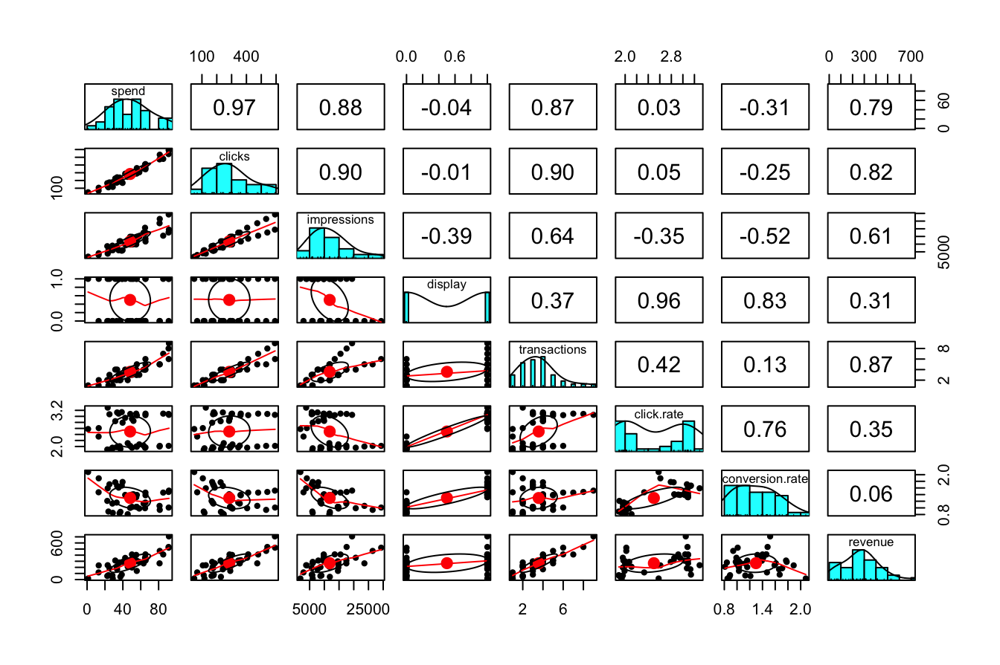
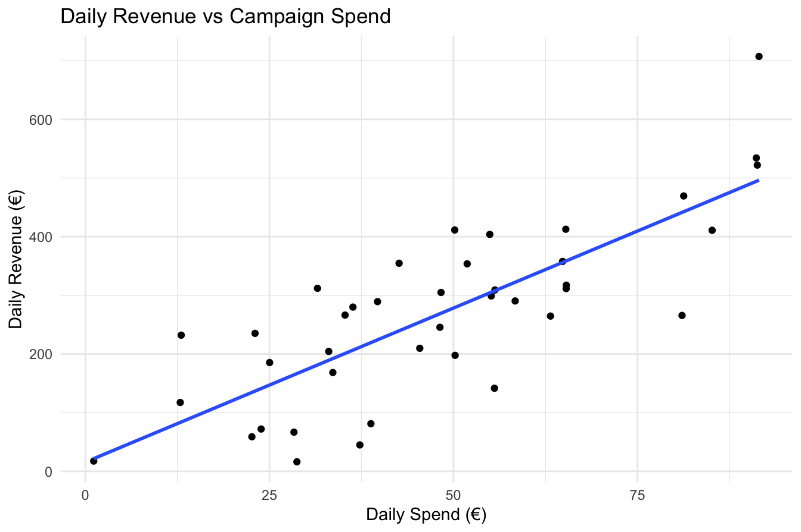
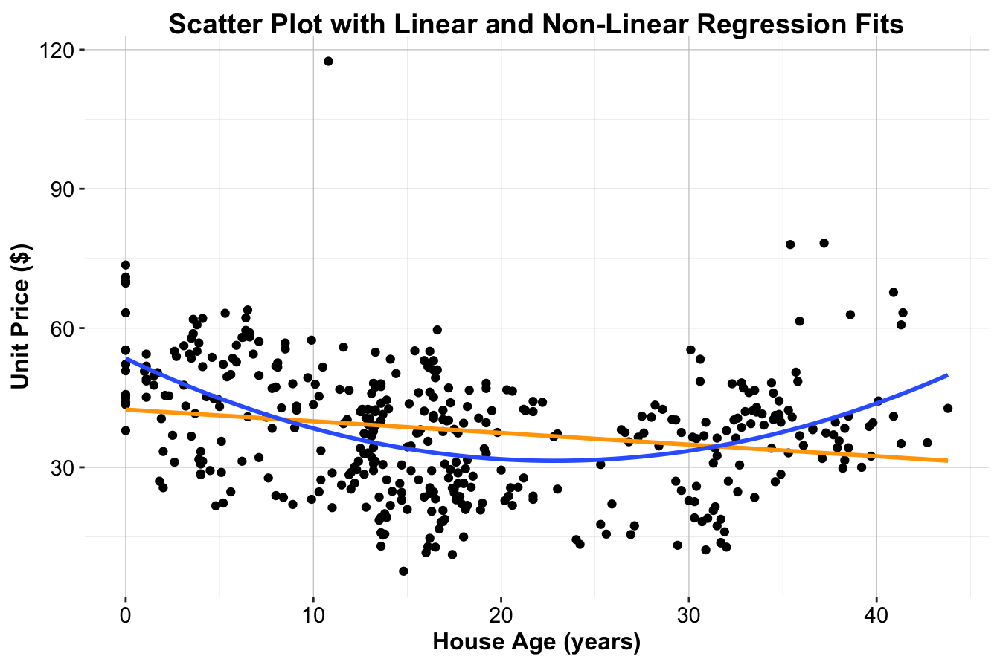
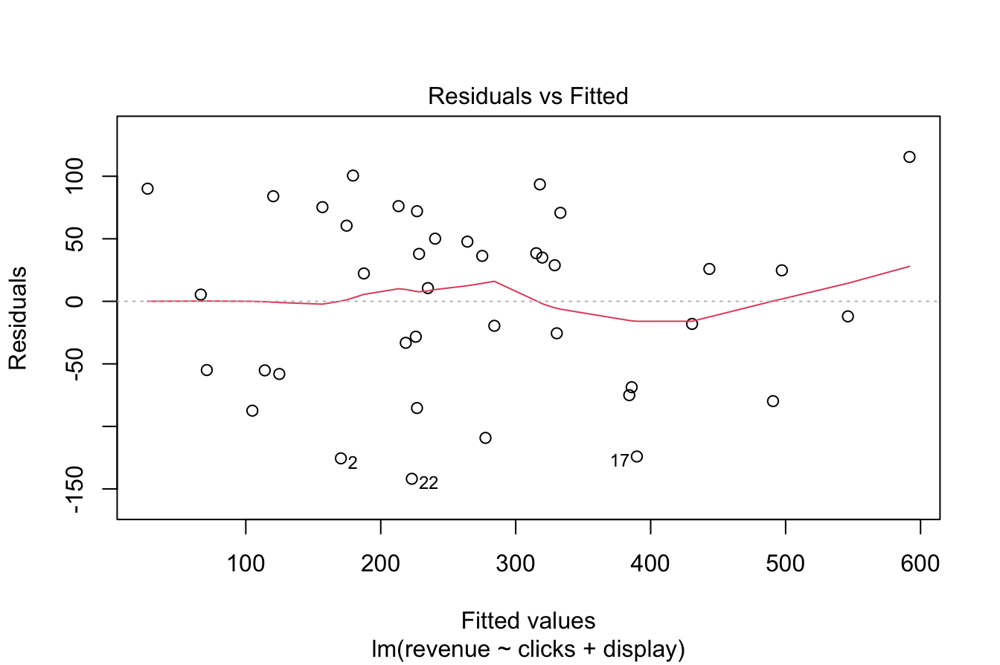
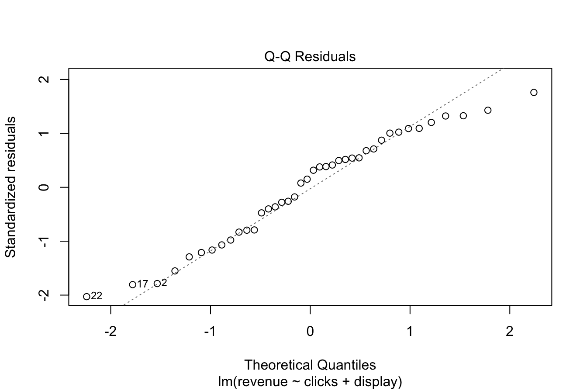
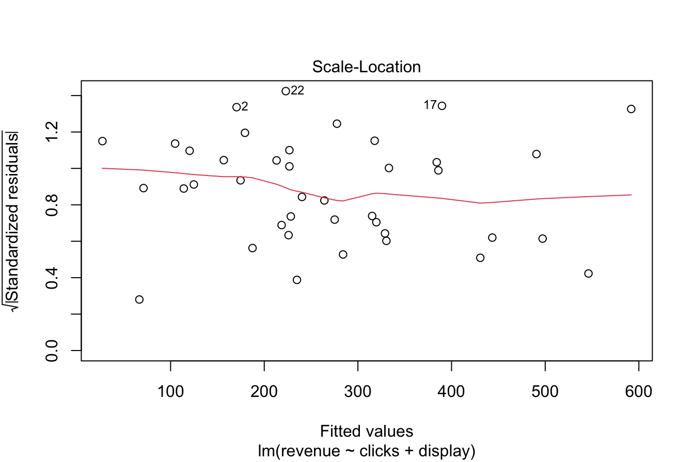
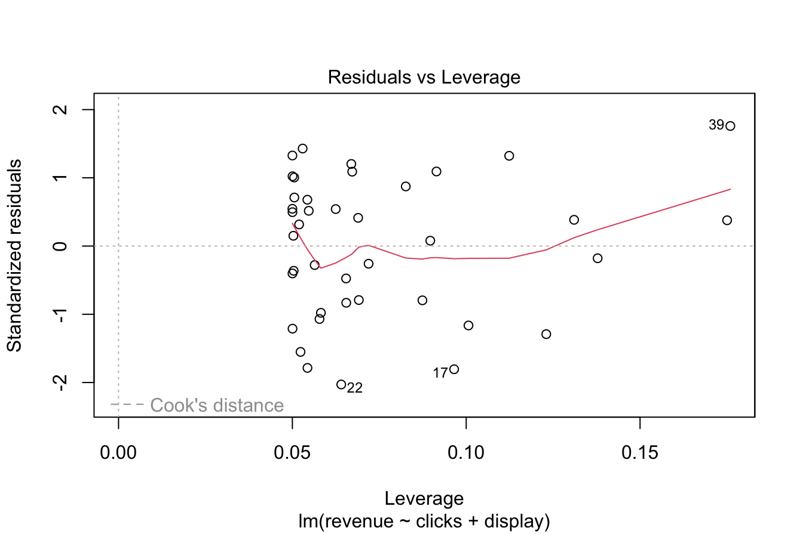

# Regression Analysis: Foundations and Applications {#chapter-regression}  

*Regression analysis* has been a fundamental tool in statistical modeling for centuries and remains one of the most versatile techniques in data science. Its mathematical foundations were established by early statisticians such as Legendre and Gauss, who developed the least squares method. Since then, regression analysis has evolved into a widely used framework for examining relationships between variables. With advancements in computing and programming languages such as R, it is now accessible and scalable for addressing complex real-world problems.  

Regression models provide a systematic approach for quantifying relationships, uncovering patterns, and making predictions. These models are applied across diverse fields, including economics, medicine, and engineering, to estimate effects, forecast outcomes, and support data-driven decision-making. Whether predicting the impact of advertising expenditure on sales, modeling housing prices, or identifying risk factors for disease, regression analysis serves as a cornerstone of statistical modeling.  
As Charles Wheelan describes in [*Naked Statistics*](https://www.goodreads.com/book/show/15786586-naked-statistics)[@wheelan2013naked], *"Regression modeling is the hydrogen bomb of the statistics arsenal."* This analogy highlights the method’s immense power—when used correctly, it provides a formidable tool for making informed decisions, but its misuse can lead to misleading conclusions.  

This chapter provides a structured introduction to regression techniques, beginning with simple linear regression and extending to multiple regression, generalized linear models (GLMs), and non-linear regression approaches. Throughout, we will apply these techniques to real-world datasets, including an *online marketing dataset* for modeling the impact of digital advertising on revenue and a *housing price dataset* to explore the relationship between property attributes and market value. By the end, readers will have a solid foundation in both the theoretical principles and practical applications of regression modeling in R, enabling them to analyze and interpret real-world data effectively.  

## Simple Linear Regression {#sec-simple-regression}

Simple linear regression is the most fundamental regression model, allowing us to quantify the relationship between a *single predictor* and a *response variable*. It provides a straightforward approach to estimating how changes in one variable influence another. By focusing on a single predictor, we establish a clear understanding of regression mechanics before extending the model to multiple predictors.

To illustrate simple linear regression, we use the *marketing* dataset from the **liver** package. This dataset captures *daily digital marketing activities* and their impact on *revenue generation*, making it an ideal real-world example for regression analysis. It includes key performance indicators of *online advertising campaigns*, such as expenditure, user engagement metrics, and daily revenue.

The dataset consists of 40 observations and 8 variables:

- `spend`: Daily expenditure on pay-per-click (PPC) advertising.  
- `clicks`: Number of clicks on advertisements.  
- `impressions`: Number of times ads were displayed to users.  
- `transactions`: Number of completed transactions per day.  
- `click.rate`: Click-through rate (CTR), calculated as the proportion of impressions resulting in clicks.  
- `conversion.rate`: Conversion rate, representing the proportion of clicks leading to transactions.  
- `display`: Whether a display campaign was active (`yes` or `no`).  
- `revenue`: Total daily revenue (response variable).  

We begin by loading the dataset and examining its structure:


``` r
library(liver)

data(marketing, package = "liver")

str(marketing)
   'data.frame':	40 obs. of  8 variables:
    $ spend          : num  22.6 37.3 55.6 45.4 50.2 ...
    $ clicks         : int  165 228 291 247 290 172 68 112 306 300 ...
    $ impressions    : int  8672 11875 14631 11709 14768 8698 2924 5919 14789 14818 ...
    $ display        : int  0 0 0 0 0 0 0 0 0 0 ...
    $ transactions   : int  2 2 3 2 3 2 1 1 3 3 ...
    $ click.rate     : num  1.9 1.92 1.99 2.11 1.96 1.98 2.33 1.89 2.07 2.02 ...
    $ conversion.rate: num  1.21 0.88 1.03 0.81 1.03 1.16 1.47 0.89 0.98 1 ...
    $ revenue        : num  58.9 44.9 141.6 209.8 197.7 ...
```

The dataset contains 8 variables and 40 observations. The response variable, `revenue`, is continuous, while the remaining 7 variables serve as potential predictors.

### Exploring Relationships in the Data {-}

Before constructing a regression model, we first explore the relationships between variables to ensure that our assumptions hold and to identify strong predictors. A useful tool for this is the `pairs.panels()` function from the **psych** package, which provides a comprehensive overview of pairwise relationships:


``` r
library(psych)

pairs.panels(marketing)
```



This visualization includes:

- *Scatter plots* (lower triangle), showing how each predictor relates to the response variable.  
- *Histograms* (diagonal), illustrating the distribution of each variable.  
- *Correlation coefficients* (upper triangle), quantifying the strength and direction of linear associations.  

From the correlation matrix, we observe that `spend` and `revenue` exhibit a *strong positive correlation* of 0.79. This suggests that *higher advertising expenditure is associated with higher revenue*, making `spend` a strong candidate for predicting `revenue`. 

In the next section, we formalize this relationship using a *simple linear regression model*.

### Fitting a Simple Linear Regression Model {-}

A logical starting point in regression analysis is examining the relationship between a single predictor and the response variable. This allows for a clearer understanding of how one variable influences another before incorporating additional predictors into more complex models. Here, we investigate how advertising expenditure (`spend`) affects daily revenue (`revenue`) using a simple linear regression model.

Before fitting the model, it is essential to visualize the relationship between these variables to assess whether a linear assumption is reasonable. A scatter plot with a fitted least-squares regression line provides insight into the strength and direction of the relationship:

<div class="figure" style="text-align: center">

<p class="caption">(\#fig:scoter-plot-simple-reg)Scatter plot of daily revenue (€) versus daily spend (€) for 40 observations, with the fitted least-squares regression line (blue) showing the linear relationship.</p>
</div>

Figure \@ref(fig:scoter-plot-simple-reg) illustrates the relationship between `spend` and `revenue` in the *marketing* dataset. The scatter plot suggests a positive association, indicating that increased advertising expenditure is generally linked to higher revenue.

A simple linear regression model is mathematically expressed as:

\[
\hat{y} = b_0 + b_1x
\]

where:

- \( \hat{y} \) represents the predicted value of the response variable (`revenue`).  
- \( x \) denotes the predictor variable (`spend`).  
- \( b_0 \) is the intercept, indicating the estimated revenue when no advertising expenditure is made.  
- \( b_1 \) is the slope, representing the expected change in revenue for a one-unit increase in `spend`.  

This formulation provides a framework for estimating the relationship between advertising expenditure and revenue, which we will now proceed to quantify.

### Estimating the Model in R {-}  

To estimate the regression coefficients, we use the `lm()` function in R, which fits a linear model using the least squares method. The syntax follows the format:  

```r
lm(response_variable ~ predictor_variable, data = dataset)
```  

For our analysis, we model `revenue` as a function of `spend`:  


``` r
simple_reg = lm(revenue ~ spend, data = marketing)
```

After fitting the model, we summarize the results using the `summary()` function:  


``` r
summary(simple_reg)
   
   Call:
   lm(formula = revenue ~ spend, data = marketing)
   
   Residuals:
        Min       1Q   Median       3Q      Max 
   -175.640  -56.226    1.448   65.235  210.987 
   
   Coefficients:
               Estimate Std. Error t value Pr(>|t|)    
   (Intercept)  15.7058    35.1727   0.447    0.658    
   spend         5.2517     0.6624   7.928 1.42e-09 ***
   ---
   Signif. codes:  0 '***' 0.001 '**' 0.01 '*' 0.05 '.' 0.1 ' ' 1
   
   Residual standard error: 93.82 on 38 degrees of freedom
   Multiple R-squared:  0.6232,	Adjusted R-squared:  0.6133 
   F-statistic: 62.86 on 1 and 38 DF,  p-value: 1.415e-09
```

The `summary()` output provides key insights into the estimated model. The regression equation based on the estimated coefficients is:  

\[
\hat{\text{revenue}} = 15.71 + 5.25 \cdot \text{spend}
\]

where:  

- The **intercept** (\(b_0\)) is 15.71, representing the estimated daily revenue when no money is spent on advertising (`spend = 0`).  
- The **slope** (\(b_1\)) is 5.25, meaning that for each additional €1 spent on advertising, daily revenue is expected to increase by approximately €5.25.  

Beyond the estimated coefficients, the `summary()` output provides several key metrics for evaluating the regression model:  

- **Estimate**: The estimated values of the intercept and slope.  
- **Standard error**: Measures the variability of each coefficient estimate. Smaller standard errors indicate more precise estimates.  
- **t-value and p-value**: The t-value quantifies how many standard errors the coefficient is from zero, while the p-value assesses statistical significance. A small p-value (typically < 0.05) suggests that the predictor has a significant impact on the response variable.  
- **Multiple R-squared (\(R^2\))**: Measures the proportion of variance in `revenue` explained by `spend`. Here, \(R^2 = 0.623\), meaning that **62.3% of the variation in revenue is explained by advertising spend**.  
- **Residual standard error (RSE)**: Provides an estimate of the typical prediction error. In this case, \(RSE = 93.82\), indicating that, on average, predictions deviate from actual revenue values by approximately €93.82.  

The results confirm a statistically significant relationship between advertising spend and revenue, supporting the use of regression analysis for business decision-making. In the next section, we explore how this model can be applied for prediction and how residual analysis helps validate model assumptions.  

### Interpreting the Regression Line {-}  

The regression line provides a mathematical approximation of the relationship between advertising spend and revenue. Once the model is estimated, it can be used for prediction. Suppose a company wants to estimate the expected revenue for a day when €25 is spent on pay-per-click (PPC) advertising. Using the regression equation:

\begin{equation} 
\begin{split}
\hat{\text{revenue}} & = 15.71 + 5.25 \cdot 25 \\
 & = 147
\end{split}
\end{equation}
Thus, the predicted daily revenue is approximately €147.  

This predictive capability is particularly valuable for marketing teams planning advertising budgets. For example, if the goal is to maximize returns while controlling costs, the model provides an evidence-based estimate of how revenue responds to different levels of spending. Decision-makers can use this information to determine optimal advertising expenditures, set performance targets, and allocate marketing resources efficiently.  

### Residuals and Model Fit {-}  

Residuals measure the difference between observed and predicted values, providing insight into how well the regression model fits the data. The residual for an observation is calculated as:

\[
\text{Residual} = y - \hat{y}
\]

where \(y\) is the actual observed value, and \(\hat{y}\) is the predicted value from the regression model. For example, suppose a day in the dataset has a marketing spend of €25 and an actual revenue of 185.36. The residual for this observation is:

\begin{equation} 
\begin{split}
\text{Residual} & = 185.36 - 147 \\
 & = 38.36
\end{split}
\end{equation}

Residuals play a crucial role in assessing model adequacy. Ideally, they should be randomly distributed around zero, indicating that the model captures the relationship between variables well. However, if residuals exhibit systematic patterns—such as curvature or increasing variance—this suggests that the model does not fully capture the relationship and may require adjustments, such as incorporating additional predictors or using a non-linear model.

The regression line is estimated using the least squares method, which finds the line that minimizes the sum of squared residuals, also known as the sum of squared errors (SSE):

\begin{equation} 
\text{SSE} = \sum_{i=1}^{n} (y_i - \hat{y}_i)^2
(\#eq:sse)
\end{equation}  

where \(y_i\) represents the observed revenue, \(\hat{y}_i\) is the predicted revenue, and \(n\) is the number of observations. Minimizing SSE ensures that the estimated regression line optimally represents the relationship between the predictor and response variable, leading to more accurate predictions.

Monitoring residuals is an essential step in regression analysis. If residuals exhibit no discernible pattern and are evenly spread around zero, the linear model is likely appropriate. However, if residuals show trends or increasing variability, further refinement—such as adding interaction terms, transforming variables, or considering a different modeling approach—may be necessary.

In summary, simple linear regression provides an effective way to model and interpret the relationship between two variables. By analyzing the *marketing* dataset, we demonstrated how to estimate, interpret, and apply a regression model to make predictions. This foundational understanding of simple linear regression sets the stage for evaluating model quality and extending the framework to multiple predictors in the following sections.

## Hypothesis Testing in Simple Linear Regression {-}  

Hypothesis testing in regression analysis helps determine whether a predictor variable has a statistically significant relationship with the response variable. Specifically, we test whether the estimated slope \( b_1 \) from the sample regression model provides evidence of a true linear relationship in the population, where the unknown slope is denoted as \( \beta_1 \).  

The population regression equation models the relationship between a predictor \( x \) and a response \( y \) for the entire population and is expressed as:  

\[
y = \beta_0 + \beta_1x + \epsilon
\]

where:  

- \( \beta_0 \) represents the population intercept, which is the expected value of \( y \) when \( x = 0 \).  
- \( \beta_1 \) represents the population slope, indicating how \( y \) changes for a one-unit increase in \( x \).  
- \( \epsilon \) is a random error term accounting for variability in \( y \) not explained by the linear model.  

The primary objective of hypothesis testing in regression is to determine whether the slope \( \beta_1 \) is significantly different from zero. If \( \beta_1 = 0 \), the regression equation simplifies to:

\[
y = \beta_0 + \epsilon
\]

This suggests that the predictor \( x \) has no linear relationship with the response variable \( y \). Conversely, if \( \beta_1 \neq 0 \), there is statistical evidence of an association between \( x \) and \( y \). To formally test this, we set up the following hypotheses:

\[
\begin{cases}
  H_0: \beta_1 =  0, \quad \text{(no linear relationship between \( x \) and \( y \))}  \\
  H_a: \beta_1 \neq 0, \quad \text{(a linear relationship exists between \( x \) and \( y \))}
\end{cases}
\]

The estimated slope \( b_1 \) from the sample data provides an approximation of \( \beta_1 \). To assess its significance, we rely on the following key statistical measures:

- **Standard error of the slope**: Measures the variability in the estimate \( b_1 \).  
- **t-statistic**: Determines how many standard errors the estimated slope is from zero. It is computed as:

\[
t = \frac{b_1}{SE(b_1)}
\]

- **p-value**: Represents the probability of observing a t-statistic as extreme as the one calculated, assuming the null hypothesis is true. A small p-value (typically less than 0.05) provides strong evidence to reject \( H_0 \), indicating that the predictor is significantly associated with the response variable.

To illustrate hypothesis testing in simple linear regression, we examine the results of the model that predicts `revenue` (daily revenue) based on `spend` (advertising expenditure) using the *marketing* dataset. The estimated slope \( b_1 \) for `spend` is:


``` r
summary(simple_reg)
   
   Call:
   lm(formula = revenue ~ spend, data = marketing)
   
   Residuals:
        Min       1Q   Median       3Q      Max 
   -175.640  -56.226    1.448   65.235  210.987 
   
   Coefficients:
               Estimate Std. Error t value Pr(>|t|)    
   (Intercept)  15.7058    35.1727   0.447    0.658    
   spend         5.2517     0.6624   7.928 1.42e-09 ***
   ---
   Signif. codes:  0 '***' 0.001 '**' 0.01 '*' 0.05 '.' 0.1 ' ' 1
   
   Residual standard error: 93.82 on 38 degrees of freedom
   Multiple R-squared:  0.6232,	Adjusted R-squared:  0.6133 
   F-statistic: 62.86 on 1 and 38 DF,  p-value: 1.415e-09
```

From the output:

- The **t-statistic** for the slope is 7.93.  
- The **p-value** is 1.4150362\times 10^{-9}, which is very close to zero.  

Since the p-value is significantly smaller than the commonly used significance level (\(\alpha = 0.05\)), we reject the null hypothesis \( H_0 \). This confirms that the predictor `spend` has a statistically significant effect on `revenue`. Specifically:

- The slope estimate \( b_1 = 5.25 \) suggests that for each additional €1 spent on advertising, daily revenue is expected to increase by approximately 5.25.  
- The strong statistical significance of `spend` validates its role as an important predictor for `revenue`, supporting its inclusion in the model.  

Hypothesis testing in simple linear regression provides a structured approach for determining whether a predictor variable has a meaningful impact on the response variable. A statistically significant slope (\(\beta_1 \neq 0\)) indicates that changes in the predictor \( x \) are associated with changes in the response \( y \), allowing for data-driven decision-making.

While statistical significance establishes the presence of a relationship, it does not imply causation. Additional factors, such as potential confounders, omitted variables, and model assumptions, should be considered when interpreting regression results.

In the next sections, we will explore further techniques for evaluating regression model quality, including measures of goodness-of-fit and model diagnostics. We will also extend these concepts to multiple predictors, enabling more comprehensive analyses and better predictions.

## Measuring the Quality of a Regression Model {-}  

Evaluating the effectiveness of a regression model goes beyond determining whether a predictor is statistically significant. While hypothesis testing confirms whether a predictor has a meaningful relationship with the response variable, it does not assess how well the model fits the data. To measure model quality, we rely on additional metrics that quantify predictive accuracy and explanatory power. Two key statistics for this purpose are the **Residual Standard Error (RSE)** and the **\(R^2\) (R-squared) statistic**.

### Residual Standard Error (RSE) {-}  

Residual Standard Error (RSE) provides an estimate of the typical prediction error in the model. It measures how much the observed values deviate from the predicted values on average. The formula for RSE is:

\[
RSE = \sqrt{\frac{1}{n-p-1} \sum_{i=1}^{n} (y_i - \hat{y}_i)^2},
\]
where \( y_i \) represents the observed values of the response variable, \( \hat{y}_i \) represents the predicted values, \( n \) is the number of observations, and \( p \) is the number of predictors in the model.  

A smaller RSE indicates a model with more precise predictions. For example, in the simple linear regression model for the *marketing* dataset, the RSE is:


``` r
rse_value = sqrt(sum(simple_reg$residuals^2) / summary(simple_reg)$df[2])
round(rse_value, 2)
   [1] 93.82
```

This value represents the average deviation of predicted revenue from actual revenue. A lower RSE suggests a better-fitting model, though it should always be interpreted in the context of the response variable's scale.

### R-squared (\(R^2\)) {-}  

The \(R^2\) statistic measures how well the regression model explains the variability in the response variable. It is defined as:

\[
R^2 = 1 - \frac{SSE}{SST}
\]

where:

- \( SST \) (Total Sum of Squares) represents the total variability in the response variable before fitting the model.  
- \( SSE \) (Sum of Squared Errors) represents the variability that remains unexplained after fitting the model.  

\( R^2 \) ranges from 0 to 1, where higher values indicate that the model explains a greater proportion of variability in the response variable. For example, in the *marketing* dataset, the \( R^2 \) value is:


``` r
round(summary(simple_reg)$r.squared, 3)
   [1] 0.623
```

This means that 62.3% of the variation in `revenue` is explained by `spend`. While higher \( R^2 \) values suggest a better fit, they do not guarantee that the model generalizes well to new data. It is important to supplement \( R^2 \) with additional model diagnostics.

### Relationship Between \(R^2\) and the Correlation Coefficient {-}  

In simple linear regression, \( R^2 \) is directly related to the correlation coefficient \( r \) between the predictor and response variable:

\[
R^2 = r^2
\]

For example, in the *marketing* dataset, the correlation between `spend` and `revenue` is:


``` r
round(cor(marketing$spend, marketing$revenue), 2)
   [1] 0.79
```

Squaring this value gives:


``` r
round(cor(marketing$spend, marketing$revenue)^2, 2)
   [1] 0.62
```

which matches the \( R^2 \) value, reinforcing how \( R^2 \) quantifies the strength of the linear relationship.

### Adjusted R-squared {-}  

While \( R^2 \) measures the proportion of variance explained by the model, **Adjusted \( R^2 \)** accounts for the number of predictors, ensuring that adding unnecessary variables does not artificially inflate the statistic. It is calculated as:

\[
\text{Adjusted } R^2 = 1 - \left(1 - R^2\right) \cdot \frac{n-1}{n-p-1},
\]
where \( n \) is the number of observations and \( p \) is the number of predictors. 

Adjusted \( R^2 \) penalizes the inclusion of irrelevant predictors, making it particularly useful in multiple regression settings. In simple linear regression (where \( p = 1 \)), \( R^2 \) and Adjusted \( R^2 \) are equal, but in multiple regression, Adjusted \( R^2 \) is often lower and provides a better measure of model performance.

### Interpreting Model Quality {-}  

A good regression model should have:

- A **low RSE**, indicating that predictions are close to observed values.  
- A **high \( R^2 \)**, suggesting that the model explains most of the variability in the response variable.  
- A **high Adjusted \( R^2 \)**, ensuring that additional predictors improve the model rather than introducing noise.

However, a model should not be judged by these metrics alone. Even a high \( R^2 \) model may fail if it violates regression assumptions or overfits the data. Additional diagnostics, such as residual analysis and cross-validation, are essential to ensure model reliability.

By understanding these measures of model quality, we gain deeper insight into the effectiveness of regression models and prepare for extending these concepts to multiple predictors in the next sections.

## Multiple Linear Regression {#sec-multiple-regression}  

Simple linear regression is useful for modeling relationships between two variables, but in many real-world applications, multiple factors influence the response variable. Multiple linear regression extends simple regression by incorporating multiple predictors, improving both estimation accuracy and predictive performance.

To illustrate, we expand the previous model, which included only `spend` as a predictor, by adding `display`, an indicator of whether a display advertising campaign was active. This additional predictor allows us to assess its impact on revenue. The general equation for a multiple regression model with \( p \) predictors is:

\[
\hat{y} = \beta_0 + \beta_1 x_1 + \beta_2 x_2 + \dots + \beta_p x_p
\]

where \( \beta_0 \) is the intercept, and \( \beta_1, \beta_2, \dots, \beta_p \) represent the estimated effects of each predictor on the response variable.

For our case, the equation with two predictors, `spend` and `display`, is:

\[
\hat{\text{revenue}} = \beta_0 + \beta_1 \cdot \text{spend} + \beta_2 \cdot \text{display}
\]

where `spend` represents daily advertising expenditure and `display` is a categorical variable (`yes/no`), which R automatically converts into a binary indicator. Here, `display = 1` indicates an active display campaign, while `display = 0` means no display campaign.

### Fitting the Multiple Regression Model {-}  

We fit the multiple regression model using the `lm()` function in R:


``` r
multiple_reg = lm(revenue ~ spend + display, data = marketing)

summary(multiple_reg)
   
   Call:
   lm(formula = revenue ~ spend + display, data = marketing)
   
   Residuals:
        Min       1Q   Median       3Q      Max 
   -189.420  -45.527    5.566   54.943  154.340 
   
   Coefficients:
               Estimate Std. Error t value Pr(>|t|)    
   (Intercept) -41.4377    32.2789  -1.284 0.207214    
   spend         5.3556     0.5523   9.698 1.05e-11 ***
   display     104.2878    24.7353   4.216 0.000154 ***
   ---
   Signif. codes:  0 '***' 0.001 '**' 0.01 '*' 0.05 '.' 0.1 ' ' 1
   
   Residual standard error: 78.14 on 37 degrees of freedom
   Multiple R-squared:  0.7455,	Adjusted R-squared:  0.7317 
   F-statistic: 54.19 on 2 and 37 DF,  p-value: 1.012e-11
```

The estimated regression equation is:

\[
\hat{\text{revenue}} = -41.44 + 5.36 \cdot \text{spend} + 104.29 \cdot \text{display}
\]

where:
- The **intercept** (\(\beta_0\)) is -41.44, representing the estimated revenue when both `spend` is zero and no display campaign is running.
- The **coefficient for `spend`** (\(\beta_1\)) is 5.36, indicating that for each additional €1 spent, revenue increases by approximately 5.36, assuming `display` remains unchanged.
- The **coefficient for `display`** (\(\beta_2\)) is 104.29, meaning that when a display campaign is active (`display = 1`), revenue increases by approximately 104.29, holding `spend` constant.

### Making Predictions {-}

Consider a scenario where the company spends €25 on advertising while running a display campaign (`display = 1`). Using the regression equation, the predicted revenue is:

\[
\hat{\text{revenue}} = -41.44 + 5.36 \cdot 25 + 104.29 \cdot 1 = 196.74
\]

Thus, the predicted revenue for that day is approximately €196.74.

The residual (prediction error) for a specific observation is calculated as the difference between the actual and predicted revenue:

\[
\text{Residual} = y - \hat{y} = 185.36 - 196.74 = -11.49
\]

The prediction error is smaller than that of the simple regression model, confirming that including `display` improves predictive accuracy.

### Evaluating Model Performance {-}  

Adding `display` enhances the regression model by reducing prediction errors and improving model fit. We compare key performance metrics between the simple and multiple regression models:

- **Residual Standard Error (RSE):** In the simple regression model, \( RSE = 93.82 \), whereas in the multiple regression model, \( RSE = 78.14 \). The reduction in RSE indicates improved prediction accuracy.

- **\(R^2\) (R-squared):** The simple regression model had \( R^2 = 62\% \), whereas the multiple regression model increased to \( R^2 = 75\% \), demonstrating improved explanatory power.

- **Adjusted \(R^2\):** Unlike \( R^2 \), Adjusted \( R^2 \) accounts for the number of predictors. In the simple regression model, Adjusted \( R^2 = 61\% \), while in the multiple regression model, Adjusted \( R^2 = 73\% \), confirming that the additional predictor contributes meaningfully to model performance.

### Key Takeaways {-}  

The multiple regression model improves upon simple regression by providing a better fit, reducing prediction errors, and enabling more accurate estimation of revenue drivers. Including `display` alongside `spend` strengthens the model's ability to explain revenue variation. However, as models grow more complex, careful evaluation is necessary to prevent issues such as **multicollinearity** (high correlation between predictors) and **overfitting** (adding unnecessary predictors that reduce generalizability).

In the next sections, we will examine model assumptions, conduct diagnostics, and refine regression models to ensure validity and reliability.

## Generalized Linear Models (GLMs)  

Linear regression provides a useful framework for modeling continuous outcomes, but it is not suitable when the response variable is binary, count-based, or follows a distribution other than normal. *Generalized Linear Models (GLMs)* extend traditional linear regression by introducing a *link function*, which transforms the relationship between predictors and the response variable, and a *variance function*, which accounts for non-constant variability in the response. These extensions allow GLMs to accommodate a broader range of response variable distributions, making them widely applicable in fields such as finance, healthcare, and marketing.

GLMs retain the fundamental principles of linear regression but introduce three key components:
1. *Random component*: Specifies the probability distribution of the response variable, which can belong to the exponential family (e.g., normal, binomial, or Poisson distributions).
2. *Systematic component*: Represents the linear combination of predictor variables.
3. *Link function*: Transforms the expected value of the response variable so that it can be modeled as a linear function of the predictors.

In the following sections, we introduce two commonly used GLMs:

- *Logistic regression*, which models binary outcomes.
- *Poisson regression*, which is suited for modeling count data.

By extending regression beyond continuous responses, these models provide a more flexible and interpretable framework for analyzing data in a variety of applications. The next sections discuss their theoretical foundations and implementation in R.

## Logistic Regression  

Logistic regression is a generalized linear model designed for binary classification, where the response variable takes two values, such as 0/1 or yes/no. Instead of predicting a continuous outcome, logistic regression estimates the probability that an observation belongs to a particular category. To ensure that predicted probabilities remain within the range \([0,1]\), the model applies the *logit function*, which transforms the linear combination of predictors into a probability scale:

\[
\text{logit}(p) = \ln\left(\frac{p}{1-p}\right) = \beta_0 + \beta_1 x_1 + \beta_2 x_2 + \dots + \beta_p x_p
\]

Here, \( p \) represents the probability that the outcome is 1, and the logit transformation ensures a linear relationship between the predictors and the log-odds of the response variable.

### Logistic Regression in R {-}

To illustrate logistic regression, we use the *churn* dataset, which contains information on customer behavior. The objective is to predict whether a customer will *churn* (leave the service) based on customer characteristics and service usage patterns. The selected predictors include variables such as `account.length`, `voice.plan`, `voice.messages`, `intl.plan`, `intl.mins`, `day.mins`, `eve.mins`, `night.mins`, and `customer.calls`, which capture aspects of user engagement and service utilization.

In R, logistic regression is implemented using the `glm()` function, which fits generalized linear models. The function follows the syntax:

```r
glm(response_variable ~ predictor_variables, data = dataset, family = binomial)
```

where `response_variable` is the binary outcome, `predictor_variables` are the independent variables, and `family = binomial` specifies a logistic regression model.

For the *churn* dataset, we fit a logistic regression model as follows:


``` r
data(churn)

logreg_1 = glm(churn ~ account.length + voice.messages + day.mins + eve.mins + 
                         night.mins + intl.mins + customer.calls + intl.plan + voice.plan, 
               data = churn, family = binomial)
```

The model estimates the relationship between the predictors and the probability of churn. To examine the model’s coefficients and significance levels, we use:


``` r
summary(logreg_1)
   
   Call:
   glm(formula = churn ~ account.length + voice.messages + day.mins + 
       eve.mins + night.mins + intl.mins + customer.calls + intl.plan + 
       voice.plan, family = binomial, data = churn)
   
   Coefficients:
                    Estimate Std. Error z value Pr(>|z|)    
   (Intercept)     8.8917584  0.6582188  13.509  < 2e-16 ***
   account.length -0.0013811  0.0011453  -1.206   0.2279    
   voice.messages -0.0355317  0.0150397  -2.363   0.0182 *  
   day.mins       -0.0136547  0.0009103 -15.000  < 2e-16 ***
   eve.mins       -0.0071210  0.0009419  -7.561 4.02e-14 ***
   night.mins     -0.0040518  0.0009048  -4.478 7.53e-06 ***
   intl.mins      -0.0882514  0.0170578  -5.174 2.30e-07 ***
   customer.calls -0.5183958  0.0328652 -15.773  < 2e-16 ***
   intl.planno     2.0958198  0.1214476  17.257  < 2e-16 ***
   voice.planno   -2.1637477  0.4836735  -4.474 7.69e-06 ***
   ---
   Signif. codes:  0 '***' 0.001 '**' 0.01 '*' 0.05 '.' 0.1 ' ' 1
   
   (Dispersion parameter for binomial family taken to be 1)
   
       Null deviance: 4075.0  on 4999  degrees of freedom
   Residual deviance: 3174.3  on 4990  degrees of freedom
   AIC: 3194.3
   
   Number of Fisher Scoring iterations: 6
```

The output provides key information, including estimated coefficients, standard errors, z-statistics, and p-values. A small p-value (typically less than 0.05) suggests that the corresponding predictor has a statistically significant effect on the probability of churn. If a variable such as `account.length` has a large p-value, it suggests that the predictor does not contribute significantly to explaining churn and may be removed from the model. Refining the model by removing non-significant predictors and re-evaluating improves both interpretability and predictive performance.

## Poisson Regression  

Poisson regression is a generalized linear model designed for modeling count data, where the response variable represents the number of occurrences of an event within a fixed interval. Examples include the number of customer service calls received daily, website visits per hour, or purchases made per customer. Unlike linear regression, which assumes normally distributed residuals, Poisson regression assumes that the response variable follows a *Poisson distribution* and that its mean equals its variance. This assumption makes Poisson regression particularly useful for data with non-negative integer counts.

The model is formulated as:

\[
\ln(\lambda) = \beta_0 + \beta_1 x_1 + \beta_2 x_2 + \dots + \beta_p x_p
\]

where \(\lambda\) represents the expected count (mean) of the response variable, and the predictors \(x_1, x_2, \dots, x_p\) influence the log of \(\lambda\). The logarithmic transformation ensures that predicted values remain positive, preventing the model from producing negative counts.

### Poisson Regression in R {-}

To illustrate Poisson regression, we analyze customer service call frequency using the *churn* dataset. The objective is to model the number of customer service calls (`customer.calls`) based on customer attributes and service usage. Since `customer.calls` is an integer-valued response variable, Poisson regression is more appropriate than linear regression.

In R, Poisson regression is implemented using the `glm()` function, similar to logistic regression. The syntax follows:

```r
glm(response_variable ~ predictor_variables, data = dataset, family = poisson)
```

For our example, we fit a Poisson regression model as follows:


``` r
formula = customer.calls ~ churn + voice.messages + day.mins + eve.mins + 
                           night.mins + intl.mins + intl.plan + voice.plan

reg_pois = glm(formula, data = churn, family = poisson)
```

Here, `customer.calls` is the response variable, while predictors such as `churn`, `intl.plan`, and `day.mins` help explain variations in call frequency. The `family = poisson` argument specifies that the model follows a Poisson distribution.

Once the model is fitted, we examine the results:


``` r
summary(reg_pois)
   
   Call:
   glm(formula = formula, family = poisson, data = churn)
   
   Coefficients:
                    Estimate Std. Error z value Pr(>|z|)    
   (Intercept)     0.9957186  0.1323004   7.526 5.22e-14 ***
   churnno        -0.5160641  0.0304013 -16.975  < 2e-16 ***
   voice.messages  0.0034062  0.0028294   1.204 0.228646    
   day.mins       -0.0006875  0.0002078  -3.309 0.000938 ***
   eve.mins       -0.0005649  0.0002237  -2.525 0.011554 *  
   night.mins     -0.0003602  0.0002245  -1.604 0.108704    
   intl.mins      -0.0075034  0.0040886  -1.835 0.066475 .  
   intl.planno     0.2085330  0.0407760   5.114 3.15e-07 ***
   voice.planno    0.0735515  0.0878175   0.838 0.402284    
   ---
   Signif. codes:  0 '***' 0.001 '**' 0.01 '*' 0.05 '.' 0.1 ' ' 1
   
   (Dispersion parameter for poisson family taken to be 1)
   
       Null deviance: 5991.1  on 4999  degrees of freedom
   Residual deviance: 5719.5  on 4991  degrees of freedom
   AIC: 15592
   
   Number of Fisher Scoring iterations: 5
```

The summary output provides estimated coefficients, standard errors, z-statistics, and p-values. A small p-value (typically < 0.05) suggests that a predictor significantly influences the expected number of customer calls. If predictors such as `voice.messages` or `night.mins` have large p-values, they may not contribute meaningfully and can be removed in subsequent model refinements.

Interpreting the coefficients in a Poisson regression model differs from linear regression. A coefficient represents the expected percentage change in the response variable for a one-unit increase in the predictor. For instance, if the coefficient of `intl.plan` is 0.3, it implies that customers with an international plan make approximately \( e^{0.3} - 1 \approx 35\% \) more service calls than those without one, holding all other predictors constant.

In summary, Poisson regression extends the linear regression framework to count data, making it a valuable tool for event frequency modeling. Like logistic regression, it belongs to the broader family of generalized linear models, enabling flexible modeling beyond continuous response variables. By iteratively refining the model and excluding non-significant predictors, we ensure an interpretable and effective model for practical applications.

In the next sections, we will explore techniques for validating and improving regression models to enhance their predictive reliability.

## Model Selection Using Stepwise Regression {#sec-stepwise-regression}  

Selecting the right predictors is essential for building a regression model that is both accurate and interpretable. This process, known as *model specification*, helps the model retain essential relationships while preventing overfitting and excluding irrelevant predictors. Proper model specification enhances predictive accuracy and ensures that insights derived from the model remain meaningful.

In practice, datasets—especially in business and data science applications—often contain numerous potential predictors. Managing this complexity requires systematic methods for identifying the most relevant variables. One such approach is *stepwise regression*, an iterative algorithm that evaluates predictors based on their statistical contribution to the model. Stepwise regression iteratively adds or removes predictors based on their statistical significance, ensuring that only the most relevant variables are retained. 

Due to its structured approach, stepwise regression is particularly useful for small to medium-sized datasets where automated predictor selection improves model interpretability without excessive computational burden.

### The Role of AIC in Model Selection {-}  

To evaluate model quality during the selection process, we use criteria such as the *Akaike Information Criterion (AIC)*. AIC provides a trade-off between model complexity and goodness of fit, where lower values indicate a more optimal balance between explanatory power and parsimony. It is defined as:  
\[
AIC = 2p + n \log\left(\frac{SSE}{n}\right),
\]
where \( p \) represents the number of estimated parameters in the model, \( n \) is the number of observations, and \( SSE \) is the sum of squared errors, representing the total unexplained variability in the response variable and measuring the extent to which the model fails to account for observed data.  

Unlike \(R^2\), which always increases when additional predictors are included, AIC accounts for overfitting by introducing a penalty for model complexity. This prevents overly complex models that fit the training data well but fail to generalize to new observations. By prioritizing models with a lower AIC, we select those that achieve the best balance between simplicity and predictive accuracy.  

### Implementing Stepwise Regression in R {-}  

Stepwise regression is implemented in R using the `step()` function, which automates the selection of predictors to find an optimal model. The function iteratively evaluates variables and makes inclusion or exclusion decisions based on statistical criteria. Three approaches can be specified using the `direction` argument: `"forward"`, which starts with no predictors and adds them incrementally; `"backward"`, which begins with all predictors and removes the least significant ones; and `"both"`, which combines forward selection and backward elimination to refine the model in an iterative process.

::: {.example #ex-stepwise-regression}  
To illustrate stepwise regression, we apply it to the *marketing* dataset, which contains seven predictors. The objective is to identify the best regression model for predicting `revenue` while ensuring a balance between model complexity and interpretability.

We begin by fitting a regression model that includes all available predictors:


``` r
ml_all = lm(revenue ~ ., data = marketing)

summary(ml_all)
   
   Call:
   lm(formula = revenue ~ ., data = marketing)
   
   Residuals:
       Min      1Q  Median      3Q     Max 
   -138.00  -59.12   15.16   54.58  106.99 
   
   Coefficients:
                     Estimate Std. Error t value Pr(>|t|)
   (Intercept)     -25.260020 246.988978  -0.102    0.919
   spend            -0.025807   2.605645  -0.010    0.992
   clicks            1.211912   1.630953   0.743    0.463
   impressions      -0.005308   0.021588  -0.246    0.807
   display          79.835729 117.558849   0.679    0.502
   transactions     -7.012069  66.383251  -0.106    0.917
   click.rate      -10.951493 106.833894  -0.103    0.919
   conversion.rate  19.926588 135.746632   0.147    0.884
   
   Residual standard error: 77.61 on 32 degrees of freedom
   Multiple R-squared:  0.7829,	Adjusted R-squared:  0.7354 
   F-statistic: 16.48 on 7 and 32 DF,  p-value: 5.498e-09
```

The initial model includes all predictors, but some may not contribute meaningfully to explaining `revenue`. Evaluating model fit using the Akaike Information Criterion (AIC) helps balance predictive accuracy with model simplicity.

Next, we apply stepwise regression using the `step()` function, setting `direction = "both"` to allow for both forward selection and backward elimination:


``` r
ml_stepwise = step(ml_all, direction = "both")
   Start:  AIC=355.21
   revenue ~ spend + clicks + impressions + display + transactions + 
       click.rate + conversion.rate
   
                     Df Sum of Sq    RSS    AIC
   - spend            1       0.6 192760 353.21
   - click.rate       1      63.3 192822 353.23
   - transactions     1      67.2 192826 353.23
   - conversion.rate  1     129.8 192889 353.24
   - impressions      1     364.2 193123 353.29
   - display          1    2778.1 195537 353.79
   - clicks           1    3326.0 196085 353.90
   <none>                         192759 355.21
   
   Step:  AIC=353.21
   revenue ~ clicks + impressions + display + transactions + click.rate + 
       conversion.rate
   
                     Df Sum of Sq    RSS    AIC
   - click.rate       1      67.9 192828 351.23
   - transactions     1      75.1 192835 351.23
   - conversion.rate  1     151.5 192911 351.24
   - impressions      1     380.8 193141 351.29
   - display          1    2787.2 195547 351.79
   - clicks           1    3325.6 196085 351.90
   <none>                         192760 353.21
   + spend            1       0.6 192759 355.21
   
   Step:  AIC=351.23
   revenue ~ clicks + impressions + display + transactions + conversion.rate
   
                     Df Sum of Sq    RSS    AIC
   - transactions     1      47.4 192875 349.24
   - conversion.rate  1     129.0 192957 349.25
   - impressions      1     312.9 193141 349.29
   - clicks           1    3425.7 196253 349.93
   - display          1    3747.1 196575 350.00
   <none>                         192828 351.23
   + click.rate       1      67.9 192760 353.21
   + spend            1       5.2 192822 353.23
   
   Step:  AIC=349.24
   revenue ~ clicks + impressions + display + conversion.rate
   
                     Df Sum of Sq    RSS    AIC
   - conversion.rate  1      89.6 192965 347.26
   - impressions      1     480.9 193356 347.34
   - display          1    5437.2 198312 348.35
   <none>                         192875 349.24
   + transactions     1      47.4 192828 351.23
   + click.rate       1      40.2 192835 351.23
   + spend            1      13.6 192861 351.23
   - clicks           1   30863.2 223738 353.17
   
   Step:  AIC=347.26
   revenue ~ clicks + impressions + display
   
                     Df Sum of Sq    RSS    AIC
   - impressions      1       399 193364 345.34
   <none>                         192965 347.26
   - display          1     14392 207357 348.13
   + conversion.rate  1        90 192875 349.24
   + click.rate       1        52 192913 349.24
   + spend            1        33 192932 349.25
   + transactions     1         8 192957 349.25
   - clicks           1     35038 228002 351.93
   
   Step:  AIC=345.34
   revenue ~ clicks + display
   
                     Df Sum of Sq    RSS    AIC
   <none>                         193364 345.34
   + impressions      1       399 192965 347.26
   + transactions     1       215 193149 347.29
   + conversion.rate  1         8 193356 347.34
   + click.rate       1         6 193358 347.34
   + spend            1         2 193362 347.34
   - display          1     91225 284589 358.80
   - clicks           1    606800 800164 400.15
```

The algorithm iteratively assesses each predictor's contribution, removing those that do not improve model performance or adding those that enhance it, based on AIC. For example, `spend` is removed in the first iteration as it does not significantly enhance the model. The stepwise process continues until no further improvements can be made, terminating after 6 iterations.

Tracking AIC values throughout the selection process allows us to quantify model improvements. The initial full model, which includes all predictors, has an AIC value of 355.21. After multiple iterations, the final model achieves a lower AIC value of 345.34, indicating a more efficient model with improved fit.

To examine the final selected model, we use:


``` r
summary(ml_stepwise)
   
   Call:
   lm(formula = revenue ~ clicks + display, data = marketing)
   
   Residuals:
       Min      1Q  Median      3Q     Max 
   -141.89  -55.92   16.44   52.70  115.46 
   
   Coefficients:
                Estimate Std. Error t value Pr(>|t|)    
   (Intercept) -33.63248   28.68893  -1.172 0.248564    
   clicks        0.89517    0.08308  10.775 5.76e-13 ***
   display      95.51462   22.86126   4.178 0.000172 ***
   ---
   Signif. codes:  0 '***' 0.001 '**' 0.01 '*' 0.05 '.' 0.1 ' ' 1
   
   Residual standard error: 72.29 on 37 degrees of freedom
   Multiple R-squared:  0.7822,	Adjusted R-squared:  0.7704 
   F-statistic: 66.44 on 2 and 37 DF,  p-value: 5.682e-13
```

Stepwise regression results in a more parsimonious model with only two predictors: `clicks` and `display`. The refined regression equation is:

\[
\hat{\text{revenue}} = -33.63 + 0.9 \cdot \text{clicks} + 95.51 \cdot \text{display}
\]

The final model demonstrates an improved fit compared to the initial full model. The **Residual Standard Error (RSE)**, which measures typical prediction error, has decreased from approximately 93.82 to 72.29, indicating improved accuracy. The **R-squared (\(R^2\))** value has increased from 62\% to 77\%, suggesting that a greater proportion of the variability in `revenue` is now explained by the selected predictors.
:::

### Strengths, Limitations, and Considerations for Stepwise Regression {-}

Stepwise regression offers a systematic approach to model selection, balancing interpretability and efficiency. By iteratively refining the set of predictors, it helps identify an optimal model without manually testing every possible combination. However, stepwise regression also has important limitations that should be considered.

One key limitation is that the algorithm evaluates predictors sequentially rather than exhaustively considering all possible subsets of variables. This can sometimes result in suboptimal models, especially when strong predictor interactions are ignored. Additionally, stepwise regression is prone to **overfitting**, particularly in small datasets with many predictors. Overfitting occurs when the model captures random noise rather than meaningful relationships, reducing its generalizability to new data. Furthermore, the presence of **multicollinearity** among predictors can distort coefficient estimates and p-values, leading to misleading conclusions.

For high-dimensional datasets or cases where predictor selection must be more robust, alternative methods such as *LASSO* (Least Absolute Shrinkage and Selection Operator) and *Ridge Regression* are often preferred. These techniques introduce regularization, which helps stabilize model estimates and improve predictive accuracy by penalizing overly complex models. For further exploration, refer to [An Introduction to Statistical Learning with Applications in R](https://www.statlearning.com) [@gareth2013introduction].

Careful model specification is a crucial step in regression analysis. By selecting predictors systematically and evaluating model performance with appropriate criteria, we can construct models that are both accurate and interpretable. While stepwise regression has its limitations, it remains a widely used method for predictor selection in datasets of moderate size. Its ability to enhance predictive performance while maintaining simplicity makes it a valuable tool in data-driven decision-making.

## Extending Linear Models to Capture Non-Linear Relationships  

Thus far, we have focused on linear regression models, which are simple, interpretable, and easy to implement. While these models work well when relationships between predictors and response variables are approximately linear, their predictive power is limited when the relationships exhibit curvature or other forms of non-linearity. In such cases, assuming a strictly linear relationship can lead to poor model performance and inaccurate predictions.  

Earlier, we explored techniques such as stepwise regression (Section \@ref(sec-stepwise-regression)) to refine model selection by reducing complexity and addressing multicollinearity. However, these methods do not account for non-linearity in relationships between predictors and the response variable. To address this limitation while maintaining model interpretability, we turn to *polynomial regression*, an extension of linear regression that introduces non-linear terms.

### The Need for Non-Linear Regression {-}  

Linear regression assumes a constant rate of change between predictors and the response variable, resulting in a straight-line relationship. However, many real-world datasets exhibit more complex patterns. Consider the scatter plot in Figure \@ref(fig:scoter-plot-non-reg), which depicts the relationship between `unit.price` (house price per unit area) and `house.age` (age of the house) from the *house* dataset. The orange line represents a simple linear regression fit, which does not adequately capture the curvature in the data.  

To better model this relationship, we can introduce non-linear terms into the regression equation. If the data suggests a quadratic trend, the model can be expressed as:  

\[
unit.price = b_0 + b_1 \cdot house.age + b_2 \cdot house.age^2
\]

This equation incorporates both `house.age` and its squared term (`house.age^2`), allowing for a curved relationship between the predictor and response variable. Although polynomial regression introduces non-linear predictors, the model remains a *linear regression model* because the coefficients (\(b_0, b_1, b_2\)) are estimated using standard least squares methods. The blue curve in Figure \@ref(fig:scoter-plot-non-reg) illustrates the improved fit of a quadratic regression model, which captures the pattern in the data more effectively than the simple linear model.

<div class="figure" style="text-align: center">

<p class="caption">(\#fig:scoter-plot-non-reg)Scatter plot of house price ($) versus house age (years) for the house dataset, with the fitted simple linear regression line in orange and the quadratic regression curve in blue.</p>
</div>

This example highlights the need for non-linear regression techniques when the assumption of linearity does not hold. By incorporating polynomial terms, we can improve model accuracy while retaining interpretability, ensuring that predictions align more closely with real-world data patterns.
  
## Polynomial Regression  

Polynomial regression extends linear regression by incorporating higher-degree terms of the predictor variable, such as squared (\(x^2\)) or cubic (\(x^3\)) terms. This allows the model to capture non-linear relationships while remaining *linear in the coefficients*, meaning it can still be estimated using least squares. The general polynomial regression model is given by:

\[
\hat{y} = b_0 + b_1 \cdot x + b_2 \cdot x^2 + \dots + b_d \cdot x^d
\]

where \( d \) represents the degree of the polynomial. While polynomial regression provides flexibility, higher-degree polynomials (\( d > 3 \)) can lead to overfitting, capturing noise rather than meaningful patterns, particularly at the boundaries of the predictor range.  

::: {.example #ex-polynomial-regression}  
To illustrate polynomial regression, we use the *house* dataset from the **liver** package. This dataset includes housing prices and features such as age, proximity to public transport, and local amenities. Our goal is to model `unit.price` (house price per unit area) as a function of `house.age` and compare the performance of simple linear regression to polynomial regression.  

First, we load the dataset and examine its structure:


``` r
data(house)

str(house)
   'data.frame':	414 obs. of  6 variables:
    $ house.age      : num  32 19.5 13.3 13.3 5 7.1 34.5 20.3 31.7 17.9 ...
    $ distance.to.MRT: num  84.9 306.6 562 562 390.6 ...
    $ stores.number  : int  10 9 5 5 5 3 7 6 1 3 ...
    $ latitude       : num  25 25 25 25 25 ...
    $ longitude      : num  122 122 122 122 122 ...
    $ unit.price     : num  37.9 42.2 47.3 54.8 43.1 32.1 40.3 46.7 18.8 22.1 ...
```

The dataset consists of 414 observations and 6 variables. The target variable is `unit.price`, while predictors include `house.age` (years), `distance.to.MRT` (distance to the nearest MRT station), `stores.number` (number of nearby convenience stores), `latitude`, and `longitude`.

We begin by fitting a simple linear regression model:


``` r
simple_reg_house = lm(unit.price ~ house.age, data = house)

summary(simple_reg_house)
   
   Call:
   lm(formula = unit.price ~ house.age, data = house)
   
   Residuals:
       Min      1Q  Median      3Q     Max 
   -31.113 -10.738   1.626   8.199  77.781 
   
   Coefficients:
               Estimate Std. Error t value Pr(>|t|)    
   (Intercept) 42.43470    1.21098  35.042  < 2e-16 ***
   house.age   -0.25149    0.05752  -4.372 1.56e-05 ***
   ---
   Signif. codes:  0 '***' 0.001 '**' 0.01 '*' 0.05 '.' 0.1 ' ' 1
   
   Residual standard error: 13.32 on 412 degrees of freedom
   Multiple R-squared:  0.04434,	Adjusted R-squared:  0.04202 
   F-statistic: 19.11 on 1 and 412 DF,  p-value: 1.56e-05
```

The *R-squared (\(R^2\))* value for this model is 0.04, indicating that only 4.43% of the variability in house prices is explained by `house.age`. This suggests that the linear model does not fully capture the relationship.

Next, we fit a quadratic polynomial regression model to introduce curvature:

\[
unit.price = b_0 + b_1 \cdot house.age + b_2 \cdot house.age^2
\]

This can be implemented in R using the `poly()` function:


``` r
reg_nonlinear_house = lm(unit.price ~ poly(house.age, 2), data = house)

summary(reg_nonlinear_house)
   
   Call:
   lm(formula = unit.price ~ poly(house.age, 2), data = house)
   
   Residuals:
       Min      1Q  Median      3Q     Max 
   -26.542  -9.085  -0.445   8.260  79.961 
   
   Coefficients:
                       Estimate Std. Error t value Pr(>|t|)    
   (Intercept)           37.980      0.599  63.406  < 2e-16 ***
   poly(house.age, 2)1  -58.225     12.188  -4.777 2.48e-06 ***
   poly(house.age, 2)2  109.635     12.188   8.995  < 2e-16 ***
   ---
   Signif. codes:  0 '***' 0.001 '**' 0.01 '*' 0.05 '.' 0.1 ' ' 1
   
   Residual standard error: 12.19 on 411 degrees of freedom
   Multiple R-squared:  0.2015,	Adjusted R-squared:  0.1977 
   F-statistic: 51.87 on 2 and 411 DF,  p-value: < 2.2e-16
```

The quadratic model achieves a significantly higher *R-squared (\(R^2\))* value of 0.2, compared to the simple regression model. Additionally, the *Residual Standard Error (RSE)* is lower, indicating smaller prediction errors. These improvements confirm that incorporating a quadratic term better captures the non-linear relationship between house age and price.  
:::

Polynomial regression effectively extends linear regression by allowing for curvature in the data. However, selecting an appropriate polynomial degree is crucial to avoid overfitting. More advanced techniques, such as splines and generalized additive models, provide additional flexibility while addressing some of the limitations of polynomial regression. These techniques are discussed in Chapter 7 of [An Introduction to Statistical Learning with Applications in R](https://www.statlearning.com) [@gareth2013introduction].  

## Diagnosing and Validating Regression Models  

Before deploying a regression model, it is essential to validate its assumptions. Ignoring these assumptions is akin to constructing a house on an unstable foundation—predictions based on an invalid model can lead to misleading conclusions and costly mistakes. Model diagnostics ensure that the model is robust, reliable, and appropriate for making predictions.

Linear regression models rely on several key assumptions:

1. **Independence**: Observations should be independent, meaning the response for one observation does not depend on another.  
2. **Linearity**: The relationship between the predictor(s) and the response variable should be approximately linear. Scatter plots of predictors against the response variable help assess this assumption.  
3. **Normality**: The residuals (errors) should follow a normal distribution, which can be assessed visually using a Q-Q plot.  
4. **Constant Variance (Homoscedasticity)**: The residuals should exhibit constant variance across all levels of the predictor(s). A residuals vs. fitted values plot is typically used to check this assumption.  

Violations of these assumptions can undermine the validity of statistical inferences, leading to unreliable predictions and inaccurate parameter estimates.

::: {.example #ex-diagnosing-regression}  
To demonstrate model diagnostics, we evaluate the assumptions of the multiple regression model constructed in Example \@ref(exm:ex-stepwise-regression) using the *marketing* dataset. The fitted model predicts daily revenue (`revenue`) based on `clicks` and `display`.  

We generate diagnostic plots for the model as follows:


``` r
ml_stepwise = lm(revenue ~ clicks + display, data = marketing)

plot(ml_stepwise)  
```

<div class="figure">

<p class="caption">(\#fig:model-diagnostics)Diagnostic plots for assessing regression model assumptions.</p>
</div>

These diagnostic plots provide insights into the validity of the model’s assumptions.

- The **Normal Q-Q plot** (upper-right) assesses whether residuals follow a normal distribution. If the points lie approximately along a straight line, the assumption of normality is satisfied. In this case, the residuals closely follow the theoretical normal distribution, supporting the assumption.  
- The **Residuals vs. Fitted plot** (upper-left) checks for both linearity and homoscedasticity. A random scatter pattern without discernible structure supports the assumption of linearity, while an even vertical spread across fitted values confirms constant variance. Here, the residuals appear randomly distributed, suggesting that these assumptions hold.  
- The **Independence assumption** is not explicitly tested with diagnostic plots but depends on the dataset structure. In the *marketing* dataset, daily revenue is unlikely to be influenced by prior days' revenue, making the independence assumption reasonable.  

Based on these diagnostics, the regression model satisfies the required assumptions, confirming its suitability for inference and prediction. Failing to check these assumptions could result in unreliable results, underscoring the importance of model validation.
:::  

When assumptions are violated, alternative approaches may be necessary. **Robust regression** methods can be employed when normality or homoscedasticity assumptions do not hold. **Non-linear regression** techniques, including polynomial regression and splines, can address cases where relationships deviate from linearity. **Transformations of variables**, such as logarithmic or square root transformations, can also help stabilize variance and improve model fit.

Beyond assumption checks, cross-validation and out-of-sample testing provide additional validation by assessing how well the model generalizes to new data. These techniques prevent overfitting and ensure that model performance is not driven by noise in the training data.

Validating regression models is fundamental to producing reliable, interpretable, and actionable results. By following best practices in model diagnostics, we strengthen the statistical foundation of our analyses and enhance the trustworthiness of predictions.

## Exercises {#regression-exercises}

The exercises are structured to test theoretical understanding, interpretation of regression outputs, and practical implementation in **R** using datasets from the **liver** package. 

### Simple and Multiple Linear Regression (House, Insurance, and Cereal Datasets)  {-}

#### Conceptual Questions  {-}

1. Explain the difference between *simple linear regression* and *multiple linear regression*.  
2. What are the key assumptions of linear regression? How do these assumptions impact model performance?  
3. Define and interpret the *R-squared (\(R^2\))* value in a regression model.  
4. Explain the purpose of the *Residual Standard Error (RSE)* and how it differs from \(R^2\).  
5. How does *multicollinearity* affect a multiple regression model? How can it be detected?  
6. What is the difference between *Adjusted \(R^2\)* and *\(R^2\)*? Why is Adjusted \(R^2\) preferred in multiple regression? 
7. What are the advantages of using *categorical variables* in a regression model? How does R handle categorical variables?  

#### Practical Exercises Using the House Dataset {-} 

Load the *house* dataset:


``` r
data(house, package = "liver")
```

8. Fit a *simple linear regression* model to predict `unit.price` based on `house.age`. Display and interpret the summary of the model.  
9. Extend the model by fitting a *multiple linear regression* model using `house.age`, `distance.to.MRT`, and `stores.number` as predictors. Interpret the coefficient estimates.  
10. Use the `predict()` function to estimate house prices for properties with an age of 10, 20, and 30 years.  
11. Assess whether `latitude` and `longitude` improve the model’s predictive ability.  
12. Evaluate the *Residual Standard Error (RSE)* and *\(R^2\)* of the model. What do these values tell you about model performance?  
13. Create a *residual plot* for the model and analyze whether the residuals appear randomly distributed.  
14. Generate a *Q-Q plot* for the residuals. What does it reveal about the normality assumption?  

#### Practical Exercises Using the Insurance Dataset {-} 

Load the *insurance* dataset:


``` r
data(insurance, package = "liver")
```

15. Fit a multiple linear regression model predicting `charges` based on `age`, `bmi`, `children`, and `smoker`.  
16. Interpret the coefficient of `smoker`. What does it suggest about the impact of smoking on insurance charges?  
17. Assess whether *interaction effects* exist between `age` and `bmi`.  
18. Evaluate the model’s Adjusted \(R^2\). Does adding `region` as a predictor improve the model?  
19. Perform a *stepwise regression* to determine the best subset of predictors.  

#### Practical Exercises Using the Cereal Dataset {-} 

Load the *cereal* dataset:


``` r
data(cereal, package = "liver")
```

20. Fit a multiple linear regression model predicting `rating` based on `calories`, `protein`, `sugars`, and `fiber`.  
21. Based on the model summary, which predictor has the strongest impact on `rating`?  
22. Does `sodium` significantly affect `rating`? Should it be included in the model?  
23. Compare the effects of `fiber` and `sugars`. Which has a larger impact on `rating`?  
24. Apply *stepwise regression* to refine the model and identify the most relevant predictors.  

### Polynomial Regression (House Dataset) {-}

#### Conceptual Questions  {-}

25. What is *polynomial regression*, and how does it differ from multiple linear regression?  
26. Why does polynomial regression remain a *linear model* even though it includes non-linear terms?  
27. What is the risk of using *high-degree polynomial regression*?  
28. How do you determine the optimal degree for a polynomial regression model?  
29. How can overfitting be detected in polynomial regression?  

#### Practical Exercises Using the House Dataset {-} 

30. Fit a *quadratic polynomial regression* model predicting `unit.price` using `house.age`. Compare it to a simple linear regression model.  
31. Fit a *cubic polynomial regression* model. Does it perform better than the quadratic model?  
32. Plot the simple, quadratic, and cubic regression fits on the same graph.  
33. Use *cross-validation* to determine the best polynomial degree.  
34. Interpret the coefficients of the quadratic regression model.  

### Logistic Regression (Bank Dataset) {-} 

#### Conceptual Questions  {-}

35. What is the difference between *linear regression* and *logistic regression*?  
36. Why does logistic regression use the *logit function* instead of fitting a linear model directly?  
37. How do you interpret the *odds ratio* in a logistic regression model?  
38. What is the *confusion matrix*, and how is it used to evaluate logistic regression?  
39. What is the difference between *precision* and *recall* in classification models?  

#### Practical Exercises Using the Bank Dataset  {-}

Load the *bank* dataset:


``` r
data(bank, package = "liver")
```

40. Fit a *logistic regression* model predicting whether a customer subscribed to a term deposit (`y`) based on `age`, `balance`, and `duration`.  
41. Interpret the coefficients in terms of *odds ratios*.  
42. Use the `predict()` function to estimate the probability of subscription for a new customer.  
43. Create a *confusion matrix* to evaluate the model’s performance.  
44. Compute the *accuracy, precision, recall, and F1-score* of the model.  
45. Use *stepwise regression* to refine the logistic model.  
46. Evaluate the *receiver operating characteristic (ROC) curve* for the model.  

### Stepwise Regression (House Dataset)  {-}

47. Apply *stepwise regression* to the `house` dataset to identify the most relevant predictors for `unit.price`.  
48. Compare the stepwise regression model to the full multiple regression model. Does it perform better?  
49. Assess whether *interaction terms* improve the stepwise regression model.  

### Model Diagnostics and Validation  {-}

50. Check the *assumptions of linear regression* for the multiple regression model on the *house* dataset.  
51. Generate *diagnostic plots* (residuals vs. fitted, Q-Q plot, scale-location plot).  
52. Use *cross-validation* to assess model performance.  
53. Compare the *mean squared error (MSE)* of different models.  
54. Assess whether a *log-transformation* improves model performance.  


  
