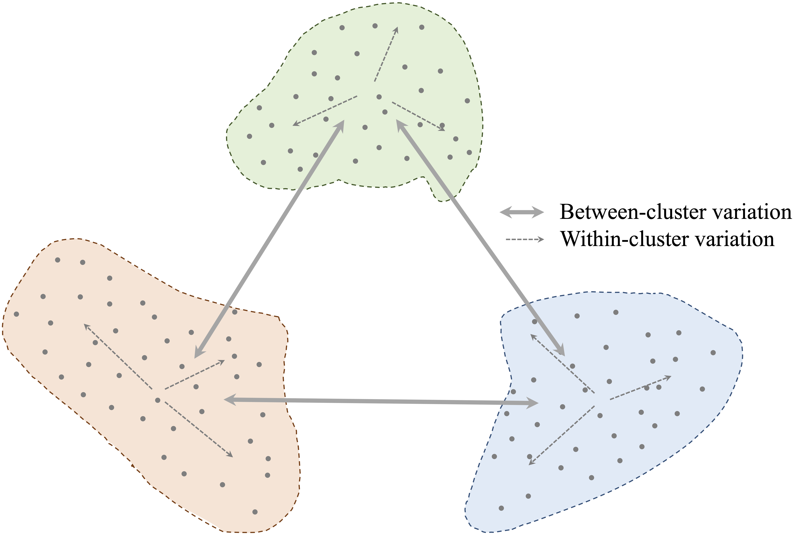
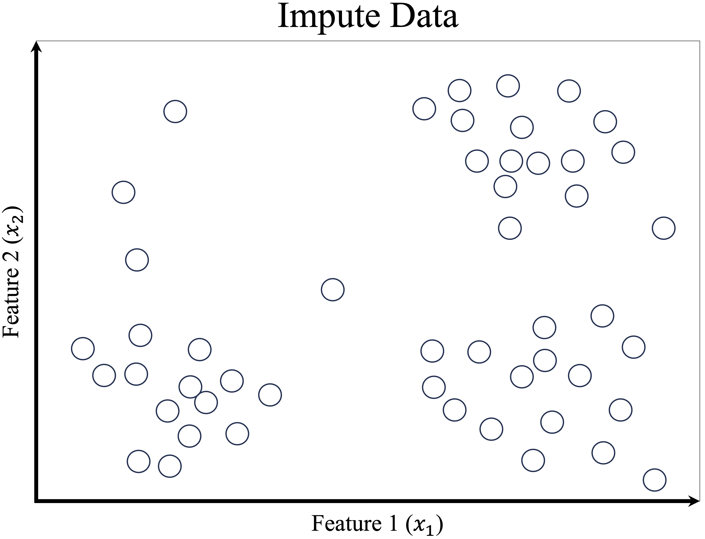
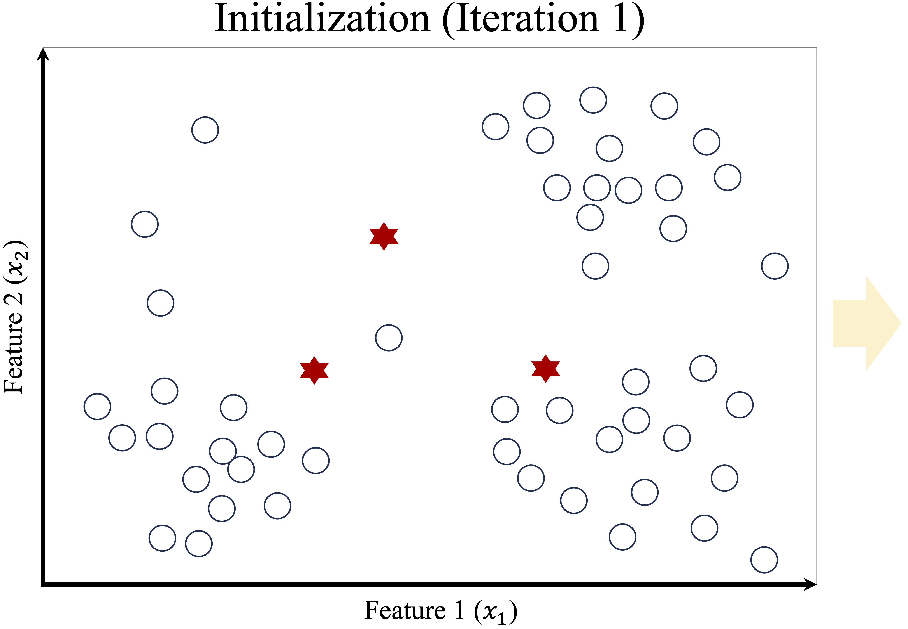
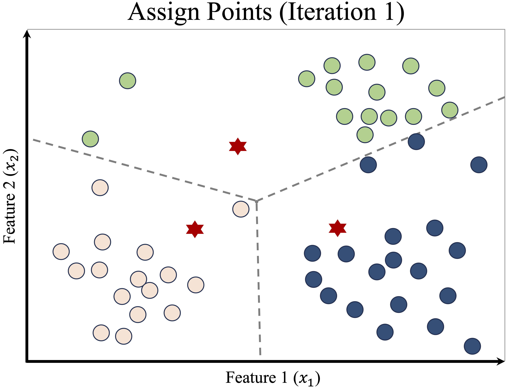
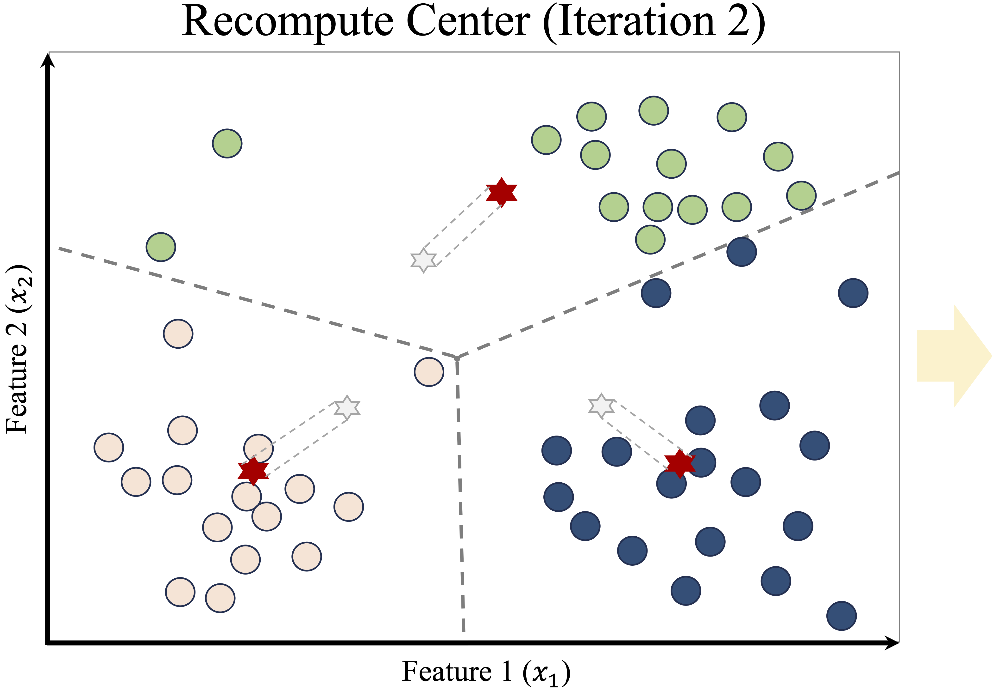
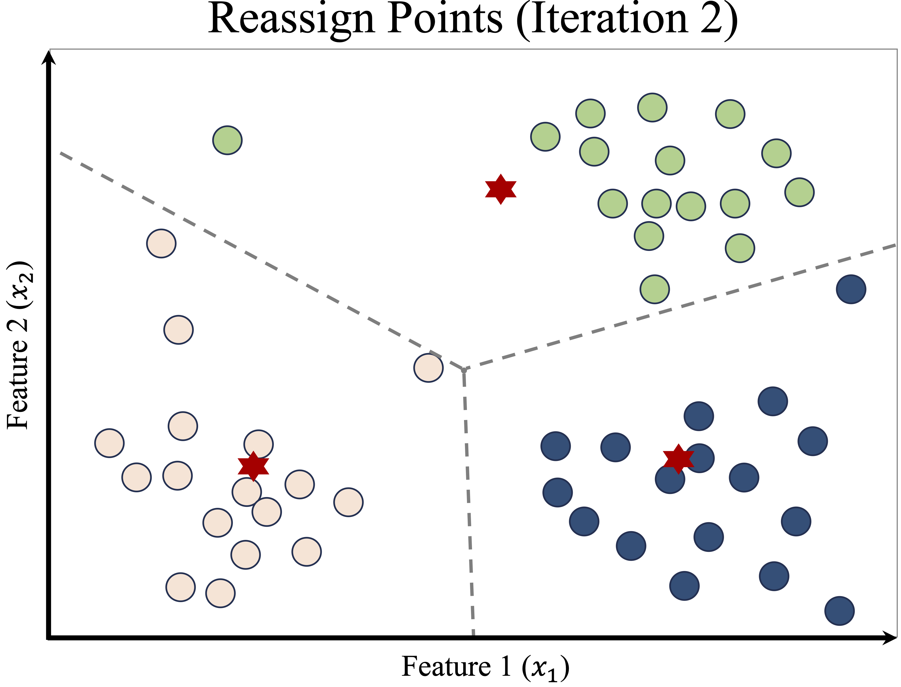
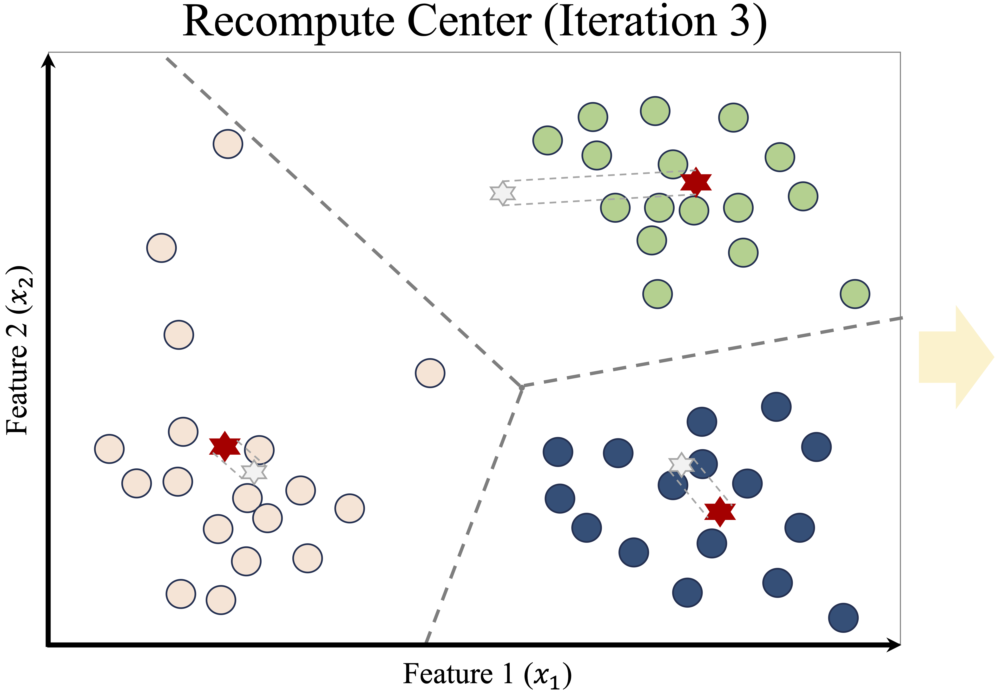
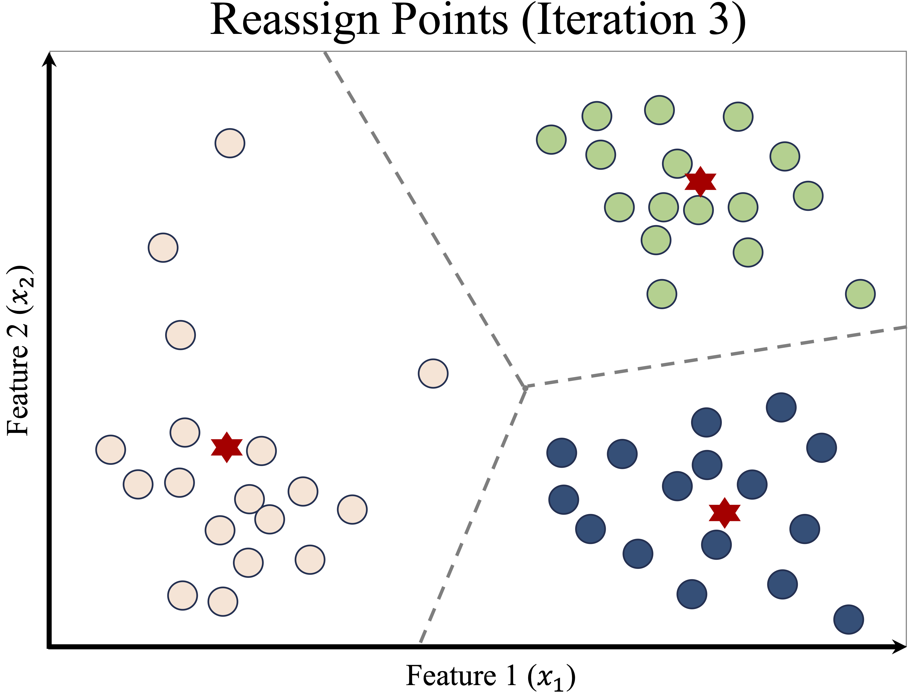
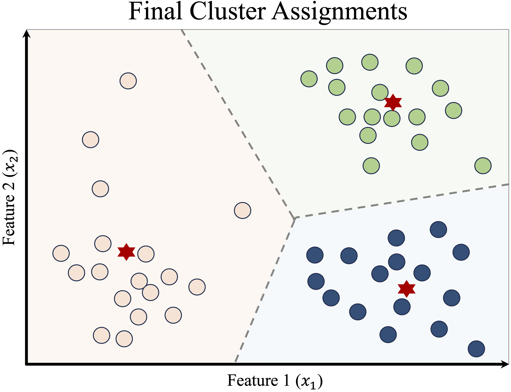
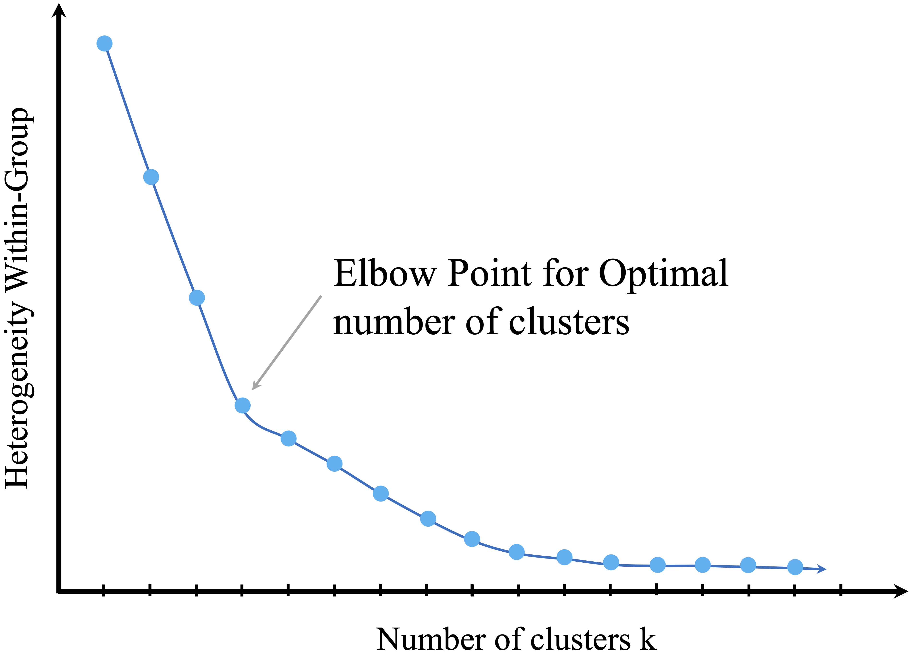

# Clustering {#chapter-cluster}  

Every day, we interact with systems that organize vast amounts of data without explicit instructions. How does Netflix recommend movies tailored to your taste? How does Amazon categorize millions of products? These are real-world examples of *clustering*, a machine learning technique that groups similar items based on shared characteristics—without any predefined labels.  

In many real-world scenarios, we deal with large datasets where the structure is unknown. Unlike classification, which assigns predefined labels to data points (e.g., distinguishing between spam and non-spam emails), clustering is *exploratory*—it helps uncover hidden patterns, making it a powerful tool for *knowledge discovery*. By identifying *meaningful groups*, clustering allows us to make sense of complex data and extract valuable insights.  

Clustering is widely used across multiple domains, including:  

- *Customer segmentation* – Identifying distinct customer groups to personalize marketing campaigns.  
- *Market research* – Understanding consumer behavior to enhance product recommendations.  
- *Fraud detection* – Detecting suspicious financial transactions that may indicate fraudulent activity.  
- *Document organization* – Automatically grouping large collections of text into meaningful categories.  
- *Bioinformatics* – Clustering genes with similar expression patterns to uncover biological insights.  

This chapter provides a comprehensive introduction to clustering, covering:  

- The fundamental principles of clustering and how it differs from classification.  
- The mechanics of clustering algorithms and how they define similarity.  
- *K-means clustering*, one of the most widely used clustering techniques.  
- A practical case study: segmenting cereal brands based on their nutritional content.  

By the end of this chapter, you will understand how clustering works, when to apply it, and how to implement it in real-world scenarios. Let’s dive in! 

## What is Cluster Analysis? {#cluster-what}  

Clustering is an unsupervised machine learning technique that groups data points into *clusters* based on their similarity. Unlike supervised learning, where models learn from labeled examples, clustering is *exploratory*—it uncovers *hidden structures* in data without predefined labels. The goal is to form groups where data points within the same cluster are highly similar, while those in different clusters are distinct.  

But how does a computer determine which data points belong together? Clustering relies on *similarity measures* that quantify how close or distant two points are. One of the most commonly used approaches is *distance metrics*, such as *Euclidean distance*, defined as:

\[
\text{dist}(x, y) = \sqrt{ \sum_{i=1}^n (x_i - y_i)^2}
\]

where \( x = (x_1, x_2, \ldots, x_n) \) and \( y = (y_1, y_2, \ldots, y_n) \) represent two data points with \( n \) features. The closer the two points, the more similar they are.  

However, Euclidean distance is not always appropriate. For *categorical variables*, alternative strategies such as *one-hot encoding* transform categories into numerical values, enabling distance-based clustering. Additionally, features often require *scaling* (e.g., min-max normalization) to ensure that no single variable dominates the clustering process.  

Clustering is often compared to classification, but they serve different purposes. *Classification assigns predefined labels to new data points based on past examples, whereas clustering discovers groupings from raw data.* Classification is typically used for prediction, while clustering is primarily for *exploration and pattern discovery*. Because clustering generates labels rather than predicting existing ones, it is sometimes referred to as *unsupervised classification*. These cluster assignments can then be used as inputs for further analysis, such as refining predictions in a neural network or decision tree model.  

All clustering algorithms aim to achieve *high intra-cluster similarity* (data points within a cluster are close together) and *low inter-cluster similarity* (clusters are well separated). This concept is visually illustrated in Figure \@ref(fig:cluster-1), where effective clusters minimize internal variation while maximizing separation between groups.

```{r cluster-1, echo = FALSE, out.width = "75%", fig.align = 'center', fig.cap = "Clustering algorithms aim to minimize intra-cluster variation while maximizing inter-cluster separation."}

```

Beyond its role in data exploration, clustering is widely used as a *preprocessing step* in machine learning. Given the massive scale of modern datasets, clustering helps reduce complexity by identifying *a smaller number of representative groups*, leading to several benefits:  

- *Reduced computation time* for downstream models.  
- *Improved interpretability* by summarizing large datasets.  
- *Enhanced predictive performance* by structuring inputs for supervised learning.  

In the following sections, we will explore *K-means clustering*, one of the most widely used clustering algorithms. We will also discuss methods for selecting the optimal number of clusters and apply clustering to a real-world dataset.  

## K-means Clustering {#kmeans}  

K-means clustering is one of the simplest and most widely used clustering algorithms. It aims to partition a dataset into *\( k \)* clusters by iteratively refining cluster centers, ensuring that data points within each cluster are as similar as possible. The algorithm operates through an iterative process of assigning points to clusters and updating cluster centers based on those assignments. The process stops when the assignments stabilize, meaning no data points switch clusters.  

The K-means algorithm requires the user to specify the number of clusters, *\( k \)*, in advance. It follows these steps:  

1. *Initialize:* Randomly select *\( k \)* data points as the initial cluster centers.  
2. *Assignment:* Assign each data point to the nearest cluster center. This creates *\( k \)* groups.  
3. *Update:* Compute the centroid (mean) of each cluster and move the cluster centers to these new locations.  
4. *Repeat:* Iterate steps 2 and 3 until convergence—when cluster assignments no longer change.  

Although K-means is simple and efficient, it has some limitations. The final clusters depend heavily on the *initial choice of cluster centers*, meaning different runs of the algorithm may produce different results. Additionally, K-means is sensitive to outliers and assumes clusters are *spherical and of similar size*, which may not always be the case in real-world data.  

To illustrate how K-means works, consider a dataset with 50 records and two features, *\( x_1 \)* and *\( x_2 \)*, as shown in Figure \@ref(fig:cluster-ex-1). Our goal is to partition the data into *three* clusters.  

```{r cluster-ex-1, echo = FALSE, out.width = "70%", fig.align = 'center', fig.cap = "A simple dataset with 50 records and two features, ready for clustering."}

```

The first step is to randomly select three initial cluster centers (red stars), as shown in the left panel of Figure \@ref(fig:cluster-ex-2). Each data point is then assigned to the nearest cluster, forming three groups labeled in *blue (Cluster A), green (Cluster B), and orange (Cluster C)*. The right panel of Figure \@ref(fig:cluster-ex-2) displays these initial assignments. The dashed lines represent the *Voronoi diagram*, which divides space into regions associated with each cluster center.

```{r cluster-ex-2, echo = FALSE, out.width = "45%", fig.align = 'center', fig.cap = "Initial random cluster centers (left) and first cluster assignments (right)."}


```

Since K-means is sensitive to *initialization*, poor placement of initial cluster centers can lead to suboptimal clustering. To mitigate this issue, *K-means++* [@arthur2006k] was introduced in 2007. This method strategically selects initial centers to improve convergence and reduce randomness.  

Once the initial cluster assignments are made, K-means enters the *update phase*. The first step is to recompute the centroid of each cluster, which is the *mean position of all points assigned to that cluster*. The cluster centers are then moved to these new centroid locations, as shown in the left panel of Figure \@ref(fig:cluster-ex-3). The right panel illustrates how the *Voronoi boundaries shift*, causing some data points to be reassigned to a different cluster.

```{r cluster-ex-3, echo = FALSE, out.width = "45%", fig.align = 'center', fig.cap = "Updated cluster centers (left) and new assignments after centroid adjustment (right)."}


```

This process—*reassigning points and updating centroids*—continues iteratively. After another update, some points switch clusters again, leading to a refined Voronoi partition, as shown in Figure \@ref(fig:cluster-ex-6).

```{r cluster-ex-6, echo = FALSE, out.width = "45%", fig.align = 'center', fig.cap = "Updated cluster centers and assignments after another iteration."}


```

The algorithm continues iterating until the cluster assignments stabilize—when *no more points switch clusters*, as shown in Figure \@ref(fig:cluster-ex-8). At this point, the algorithm *converges*, and the final clusters are established.

```{r cluster-ex-8, echo = FALSE, out.width = "45%", fig.align = 'center', fig.cap = "Final cluster assignments after K-means convergence."}

```

Once clustering is complete, the results can be presented in two ways:  

- *Cluster Assignments:* Each data point is labeled as belonging to Cluster A, B, or C.  
- *Centroid Coordinates:* The final positions of the cluster centers can be reported.  

These final cluster centroids act as *representative points*, summarizing the dataset and enabling further analysis. K-means clustering is widely used in applications such as customer segmentation, image compression, and document clustering. In the next section, we will explore methods for selecting the *optimal number of clusters* to ensure meaningful partitions in real-world datasets.  

## Choosing the Number of Clusters {#kmeans-choose}  

One of the key challenges in *K-means clustering* is selecting the appropriate number of clusters, *\( k \)*. The choice of \( k \) significantly impacts the results—too few clusters may fail to capture meaningful structures, while too many clusters risk overfitting by creating overly fragmented groups. Unlike supervised learning, where evaluation metrics like accuracy guide model selection, clustering does not have an absolute ground truth, making the selection of \( k \) more subjective.  

In some cases, domain knowledge can provide useful guidance. For example, when clustering movies, a reasonable starting point might be the number of well-known genres. In a business setting, marketing teams may set \( k = 3 \) if they plan to design three distinct advertising campaigns. Similarly, seating arrangements at a conference might determine the number of groups based on the available tables. However, when no clear intuition exists, data-driven methods are needed to determine an optimal \( k \).  

One widely used technique for choosing \( k \) is the *elbow method*, which evaluates how the within-cluster variation changes as the number of clusters increases. As more clusters are added, the clusters become more *homogeneous* (internal similarity increases), and overall *heterogeneity* (difference between clusters) decreases. However, this improvement follows a diminishing returns pattern. The idea is to find the point at which adding another cluster *no longer significantly reduces the within-cluster variance*.  

This critical point, known as the *elbow point*, represents the most natural number of clusters. The concept is illustrated in Figure \@ref(fig:cluster-elbow), where the curve shows the total within-cluster sum of squares (WCSS) as a function of \( k \). The "elbow" in the curve—where the rate of improvement slows—is a strong candidate for \( k \).  

```{r cluster-elbow, echo = FALSE, out.width = "60%", fig.align = 'center', fig.cap = "The elbow method helps determine the optimal number of clusters in K-means clustering."}

```

While the elbow method provides a useful heuristic, it has limitations. In some datasets, the curve may not exhibit a clear elbow, making the choice of \( k \) more ambiguous. Additionally, evaluating many different values of \( k \) can be computationally expensive, especially for large datasets.  


Other techniques can supplement or refine the selection of \( k \):  

- *Silhouette Score:* Measures how well each point fits within its assigned cluster compared to others. A higher silhouette score suggests a well-defined clustering structure.  
- *Gap Statistic:* Compares the clustering result with a reference distribution to assess whether the structure is significant.  
- *Cross-validation with clustering tasks:* In applications where clustering feeds into a downstream task (e.g., classification), the impact of different \( k \) values can be evaluated in that context.  

Ultimately, the choice of \( k \) should be driven by both *data characteristics* and *practical considerations*. Clustering is often used for *exploratory analysis*, meaning that the most useful \( k \) is not necessarily the mathematically "optimal" one but rather the one that yields meaningful, interpretable insights.  

Observing how cluster characteristics evolve as \( k \) varies can itself be informative. Some groups may remain stable across different \( k \) values, indicating strong natural boundaries, while others may appear and disappear, suggesting more fluid structures in the data.  

Rather than aiming for a perfect cluster count, it is often sufficient to find a *reasonable and interpretable* clustering solution. In the next section, we will apply clustering to a real-world dataset, demonstrating how practical knowledge can guide the choice of \( k \) for actionable insights.  

Now that we have explored K-means clustering and methods for selecting the optimal number of clusters, we apply these concepts to a real-world dataset.

## Case Study: Clustering Cereal Data {#kmeans-cereal}  

In this case study, we apply *K-means clustering* to the *cereal* dataset from the **liver** package. This dataset contains nutritional information for 77 cereal brands, including calories, protein, fat, sodium, fiber, and sugar content. Understanding these nutritional profiles is valuable for marketing strategies, consumer targeting, and product positioning. Our goal is to segment cereals into distinct groups based on their nutritional similarities.  

### Dataset Overview  

The *cereal* dataset includes 77 observations and 16 variables, covering various nutritional attributes. It can be accessed through the **liver** package, as shown below:  

```{r}
library(liver)  # Load the liver package

data(cereal)    # Load the cereal dataset
```

We can examine its structure using:  

```{r}
str(cereal)
```

The dataset contains the following variables:  

- `name`: Name of the cereal (categorical).  
- `manuf`: Manufacturer of the cereal (categorical).  
- `type`: Cereal type (hot or cold, categorical).  
- `calories`: Calories per serving (numerical).  
- `protein`: Grams of protein per serving (numerical).  
- `fat`: Grams of fat per serving (numerical).  
- `sodium`: Milligrams of sodium per serving (numerical).  
- `fiber`: Grams of dietary fiber per serving (numerical).  
- `carbo`: Grams of carbohydrates per serving (numerical).  
- `sugars`: Grams of sugar per serving (numerical).  
- `potass`: Milligrams of potassium per serving (numerical).  
- `vitamins`: Percentage of FDA-recommended vitamins (categorical: 0, 25, or 100).  
- `shelf`: Display shelf position (categorical: 1, 2, or 3).  
- `weight`: Weight of one serving in ounces (numerical).  
- `cups`: Number of cups per serving (numerical).  
- `rating`: Cereal rating score (numerical).  

### Data Preprocessing  

Before applying K-means clustering, we need to *clean and preprocess* the data. We start by summarizing the dataset:  

```{r}
summary(cereal)
```

Upon inspection, we notice *unusual values* in the variables `sugars`, `carbo`, and `potass`, where some entries are set to `-1`. Since negative values are invalid for these nutritional attributes, we replace them with `NA`:  

```{r}
cereal[cereal == -1] <- NA
find.na(cereal)  # Check missing values
```

Next, we handle missing values using *K-nearest neighbors (KNN) imputation* with the `knnImputation()` function from the **DMwR2** package:  

```{r}
library(DMwR2)
cereal <- knnImputation(cereal, k = 3, scale = TRUE)
find.na(cereal)  # Verify missing values are filled
```

For clustering, we exclude categorical and identifier variables (`name`, `manuf`, and `rating`), retaining only *numerical features*:  

```{r}
selected_variables <- colnames(cereal)[-c(1, 2, 16)]
cereal_subset <- cereal[, selected_variables]
```

Since the dataset includes features on *different scales*, we apply *min-max scaling* using the `minmax()` function from the **liver** package to ensure all variables contribute equally to the clustering process:  

```{r}
cereal_mm <- minmax(cereal_subset, col = "all")
str(cereal_mm)  # Check the transformed dataset
```

To visualize the effect of normalization, we plot the *sodium* distribution before and after scaling:  

```{r fig.align = 'default', fig.show = "hold", out.width = "50%"}
ggplot(data = cereal) +
    geom_histogram(aes(x = sodium), color = "blue", fill = "lightblue") +
    theme_minimal() + ggtitle("Before min-max normalization")

ggplot(data = cereal_mm) +
    geom_histogram(aes(x = sodium), color = "blue", fill = "lightblue") + 
    theme_minimal() + ggtitle("After min-max normalization")
```

After scaling, all values fall within the *0–1 range*, making distance-based clustering more reliable.  

### Applying K-means Clustering  

#### Choosing the Optimal Number of Clusters {-}  

Before clustering, we need to determine the *optimal number of clusters*. We use the *elbow method*, which plots the within-cluster sum of squares (WCSS) for different values of \( k \). The elbow point—where the improvement in WCSS slows—suggests an ideal \( k \):  

```{r}
library(factoextra)

fviz_nbclust(cereal_mm, kmeans, method = "wss", k.max = 15) + 
  geom_vline(xintercept = 4, linetype = 2, color = "gray")
```

From the plot, we observe that *\( k = 4 \) clusters* is a reasonable choice, as adding more clusters beyond this point yields diminishing improvements in WCSS.  

#### Performing K-means Clustering {-}  

We now apply the *K-means algorithm* with \( k = 4 \) clusters:  

```{r}
set.seed(3)  # Ensure reproducibility
cereal_kmeans <- kmeans(cereal_mm, centers = 4)
```

To check cluster sizes:  

```{r}
cereal_kmeans$size
```

#### Visualizing the Clusters {-}

To better understand the clustering results, we visualize the clusters using the `fviz_cluster()` function from the **factoextra** package:  

```{r}
fviz_cluster(cereal_kmeans, cereal_mm, geom = "point", ellipse.type = "norm", palette = "custom_palette")
```

The scatter plot displays the *four clusters*, with each point representing a cereal brand. Different colors indicate distinct clusters, and the ellipses represent the *spread of each cluster* based on its standard deviation.  

#### Interpreting the Results {-} 

The clusters reveal natural groupings among cereals based on *nutritional content*. For example:  
- Some clusters may contain *low-sugar, high-fiber cereals*, appealing to health-conscious consumers.  
- Others may group *high-calorie, high-sugar cereals*, often marketed to children.  
- Another group may include *balanced cereals*, offering a mix of moderate calories and nutrients.  

To examine which cereals belong to a specific cluster (e.g., Cluster 1), we can use:  

```{r eval = FALSE}
cereal$name[cereal_kmeans$cluster == 1]
```

This command lists the names of cereals assigned to *Cluster 1*, helping us interpret the characteristics of that group.  

This case study demonstrated how *K-means clustering* can segment cereals into meaningful groups based on *nutritional content*. Through *data preprocessing, feature scaling, and cluster visualization*, we successfully grouped cereals with similar characteristics. Such clustering techniques are widely applicable in *marketing, consumer analytics, and product positioning*, providing actionable insights for businesses and researchers alike.  

In this chapter, we explored the fundamentals of clustering, the mechanics of the K-means algorithm, and methods for choosing the optimal number of clusters. We then applied these concepts to a real-world dataset, demonstrating how K-means can extract meaningful insights. Clustering remains a powerful tool across various domains, from marketing to bioinformatics, making it an essential technique in the modern data science toolkit.

## Exercises {-}  

These exercises reinforce the concepts introduced in this chapter, focusing on clustering fundamentals, hyperparameter tuning, and practical applications using the *redWines* dataset. The exercises are divided into two categories:  

1. Conceptual questions – Understanding the theory behind clustering and K-means.  
2. Practical exercises using the *redWines* dataset – Applying clustering techniques to real-world data.  

### Conceptual questions {-}  

1. What is clustering, and how does it differ from classification?  
2. Explain the concept of similarity measures in clustering. What is the most commonly used distance metric for numerical data?  
3. Why is clustering considered an unsupervised learning method?  
4. What are some real-world applications of clustering? Name at least three.  
5. Define the terms *intra-cluster similarity* and *inter-cluster separation*. Why are these important in clustering?  
6. How does K-means clustering determine which data points belong to a cluster?  
7. Explain the role of centroids in K-means clustering.  
8. What happens if the number of clusters \( k \) in K-means is chosen too small? What if it is too large?  
9. What is the elbow method, and how does it help determine the optimal number of clusters?  
10. Why is K-means sensitive to the initial selection of cluster centers? How does K-means++ address this issue?  
11. Describe a scenario where Euclidean distance might not be an appropriate similarity measure for clustering.  
12. Why do we need to normalize or scale variables before applying K-means clustering?  
13. How does clustering help in dimensionality reduction and preprocessing for supervised learning?  
14. What are the key assumptions of K-means clustering?  
15. How does the silhouette score help evaluate the quality of clustering?  
16. Compare K-means with hierarchical clustering. What are the advantages and disadvantages of each?  
17. Why is K-means not suitable for non-spherical clusters?  
18. What is the difference between hard clustering (e.g., K-means) and soft clustering (e.g., Gaussian Mixture Models)?  
19. What are outliers, and how do they affect K-means clustering?  
20. What are alternative clustering methods that handle outliers better than K-means?  

### Practical exercises using the *redWines* dataset {-}  

The *redWines* dataset contains chemical properties of red wines and their quality scores. These exercises guide you through clustering analysis, from data preprocessing to model evaluation.

#### Data preparation and exploratory analysis {-}  

21. Load the *redWines* dataset from the **liver** package and inspect its structure.  
```r
library(liver)
data(redWines)
str(redWines)
```

22. Summarize the dataset using `summary()`. Identify any missing values.  
23. Check the distribution of wine quality scores in the dataset. What is the most common wine quality score?  
24. Since clustering requires numerical features, remove any non-numeric columns from the dataset.  
25. Apply min-max scaling to normalize all numerical variables before clustering. Why is this step necessary?  

#### Applying K-means clustering {-}  

26. Use the elbow method to determine the optimal number of clusters for the dataset.  
```r
library(factoextra)
fviz_nbclust(redWines, kmeans, method = "wss")
```

27. Based on the elbow plot, choose an appropriate value of \( k \) and perform K-means clustering.  
28. Visualize the clusters using a scatter plot of two numerical features.  
29. Compute the silhouette score to evaluate cluster cohesion and separation.  
30. Identify the centroids of the final clusters and interpret their meaning.  

#### Interpreting the clusters {-}  

31. Assign the cluster labels to the original dataset and examine the average chemical composition of each cluster.  
32. Compare the wine quality scores across clusters. Do some clusters contain higher-quality wines than others?  
33. Identify which features contribute most to defining the clusters.  
34. Are certain wine types (e.g., high acidity, high alcohol content) concentrated in specific clusters?  
35. Experiment with different values of \( k \) and compare the clustering results. Does increasing or decreasing \( k \) improve the clustering?  
36. Visualize how wine acidity and alcohol content influence cluster formation.  
    


