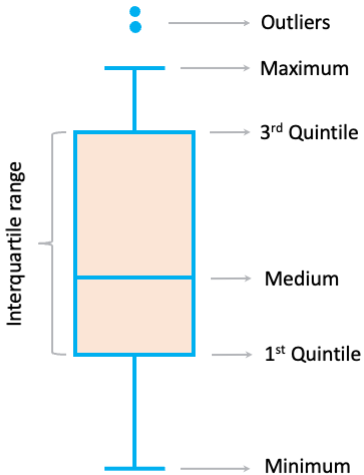

# Data Cleaning

```{r include = FALSE, message = FALSE, warning = FALSE}
library( ggplot2 )
library( plyr    )  # for function 'mutate'.
library( dplyr   )  # for `filter` and `between` functions
library( liver   )

library( forcats )  # for function "fct_collapse"

library( Hmisc   )  # for missing values
library( naniar  )  # for visualizing the missing values
```

The quality of input data has a huge impact on the Data Science Methodology. 
For data analytics purposes, database values must undergo data cleaning and data transformation.
Basically, we want to minimize *garbage in garbage out*.    
Thus, it is important to prepare and learn more about the data. This requires cleaning so-called *messy* data, eliminating unnecessary data, and if it's needed recording the (part of) data for the modeling part.

In general, data cleaning is the most time consuming part of the date science methodology. 
Effort for data preparation and cleaning ranges around 10\%-60\% of data analysis process – depending on the dataset.

## `diamonds` dataset for data cleaning

We represent how to preform the steps one and two of the Data Science Methodology using the `diamonds` dataset. This dataset is available in [**ggplot2**](https://CRAN.R-project.org/package=ggplot2) package and contains information about \~$54,000$ diamonds, including the `price`, `carat`, `color`, `clarity`, `cut`, and dimensions of each diamond.  

In general, we could import the Dataset sheet from our personal computer or an online source into **R**, by using the `read.csv()` function. But, here, since the *diamonds* dataset is available in the **R** package "*ggplot2*", we import the *diamonds* dataset in **R** as follows:
```{r}
data( diamonds ) # loads "diamonds" data in your RStudio environment
``` 

To see the overview of the dataset in **R**, we could use the following functions: 

* `str()`  to see a compact display of the structure of the data. 
* `View()` to see spreadsheet-style data. 
* `head()` to see the first part of the data (first 6-rows of data).
* `summary()` to see the summary of each variable.

Here we use the `str()` function to report the structure of the *diamonds* dataset as follows
```{r}
str( diamonds )   
```

It shows the dataset has `r nrow( diamonds )` observations and `r ncol( diamonds )` variables where:

* `price`: price in US dollars (\$326–\$18,823).
* `carat`: weight of the diamond (0.2–5.01).
* `cut`: quality of the cut (Fair, Good, Very Good, Premium, Ideal).
* `color`: diamond color, from D (best) to J (worst).
* `clarity`: a measurement of how clear the diamond is (I1 (worst), SI2, SI1, VS2, VS1, VVS2, VVS1, IF (best)).
* `x`: length in mm (0–10.74).
* `y`: width in mm (0–58.9).
* `z`: depth in mm (0–31.8).
* `depth`: total depth percentage = `z` / mean(`x`, `y`) = 2 * `z` / (`x` + `y`).

To see the first part of the data
```{r}
head( diamonds )   
```

After loading dataset in the R, we need to know which type of features (variables, attributes, or fields) we have in our dataset. 

In general, the type of variables are:

1. Quantitative (or numerical) variables: which are represented by numbers, and are divided into three broad divisions.
    + Continuous variables: which are represented by entities get a distinct score. For example, in the diamonds dataset, the length of diamonds (variable `x`) as well as variables `y`, `z`, and `depth` are continuous.
    + Discrete (or count) variables: are countable in a finite amount of time. Some examples of such variables are age (in years) and number of customer who churn the company.

2. Qualitative (or categorical) variables: which describe data that fits into categories and they are not numerical. They may be divided into three broad divisions. 
    + Ordinal variables: are ordered categories and the distances between the categories are not known. For example, cloth sizes S, M, L, and XL. As an another example, in the diamonds dataset variable `clarity` is ordinal.
    + Binary variables: are variables which only take two values. For example, having a tattoo (yes/no)
    + Nominal variables: are categorical variables which do not have intrinsic ordering to the categories. For example, gender (female, male, LGBT) or color of diamonds in the diamonds dataset.

## Outliers

Outlines are unusual/extreme values that significantly differ from other observations.
Outliers may be due to variability in the measurement or may be due to data entry errors.
Outliers can potentially have serious problems in statistical analyses.
Thus, it’s important to detect potential outliers in the dataset and deal with them in an appropriate manner.
One easy way to detect outliers is by data visualization methods.

### Identify outliers by boxplot

We can detect outliers by using Boxplot which represents the distribution of the feature. Boxplot is suitable for the numerical features. 

<p align="center">
  
</p>

For example, the Boxplot for the variable `y` (width of diamonds) from the `diamonds` dataset is
```{r fig.align = 'center'}
ggplot( data = diamonds ) +
    geom_boxplot( mapping = aes( y = y ) )
```

The `y` variable measures one of the three dimensions of these diamonds, in mm. We know that diamonds can’t have a width of 0mm, so these values must be incorrect. We might also suspect that measurements of 32mm and 59mm are implausible.

### Identify outliers by histogram

Another way to detect outliers is by using histogram which represents the distribution of the feature. 
For example, the histogram for the variable `y` (width of diamonds) from the `diamonds` dataset is
```{r fig.align = 'center'}
ggplot( data = diamonds ) +
    geom_histogram( aes( x = y ), binwidth = 0.5, color = 'blue', fill = "lightblue" )
```

There are so many observations in the common bins that the rare bins are so short that you cann't see them (although maybe if you stare intently at 0 you'll spot something). To make it easy to see the unusual values, we need to zoom in to small values of the y-axis:

```{r fig.align = 'center'}
ggplot( data = diamonds ) +
    geom_histogram( mapping = aes( x = y ), binwidth = 0.5, color = 'blue', fill = "lightblue" ) +
    coord_cartesian( ylim = c( 0, 30 ) )
```

### Identify outliers by scator plot

Another way to detect outliers is by using scatter plot which represents the point distribution between two numerical features. 
For example, the scatter plot for variable `y` vs `price` is
```{r fig.align = 'center'}
ggplot( data = diamonds, mapping = aes( x = y, y = price ) ) + 
    geom_point( colour = 'blue' )
```

We might also suspect that measurements of 32mm and 59mm are implausible: those diamonds are over an inch long, but don’t cost hundreds of thousands of dollars!

## Handling Outliers

After detecting outliers, we should decide what to do with them. In this case we have two options: 

1. Treat outliers as missing values, which we recommend;
2. Remove outliers from the dataset, which we do *not* recommend it.

For replacing outliers with missing values, one easy way to do it is to use `mutate()` function which is from the **plyr** package; With this function, we can replace the variable with a modified copy. You can use the `ifelse()` function to replace unusual values with `NA`:

```{r}
diamonds_2 = mutate( diamonds, y = ifelse( y ==  0 | y > 30, NA, y ) ) 
```

[`ifelse()`](https://rdrr.io/r/base/ifelse.html) has three arguments. The first argument test should be a logical vector. The result will contain the value of the second argument, `yes`, when test is `TRUE`, and the value of the third argument, `no`, when it is `FALSE`. 
Note, in R, we show missing values with NA (Not Available).

To see the summary of the variable `y` with missing values:
```{r}
summary( diamonds_2 $ y )
```
which show that we have `r as.numeric( summary( diamonds_2 $ y )[ 7 ] )` unusual values which are replaced by `NA`.


For the case of removing outliers for the dataset, we can do it by using `filter()` function from **dplyr** package
```{r}
diamonds_2 = filter( diamonds, between( y, 3, 20 ) )
```

```{r fig.align = 'center'}
ggplot( data = diamonds_2, mapping = aes( x = y, y = price ) ) + 
    geom_point( colour = 'blue' )
```

It’s good practice to repeat your analysis with and without the outliers. If they have minimal effect on the results, and you can’t figure out why they’re there, it’s reasonable to replace them with missing values, and move on. However, if they have a substantial effect on your results, you shouldn’t drop them without justification. You’ll need to figure out what caused them (e.g. a data entry error) and disclose that you removed them in your write-up.

## Missing Values

Missing values pose problems to data analysis methods. We have two option to deal with the missing values:

1. Impute the missing values which we recommend.
2. Delete Records Containing Missing Values which we do *not* recommend; this option is similar to the precious section for removing outliers.

To impute the missing values with *random* values (which is proportional to categories' records) by using the function `impute()` from R package **Hmisc** 
```{r}
diamonds_2 $ y = impute( diamonds_2 $ y, 'random' )
```

To see the summary of the variable `y`:
```{r}
summary( diamonds_2 $ y )
```
  
## Data Transformation

In Data Science Methodology, before applying any machine learning algorithms, sometimes, we need to convert the raw data into a format or structure that would be more suitable for modeling. Fer example, in “diamonds” dataset, variable `carat` range between (0.2, 5) and variable `price` range between (326, 18823). Some some machine learning algorithms (i.e. the k-nearest neighbor algorithm) are adversely affected by differences in variable ranges. Variables with greater ranges tend to have larger influence on the data model’s results. Thus, numeric field values should be normalized.
Two of the prevalent methods will be reviewed

* min-max transformation.
* Z-score transformation also know as an Z-score Standardization

## How to Reexpress Categorical Field Values 


