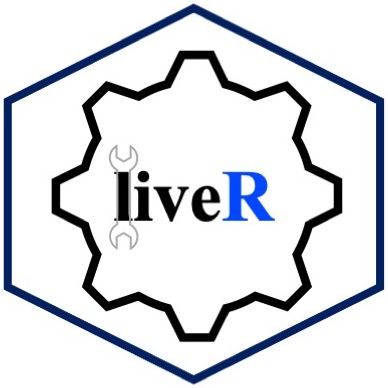

--- 
title: "Uncovering Data Science with R"
authors: "Reza Mohammadi and Kevin Burke"
date: "`r Sys.Date()`"
site: bookdown::bookdown_site
documentclass: book
bibliography: [book.bib, packages.bib]
url: https://uncovering-data-science.netlify.app
cover-image: "images/cover.jpg"
biblio-style: apalike
csl: chicago-fullnote-bibliography.csl
---

# Welcome {-}

This is the online home of *Uncovering Data Science with R*, a book for beginners and non-beginners alike, with no previous analytics or programming experience. 

<a href="https://uncovering-data-science.netlify.app"></a>

Inspired by the Free and Open Source Software movement, the code and prose underlying this book are open, ensuring that the content is reproducible, transparent, and accessible. Hosting the source code on [CRAN](https://cran.r-project.org/web/packages/liver/index.html) allows anyone to interact with the project by opening issues or contributing new content and typo fixes for the benefit of everyone. The code and R codes are available in **R** package named **liver** at https://cran.r-project.org/web/packages/liver/index.html.

Following an ancient Persian idiom, the title of this book is “Eating the Liver of Data Science” which could be interpreted as “getting intimately close with data science”. The purpose of the book is to introduce non-experts (business analysts etc.) to the world of data science. The aim is therefore that the content is easily accessible to individuals who may not necessarily have a strong background in either mathematics or programming. We will largely avoid deep technical development, focusing primarily on key concepts and applications. However, we will include references to more advanced material for the interested reader, and some short “starred” sections which will include a small amount of mathematical detail which can be skipped by less advanced readers.

## What you will learn {-}

The main goals of this book is to introduce the reader to the Data Science domain by using **R** as a tool for performing data mining/analytics. **R** is a freely downloadable ^[Download it from <http://www.R-project.org>.] language and environment for statistical computing and graphics. Its capabilities and the large set of available packages make this tool an excellent alternative to the existing (and expensive!) data mining tools.

Data Science uses tools and techniques to turn data into meaningful business insights.
In this regards the Data Science Methodology is a phased, adaptive, iterative, approach within a scientific framework. 
This is a cyclic process that undergoes a critic behaviour guiding data scientists to act accordingly. 

* Business Understanding.
* Data Preparation.
* Exploratory Data Analysis.
* Preparing Data to Model.
* Modeling.
* Evaluation.
* Deployment.

## How the book is structured {-}

This book is structured around the Data Science methodology by a hands-on approach to learning using **R** software. The main spirit behind the book is "*Learning by doing it!*"

## Prerequisites {-}

We write this book for the general reader, with no previous analytics or programming experience. 
In order to get the most out of this book, you should be generally numerically literate, and it’s helpful if you have some programming experience already. 
If you’ve never programmed before and interested to learn R, you might find [Hands on Programming with R](https://rstudio-education.github.io/hopr/) by Garrett to be a useful.

There are four things you need to run the code in this book: R, RStudio, and a handful of other packages. Packages are the fundamental units of reproducible R code. They include reusable functions, the documentation that describes how to use them, and sample data.

```{r include=FALSE}
# automatically create a bib database for R packages
knitr::write_bib(c(
  .packages(), 'bookdown', 'knitr', 'rmarkdown'
), 'packages.bib')
```
