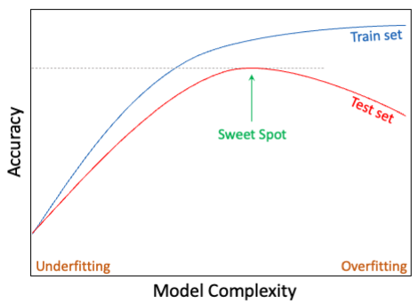
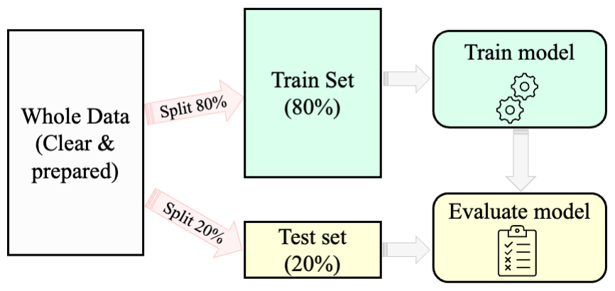

# Preparing Data for Modeling {#chapter-modeling}

```{r include = FALSE, message = FALSE, warning = FALSE}
library(liver)
library(ggplot2)   

data(churn) 
```

As we advance through the Data Science Process, illustrated in Chapter \@ref(chapter-intro-DS), Figure \@ref(fig:CRISP-DM), we’ve completed the foundational steps that pave the way for effective modeling:

1. **Problem Understanding**: Chapter \@ref(problem-understanding) highlighted the importance of clearly defining the problem and aligning objectives with data-driven strategies.  
2. **Data Preparation**: In Chapter \@ref(chapter-data-prep), we addressed challenges such as missing values, outliers, and data transformation to ensure our dataset is clean and ready for analysis.  
3. **Exploratory Data Analysis**: Chapter \@ref(chapter-EDA) guided us through visualizing and summarizing data to uncover patterns and generate meaningful insights.  
4. **Statistical Inference**: In Chapter \@ref(chapter-statistics), we explored hypothesis testing and feature selection, tools we’ll leverage in this chapter to validate our data partitioning.

Before diving into building machine learning models, it’s essential to establish a robust foundation during what we’ll refer to as the **Setup Phase**. This phase includes three critical tasks that must be completed before modeling begins:

- **Partitioning the Data**: Dividing the dataset into training and testing subsets to create a clear separation for model building and evaluation.  
- **Validating the Partition**: Ensuring the partition is appropriate and representative, allowing reliable insights to emerge from the training and testing process.  
- **Balancing the Training Dataset**: Addressing any imbalances in the training data (e.g., class imbalances in categorical targets) to ensure fair and accurate model training.  

These tasks are often overlooked but play a crucial role in ensuring that the modeling process is both rigorous and effective.

When introducing this topic, students often ask, "_Why is it necessary to partition the data?_" or "_Why do we need to follow these specific steps?_". These are insightful questions—and ones we’ll address in depth throughout this chapter. However, before diving into the details of partitioning and validating datasets, it’s worth stepping back to examine how the Data Science Process aligns with and diverges from Statistical Inference. By understanding their similarities and differences, we can better appreciate the importance of these steps and how they bridge the principles of traditional statistics with the practical demands of modern machine learning.

## Statistical Inference in the Context of Data Science

In Chapter \@ref(chapter-statistics), we explored how statistical inference helps us make conclusions about populations based on sample data. While this foundation remains valuable in the data science process, the goals and applications differ when preparing data for modeling.

Statistical inference and data science diverge in two key ways when applied to modeling tasks:

1. **From Significance to Practicality**: In data science, where datasets often contain thousands or even millions of observations, nearly any difference or relationship becomes statistically significant. However, statistical significance does not necessarily equate to practical significance. For example, a machine learning model might identify a tiny effect size (e.g., a minor improvement in predictions) that is statistically significant but has no meaningful impact on decision-making. Thus, in modeling, the focus shifts to practical relevance and predictive power over mere statistical significance.

2. **Exploration vs. Hypothesis Testing**: Traditional statistical inference begins with a specific hypothesis in mind, such as testing whether a new treatment improves outcomes compared to a control. In contrast, data science often takes an exploratory approach, using the data to uncover patterns, relationships, or actionable insights without a predefined hypothesis. For instance, in preparing data for modeling, we might investigate which features are most predictive of the target variable or assess relationships between variables to refine the dataset.

That said, statistical inference still plays a critical role in the data science process, particularly in validating key steps during data preparation. For example:

- **Partition Validation**: When splitting the data into training and testing sets, statistical tests can confirm whether the two subsets are representative of the original dataset.
- **Feature Selection**: Hypothesis tests can help identify which features have strong relationships with the target variable, aiding in selecting predictors for modeling.

By understanding these differences and leveraging statistical inference strategically, we can ensure that the data preparation process supports building robust, reliable, and interpretable models. As we proceed through this chapter, we’ll see how inference and data science methods work together to create datasets that are both meaningful and ready for modeling. 

## Why Is It Necessary to Partition the Data?

Partitioning the dataset is a critical step in preparing data for modeling. A common question students ask when learning this topic is, "_Why do we need to partition the data?_". The answer lies in the principle of **generalization**—the ability of a model to perform well on unseen data. Without proper partitioning, we risk building models that excel on the training data but fail to make accurate predictions in real-world scenarios. Partitioning ensures that a model’s performance is evaluated on data it hasn’t seen during training, providing an unbiased measure of its ability to generalize effectively.

The goal of partitioning is to divide the data into two distinct subsets: the **training set**, used to build the model, and the **testing set**, used to evaluate its performance. This separation simulates real-world conditions, where the model must make predictions on new, unseen data. Partitioning helps us detect and address common modeling pitfalls like **overfitting** and **underfitting**. These trade-offs are illustrated in Figure \@ref(fig:model-complexity), which highlights the balance between model complexity and performance on training and testing datasets.

```{r model-complexity, echo = FALSE, out.width = "65%", fig.align = 'center', fig.cap = "The trade-off between model complexity and accuracy on the training and test sets. It highlights the optimal model complexity (sweet spot), where the test set accuracy reaches its highest value for unseen data."}

```

**Overfitting** occurs when a model learns the training data too well, including its noise and random fluctuations, instead of capturing the general patterns. Overfitted models achieve high accuracy on the training set but fail miserably on unseen data. For example, a churn prediction model might memorize customer IDs or irrelevant details instead of identifying meaningful behavioral trends. Such a model would struggle to predict churn for new customers and have little practical value.

**Underfitting**, on the other hand, arises when a model is too simplistic to capture the underlying patterns in the data. This might happen if the model lacks complexity or if preprocessing removes too much useful information. Underfitted models perform poorly on both the training and testing sets, failing to capture the signal within the data. For instance, a churn model that predicts the overall churn rate for all customers, without considering individual characteristics, would lack predictive power.

Partitioning addresses these issues by enabling us to evaluate the model’s performance on unseen data (the testing set). By comparing accuracy on the training and testing sets, we can identify whether the model is overfitting (high training accuracy but low testing accuracy) or underfitting (low accuracy on both datasets). This evaluation helps us iteratively refine the model and strike the right balance between complexity and generalization.

Partitioning also protects against **data leakage**, a critical issue where information from the testing set inadvertently influences the training process. Data leakage inflates performance metrics, leading to a false sense of confidence in the model’s abilities. By strictly separating the testing set from the training process, we can obtain a more realistic and reliable assessment of the model’s generalization performance.

Beyond simple train-test splits, **cross-validation** is a powerful technique that improves the robustness of partitioning. In cross-validation, the dataset is divided into multiple subsets, or "folds." The model is trained on a subset of the data and tested on a different fold, with this process repeated across all folds. The results are averaged to provide a more reliable estimate of model performance. Cross-validation is particularly useful when working with smaller datasets or when tuning hyperparameters, as it minimizes bias and variance introduced by a single train-test split.

Partitioning the data isn’t just a procedural step—it’s a cornerstone of building models that perform well in real-world applications. By systematically addressing overfitting, underfitting, and data leakage, and by incorporating techniques like cross-validation, we ensure that the model is not only well-suited to the training data but also capable of making accurate predictions on unseen data. 

To summarize, the general strategy for supervised machine learning models consists of three key steps, illustrated in Figure \@ref(fig:modeling):

1. **Partitioning** the dataset into training and testing sets, followed by validating the partition.  
2. **Building** machine learning models on the training data.  
3. **Evaluating** the performance of the models on the testing data to identify the most effective approach.

```{r modeling, echo = FALSE, out.width = "80%", fig.align = 'center', fig.cap = "A general predictive machine learning process for building and evaluating models. The 80-20 split ratio is an example and may vary based on the dataset and task."}

```

By following this process, we create models that are both reliable and capable of generalizing to unseen data. In this chapter, we will focus on the crucial first step: partitioning the data effectively, validating the partition, and preparing a balanced training dataset. These steps form the foundation for robust model building and evaluation, paving the way for impactful, data-driven decision-making.

## Partitioning the Data {#sec-partitioning}

Partitioning data is a crucial step in preparing it for machine learning. The most common method is the **train-test split**, also known as the holdout method, where the dataset is divided into two subsets: the training set and the testing set (Figure \@ref(fig:modeling)). The training set is used to build the model, while the testing set is reserved for evaluating its performance. The split ratio is typically 70-30, 80-20, or 90-10, depending on the dataset size and the specific modeling task.

In this process, the training set includes all records with complete information, including the target variable. The testing set, however, has the target variable temporarily hidden to simulate unseen data. Machine learning models are trained exclusively on the training set, learning patterns and trends. These models are then applied to the test set to predict the hidden target values. Finally, the predictions are compared to the actual (restored) target values in the test set to evaluate the model’s performance. This approach ensures the model is evaluated on unseen data, providing an unbiased measure of its generalization ability. Cross-validation further safeguards against overfitting by minimizing the chance of random variations being present in both sets. 

For example, consider the *churn* dataset, where the goal is to predict customer churn based on various features, as we’ll explore in Chapter \@ref(chapter-knn). In this case, the train-test split divides the data into two subsets:
- The **training set**, which includes customer features and their known churn status.  
- The **testing set**, which includes customer features but omits the churn status (temporarily treated as unknown).  

In R, the **liver** package offers the `partition()` function for creating a train-test split. Here’s how the *churn* dataset can be split into training and testing sets:

```{r}
set.seed(43)

data_sets = partition(data = churn, ratio = c(0.8, 0.2))

train_set = data_sets$part1
test_set  = data_sets$part2

actual_test  = test_set$deposit
```

In this example: 

1. **`set.seed(43)`**: Sets a seed to ensure reproducibility, so the split remains consistent across runs.  
2. **`partition()`**: Splits the dataset into 80% training data (`train_set`) and 20% testing data (`test_set`).  
3. **`actual_test`**: Stores the true target values from the testing set for later evaluation.  

Reproducibility is essential in data science. By setting a seed, you ensure that the random split can be recreated exactly, allowing others to replicate your results or grade assignments reliably. Any integer can be used as the seed value—it doesn’t need to match the one used here. Setting a seed is a best practice, particularly when sharing code or collaborating with others, as it eliminates inconsistencies and ensures precise reproducibility. 

By applying a train-test split, we establish a reliable framework for evaluating model performance and ensure the robustness of our results. In the next steps, this foundation will allow us to validate partitions, balance training datasets, and build effective machine learning models.

## Validating the Partition {#sec-validate-partition}

The success of the entire modeling process depends on the quality of the data partition. Validating the partition ensures that both the training and testing sets are representative of the original dataset, enabling the model to learn from diverse examples and generalize effectively to unseen data. Without validation, the modeling process risks bias—either the model fails to generalize because the training set isn’t representative, or the testing set doesn’t provide an accurate evaluation of real-world performance.

Validation involves comparing the training and testing sets to confirm that their distributions are statistically similar, particularly for key variables. Since datasets often include many variables, this step typically focuses on a small set of randomly selected features or features of particular importance, such as the target variable. The choice of statistical test depends on the type of variable being compared, as shown in Table \@ref(tab:partition-test).

Table: (\#tab:partition-test) Suggested hypothesis tests for validating partitions, based on the type of target variable.

| Type of Variable                          | Suggested Test (from Chapter \@ref(chapter-statistics)) |
|-------------------------------------------|---------------------------------------------------------|
| Numerical variable                        | Two-sample t-test                                       |
| Binary/Flag variable                      | Two-sample Z-test                                       |
| Categorical variable (with > 2 categories)| Chi-square test                                         |

Validating the partition is more than a procedural step—it is a safeguard against biased modeling. If the training and testing sets differ significantly, the model’s performance could be compromised. For example, if the training set isn’t representative of the original dataset, the model may fail to generalize. Conversely, if the testing set isn’t representative, the evaluation results may be overly optimistic. Ensuring that the split reflects the original dataset’s characteristics allows for fair and reliable model evaluation.

::: {.example #ex-test-partition}
Let’s consider the *churn* dataset introduced in the previous section. The target variable, *churn* (whether a customer has churned or not), is binary. According to Table \@ref(tab:partition-test), the appropriate statistical test to validate the partition for this variable is a **Two-Sample Z-Test**, which compares the proportion of churned customers in the training and testing sets. Here’s how it can be implemented in R:

```{r}
x1 <- sum(train_set$churn == "yes")
x2 <- sum(test_set$churn == "yes")

n1 <- nrow(train_set)
n2 <- nrow(test_set)

test_churn <- prop.test(x = c(x1, x2), n = c(n1, n2))
test_churn
```

In this example:  

- \(x_1\) and \(x_2\) represent the number of churned customers in the training and testing sets, respectively.  
- \(n_1\) and \(n_2\) represent the total number of observations in the training and testing sets, respectively.  
- The `prop.test()` function compares the proportions of churned customers between the two subsets.

The hypotheses for the test are:  
\[
\bigg\{
\begin{matrix}
H_0:  \pi_{\text{churn, train}} = \pi_{\text{churn, test}} \quad \text{(Proportions are equal)} \\
H_a:  \pi_{\text{churn, train}} \neq \pi_{\text{churn, test}} \quad \text{(Proportions are not equal)}
\end{matrix}
\]

The test result provides a *p*-value = `r round(test_churn$p.value, 2)`. Since the *p*-value is greater than the significance level (\(\alpha = 0.05\)), we fail to reject the null hypothesis (\(H_0\)). This indicates no statistically significant difference in the proportions of churned customers between the training and testing sets. By failing to reject \(H_0\), we confirm that the partition is valid with respect to the target variable *churn*. The proportions of churned customers are consistent across both subsets, ensuring that the model will be trained and tested on representative data.
::: 

Beyond validating the target variable, you can extend this process to other key features in the dataset. For example, you might compare numerical features like `customer.calls` or `day.mins` using a two-sample t-test or validate categorical features with more than two categories using a Chi-square test. This broader validation ensures that the partition is representative across all relevant variables.

_What If the Partition Is Invalid?_ For example, if significant differences are found between the training and testing sets—several corrective actions can be taken. You could revisit the partitioning process by changing the random seed, adjusting the split ratio, or using stratified sampling to ensure that key features are proportionally represented in both subsets. Alternatively, techniques like k-fold cross-validation can provide a more robust approach by using all observations for both training and testing across multiple iterations.

Validating the partition is a critical step in the data preparation process. It ensures that the modeling process is fair, reliable, and capable of producing generalizable results. By addressing potential discrepancies early, we set the stage for robust machine learning models that perform effectively on real-world, unseen data. 

## Balancing the Training Dataset  

In some real-world classification problems, one class of the target variable is often significantly underrepresented compared to the other(s). This imbalance can lead to biased models that perform well for the majority class but poorly for the minority class. For example, in a fraud detection dataset, fraudulent transactions may account for only a tiny fraction of the data, while legitimate transactions dominate. Similarly, in a churn prediction dataset, the majority of customers might not churn, while only a small percentage do. If left unaddressed, this imbalance can result in models that fail to accurately predict the minority class, despite appearing to perform well overall.

Imbalanced datasets are problematic because most machine learning algorithms optimize for overall accuracy, which can favor the majority class. A model trained on an imbalanced churn dataset, for example, might predict "no churn" for almost all customers, resulting in high accuracy but completely missing the minority class of customers likely to churn. This failure can have significant implications, particularly in cases where the minority class—such as fraud cases, churners, or patients with a rare disease—is of critical importance.

To address this issue, balancing the training dataset ensures that both classes are adequately represented during model training. By exposing the model to sufficient examples from the minority class, balancing helps the model learn patterns and trends from both classes, improving its ability to generalize and make accurate predictions for the minority class. Common techniques for balancing include:

1. **Oversampling**: Increasing the number of minority class examples by duplicating existing observations or generating synthetic samples (e.g., using SMOTE).  
2. **Undersampling**: Reducing the number of majority class examples by randomly removing observations.  
3. **Hybrid Methods**: Combining oversampling and undersampling to achieve a balanced dataset.  
4. **Class Weights**: Modifying the algorithm to penalize misclassifications of the minority class more heavily during training.

The choice of technique depends on factors such as the dataset size, the degree of imbalance, and the specific machine learning algorithm being used. Let’s demonstrate balancing the training dataset with an example using the churn dataset.

First, we examine the distribution of the target variable, *churn*, in the training dataset to determine whether balancing is necessary. This can be done in R as follows:

```{r}
# Check the class distribution
table(train_set$churn)
prop.table(table(train_set$churn))
```

Suppose the output reveals that the proportion of customers who churn (`churn = "yes"`) is only `r round(prop.table(table(train_set$churn))[1], 2)` while the proportion of non-churners (`churn = "no"`) is `r round(prop.table(table(train_set$churn))[2], 2)`. This significant imbalance suggests that balancing may be beneficial, particularly if predicting churners is a priority.

To balance the training dataset, we use the **ROSE** package in R to oversample the minority class (`churn = "yes"`) so that it constitutes 30% of the training dataset. Here’s how this can be implemented:

```{r}
# Load the ROSE package
library(ROSE)

# Oversample the training set to balance the classes with 30% churners
balanced_train_set <- ovun.sample(churn ~ ., data = train_set, method = "over", 
                                  p = 0.3)$data

# Check the new class distribution
table(balanced_train_set$churn)
prop.table(table(balanced_train_set$churn))
```

In this example, the `ovun.sample()` function is used to oversample the minority class, achieving the desired class distribution. The parameter `p = 0.3` specifies that churners should comprise 30% of the balanced training dataset. Notably, the formula notation `churn ~ .` indicates that the balancing is performed based on the target variable `churn` (refer to Section \@ref(sec-formula-in-R) for details on formula notation). After oversampling, the new class distribution is examined to ensure that the dataset reflects the specified proportions.

Balancing ensures that the model is exposed to a sufficient number of examples from both churners and non-churners during training. For instance, a decision tree trained on this balanced dataset would give equal importance to features predictive of churn, rather than being dominated by the majority class.

It’s important to note that balancing should be applied only to the **training dataset**, not the test dataset. The test dataset should remain representative of the original data distribution to provide an unbiased evaluation of the model’s generalization performance. Balancing the test set can introduce bias and lead to overly optimistic performance metrics, which do not reflect real-world conditions.

Moreover, balancing must be performed **after partitioning** the dataset into training and testing sets. Balancing before partitioning can lead to **data leakage**, where information from the test set influences the training process. This compromises the integrity of the modeling process and inflates performance metrics, creating a false sense of confidence in the model's ability to generalize.

That said, balancing is not always necessary. Many modern machine learning algorithms, such as random forests and gradient boosting machines, are robust to class imbalances and incorporate techniques like class weighting to handle minority classes effectively. Additionally, evaluation metrics such as precision, recall, F1-score, and AUC-ROC are designed to account for class imbalance, providing a fairer assessment of model performance even when the dataset remains imbalanced.

In summary, balancing the training dataset can address class imbalance, especially when the minority class is critical to the analysis. However, it is not always required and should be used judiciously. If balancing is deemed necessary, it must be performed on the training dataset **after partitioning** to maintain the validity and reliability of the modeling process. By carefully balancing the training data, we ensure that models are better equipped to handle the minority class, resulting in fairer and more effective predictions.

