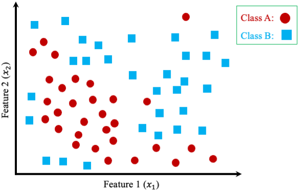
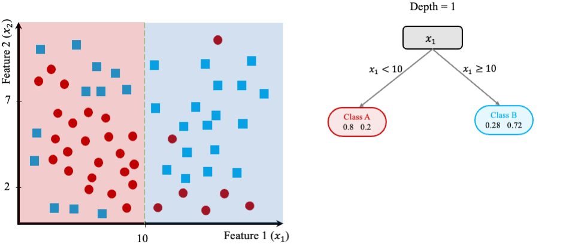
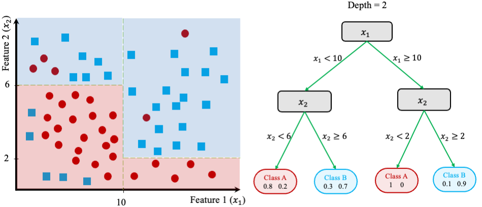
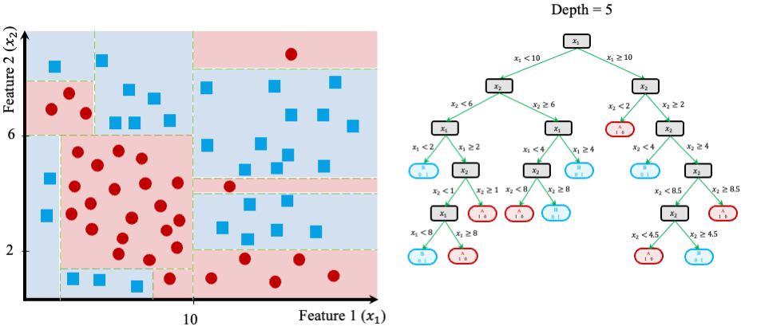

```{r, echo = F}
# To use this link: 
# 

```


```{r include = FALSE, message = FALSE, warning = FALSE}
library(rpart)         # For "CART" algorithm
library(rpart.plot)    # To plot decision trees
library(C50)           # For "C5.0" algorithm
library(randomForest)  # For "Random Forest" algorithm

library(liver)         # For "adult" dataset & "partition" function
library(ggplot2)       # For ggroc plot
library(pROC)          # For ROC plot using "plot.roc" function

library(naivebayes)    # for Naive Bayes algorithm

data(adult) 
data(risk)
```

# Decision Trees and Random Forests {#chapter-tree}

As part of the Data Science workflow, we have already explored several powerful algorithms for classification and regression. These include **k-Nearest Neighbors** and **Naive Bayes** for classification, as well as **linear regression models** for both continuous outcomes and classification tasks. In this chapter, we introduce two additional and widely-used techniques: **Decision Trees** and **Random Forests**. These algorithms are highly versatile, capable of tackling both classification and regression problems, and they are built around the idea of making a series of hierarchical decisions to classify data or predict outcomes.

At their core, **Decision Trees** employ simple decision-making rules to split the dataset into smaller, more homogeneous subsets, resulting in a tree-like structure of decisions. This step-by-step partitioning allows trees to capture complex relationships in the data while remaining interpretable and intuitive. **Random Forests**, an extension of Decision Trees, enhance their predictive power by combining the outputs of multiple trees. This ensemble learning approach improves accuracy, reduces overfitting, and provides a more robust solution compared to a single tree.

To illustrate the concept, consider the simple **Decision Tree** shown in Figure \@ref(fig:tree-0), which predicts whether a customer’s credit risk is classified as "good" or "bad" based on features such as `age` and `income`. This example uses the `risk` dataset introduced in Chapter \@ref(chapter-bayes). Each node in the tree represents a question, such as "Is yearly income is lower than 36K? (`income < 36e+3`)" or "Is age >= 29?", while the terminal nodes, also known as **leaves**, represent the final predictions (e.g., "Good risk" or "Bad risk"). Along with the predictions, the tree also provides uncertainty values. The process begins at the **root node**, and the data is iteratively split into branches based on feature values until it reaches the terminal nodes.

```{r tree-0, echo = FALSE, out.width = "65%", fig.align = 'center', fig.cap = "Decision tree for predicting credit risk based on age and income."}
formula = risk ~ age + income + mortgage + nr.loans + marital

tree.cart = rpart(formula, data = risk, method = "class")

rpart.plot(tree.cart, type = 4, extra = 104)
```

As shown in Figure \@ref(fig:tree-0), decision trees provide a visually intuitive and interpretable structure that does not require advanced statistical knowledge. This makes them especially valuable in business contexts, where simplicity, interpretability, and actionable insights are critical. Whether it’s customer segmentation, risk assessment, or process optimization, decision trees serve as a user-friendly tool for deriving insights and informing decisions.

By the end of this chapter, you will gain:

- A deep understanding of the mechanics behind **Decision Trees** and **Random Forests**,  
- Practical knowledge of building, evaluating, and tuning Decision Trees using algorithms like **CART** and **C5.0**, and  
- The ability to leverage **Random Forests** for solving real-world problems, such as identifying risky loans, detecting fraudulent transactions, or classifying images.  

We will start by exploring how Decision Trees are constructed, learning about their key concepts and algorithms. Then, we will delve into **Random Forests**, a powerful ensemble learning method that builds upon the strengths of Decision Trees to deliver state-of-the-art performance across a wide range of applications.

## How Decision Trees Work  

Decision Trees classify data or predict outcomes by recursively dividing a dataset into smaller subsets based on feature values. This **divide and conquer** approach aims to maximize the homogeneity of the subsets at each step, creating groups that are as similar as possible. At each split, the algorithm identifies the feature and threshold that best separate the data, using criteria such as the **Gini Index**, **Entropy**, or **Variance Reduction**, depending on whether the task is classification or regression. The process continues until one of the following conditions is met:  

1. The tree reaches a predefined maximum depth,  
2. All observations in a subset belong to the same class (for classification) or share the same value (for regression), or  
3. Further splits fail to improve the model’s performance.  

This iterative process creates a **binary tree**, where each **node** represents a decision test (e.g., "Is \(x_1 < 10\)?"), and each **leaf** represents the final prediction (e.g., "Class A" or "Class B"). Decision Trees are highly interpretable, as their structure visually represents the decision-making process, making them particularly useful for understanding how predictions are made.

To better understand how Decision Trees work, consider a toy dataset with two features (\(x_1\) and \(x_2\)) and two classes (Class A and Class B), as shown in Figure \@ref(fig:tree-1). The dataset contains 50 data points, and the goal is to classify these points into their respective classes using a Decision Tree.

```{r tree-1, echo = FALSE, out.width = "65%", fig.align = 'center', fig.cap = "A two-dimensional toy dataset (50 observations) with two classes (Class A and Class B), used to illustrate how to build Decision Trees."}

```

The process starts by identifying the feature and threshold that best separate the two classes. The algorithm evaluates all possible thresholds for each feature and selects the split that maximizes homogeneity in the resulting subsets. For this dataset, the best split is based on the feature \(x_1\), with a decision boundary at \(x_1 = 10\). 

As shown in Figure \@ref(fig:tree-2), this split divides the dataset into two regions:

- **Left region**: Data points where \(x_1 < 10\), which are 80% Class A and 20% Class B.  
- **Right region**: Data points where \(x_1 \geq 10\), which are 28% Class A and 72% Class B.  

The test \(x_1 < 10\) forms the **root node** of the tree, and the two regions correspond to the left and right branches of the tree.

```{r tree-2, echo = FALSE, out.width = "90%", fig.align = 'center', fig.cap = "Left: Decision boundary for a tree with depth 1. Right: The corresponding Decision Tree."}

```

Although the first split significantly separates the two classes, both regions still contain points from both classes. To further improve classification accuracy, the algorithm recursively evaluates additional splits within each region. 

In Figure \@ref(fig:tree-3), the second split is made using the feature \(x_2\). For the left region (\(x_1 < 10\)), the optimal threshold is \(x_2 = 6\), while for the right region (\(x_1 \geq 10\)), the threshold is \(x_2 = 8\). These additional splits refine the boundaries of the feature space, creating smaller and more homogeneous regions.

```{r tree-3, echo = FALSE, out.width = "90%", fig.align = 'center', fig.cap = "Left: Decision boundary for a tree with depth 2. Right: The corresponding Decision Tree."}

```

The splitting process continues until the tree meets a stopping condition, such as reaching a maximum depth or producing pure leaf nodes (regions containing data points from only one class). Figure \@ref(fig:tree-4) shows the final tree, grown to a depth of 5. The decision boundaries on the left illustrate how the feature space is partitioned into regions, each associated with a specific class.

```{r tree-4, echo = FALSE, out.width = "90%", fig.align = 'center', fig.cap = "Left: Decision boundary for a tree with depth 5. Right: The corresponding Decision Tree."}

```

At this depth, the tree has created highly specific decision boundaries that closely match the training data. However, this specificity often leads to **overfitting**, where the model captures noise or outliers in the data instead of general patterns. Overfitted trees may perform poorly on unseen data.

To make predictions with a Decision Tree, the algorithm evaluates the test conditions at each node and follows the corresponding branch until it reaches a leaf. The prediction depends on the type of task:

- **For classification**, the predicted class is the majority class of the points in the leaf.
- **For regression**, the predicted value is the mean of the target variable for all points in the leaf.

For example, in Figure \@ref(fig:tree-3), a new data point with \(x_1 = 8\) and \(x_2 = 4\) would traverse to the left region (\(x_1 < 10\)), then to the bottom-left region (\(x_2 < 6\)), ultimately landing in a leaf labeled as Class A with 80% confidence and a 20% error rate.

Decision Trees can also handle regression tasks by following the same splitting process but minimizing the **variance** of the target variable instead of maximizing class homogeneity. For regression, the prediction for a new data point is the average target value of all training points in the corresponding leaf. This allows Decision Trees to model non-linear relationships effectively.

Controlling the complexity of a Decision Tree is crucial to prevent overfitting. Fully growing a tree until all leaves are pure often results in a highly complex model that perfectly fits the training data but performs poorly on unseen data. This can be observed in Figure \@ref(fig:tree-4), where the decision boundaries overfit the training set, capturing outliers and noise. 

To address this, two strategies are commonly used:  

1. **Pre-pruning**: Stop the tree-building process early based on criteria such as limiting the maximum depth, the number of leaf nodes, or the minimum number of points required to split a node.  
2. **Post-pruning**: Build the full tree and then simplify it by removing or collapsing nodes that provide little additional value.

The effectiveness of these strategies depends on the dataset and the application. The choice of the split criterion—such as the **Gini Index**, **Entropy**, or **Variance Reduction**—also plays a crucial role in determining the tree’s performance. These criteria are foundational to the two most widely used Decision Tree algorithms, **CART** and **C5.0**, which will be explored in the following sections.

## Classification and Regression Trees (CART)  

The **Classification and Regression Trees (CART)** algorithm, introduced by Breiman et al. in 1984 [@breiman1984classification], is one of the most widely used methods for constructing decision trees. CART generates **binary trees**, meaning that each decision node splits the data into exactly two branches. It recursively partitions the training dataset into subsets of records that share similar values for the target variable. This partitioning is guided by a splitting criterion designed to minimize impurity in the resulting subsets. For classification tasks, CART employs measures such as the **Gini Index** or **Entropy** to evaluate splits, while for regression tasks, it minimizes the **Variance** of the target variable.  

As an example, the **Gini Index** is commonly used to measure impurity in classification tasks. The Gini Index for a node is calculated as:  

\[
Gini = 1 - \sum_{i=1}^k p_i^2
\]

where \(p_i\) represents the proportion of samples in the node that belong to class \(i\), and \(k\) is the total number of classes. A node is considered "pure" when all the data points in it belong to a single class, resulting in a Gini Index of 0. During tree construction, CART selects the feature and threshold that result in the largest reduction in impurity, splitting the data to create two more homogeneous child nodes.  

The recursive nature of CART can result in highly detailed trees that perfectly fit the training data. While this ensures the lowest possible error rate on the training set, it can lead to **overfitting**, where the tree becomes overly complex and fails to generalize to unseen data. To mitigate this, CART employs a technique called **pruning** to simplify the tree.  

Pruning involves cutting back branches of the tree that do not contribute meaningfully to its predictive accuracy on a validation set. This is achieved by finding an adjusted error rate that penalizes overly complex trees with too many leaf nodes. The goal of pruning is to strike a balance between accuracy and simplicity, enhancing the tree's ability to generalize to new data. The pruning process is described in detail by Breiman et al. [@breiman1984classification].

Despite its simplicity, CART is a powerful algorithm that has been widely adopted in practice. Its key strengths include:  

- **Interpretability:** The tree structure is intuitive and easy to visualize, making CART models highly explainable.  
- **Versatility:** CART can handle both classification and regression tasks effectively.  
- **Ability to handle mixed data types:** CART works seamlessly with datasets containing both numerical and categorical variables.  

However, CART also has limitations. The algorithm tends to produce deep trees that may overfit the training data, especially when the dataset is small or noisy. Additionally, CART's reliance on greedy splitting can result in suboptimal splits, as it evaluates one split at a time rather than considering all possible combinations.  

To address these shortcomings, more advanced algorithms have been developed, such as **C5.0**, which incorporates improvements in splitting and pruning techniques, and **Random Forests**, which combine multiple decision trees to create more robust models. These approaches build on the foundations of CART, improving its performance and reducing its susceptibility to overfitting. We will explore these methods in subsequent sections.  

## The C5.0 Algorithm for Building Decision Trees  

The **C5.0 algorithm** is one of the most well-known and widely used decision tree implementations. Developed by J. Ross Quinlan, C5.0 is an advanced iteration of his earlier algorithms, **C4.5** and **ID3** (Iterative Dichotomiser 3). Building upon the strengths of its predecessors, C5.0 introduces several improvements in efficiency, flexibility, and accuracy, making it a popular choice for both academic and commercial applications. While Quinlan offers a commercial version of C5.0 (available at [RuleQuest](http://www.rulequest.com/)), a single-threaded implementation has been made publicly available and has been incorporated into open-source tools such as R.

C5.0 differs from other decision tree algorithms, such as CART, in several key ways. Unlike CART, which only produces binary trees, C5.0 allows for more flexible tree structures with non-binary splits. For categorical attributes, C5.0 can create separate branches for each unique value of the attribute, which can lead to highly "bushy" trees if the attribute has many categories. Another major distinction lies in the way node homogeneity is measured. While CART uses metrics like the Gini Index or Variance Reduction, C5.0 employs **Entropy** and **Information Gain**, concepts rooted in information theory, to evaluate the optimal splits. 

Entropy measures the level of disorder or randomness in a dataset. High entropy indicates a dataset with high diversity (e.g., a mix of classes), whereas low entropy signifies greater homogeneity (e.g., all samples belong to the same class). The goal of the C5.0 algorithm is to identify splits that reduce entropy, creating purer subsets of data at each step of the tree-building process. Formally, entropy for a variable \(x\) with \(k\) classes is defined as:

\[
Entropy(x) = - \sum_{i=1}^k p_i \log_2(p_i)
\]

Here, \(p_i\) is the proportion of samples belonging to class \(i\). For example, if a dataset contains an even split between two classes, the entropy is at its maximum. Conversely, if all samples belong to a single class, entropy is zero. This concept extends naturally to the calculation of **Information Gain**, which quantifies the reduction in entropy achieved by splitting the data on a particular feature. Given a candidate split \(S\) that divides a dataset \(T\) into subsets \(T_1, T_2, \dots, T_c\), the entropy after the split is calculated as a weighted sum of the entropies of the subsets:

\[
H_S(T) = \sum_{i=1}^c \frac{|T_i|}{|T|} \cdot Entropy(T_i)
\]

The **Information Gain** for the split \(S\) is then:

\[
gain(S) = H(T) - H_S(T)
\]

where \(H(T)\) represents the entropy of the dataset before the split. At each decision node, the C5.0 algorithm evaluates all possible splits and selects the one that maximizes information gain. This process ensures that the splits lead to progressively purer subsets, improving the accuracy of the model.

To illustrate the C5.0 algorithm, consider its application to the `risk` dataset, which predicts credit risk ("good" or "bad") based on features like `age` and `income`. Figure \@ref(fig:tree-C50) shows the resulting decision tree, created using the `C5.0` function from the `C50` package in R. Each node in the tree represents a decision based on a feature value, and the branches lead to subsets of data that become progressively more homogeneous.

```{r tree-C50, echo = FALSE, out.width = "65%", fig.align = 'center', fig.cap = "C5.0 Decision Tree for predicting credit risk based on age and income."}
formula = risk ~ age + income

C50_fit = C5.0(formula, data = risk)

par(mar = c(0, 0, 0, 0))
plot(C50_fit)
```

The tree in Figure \@ref(fig:tree-C50) demonstrates how the algorithm uses entropy and information gain to construct splits that best separate the classes. Unlike the strictly binary splits produced by CART, C5.0 allows for multi-way splits when working with categorical attributes, which can create trees with variable shapes. This flexibility often leads to more compact trees that are easier to interpret, especially for datasets with categorical variables.

C5.0 offers several advantages over other decision tree algorithms. It is computationally efficient, making it suitable for large datasets, and its flexibility in handling non-binary splits allows for more nuanced tree structures. Additionally, C5.0 incorporates advanced features such as **feature weighting**, which allows the algorithm to prioritize more relevant features during the tree-building process. This can improve model performance by focusing on the most important predictors.

Despite its strengths, the C5.0 algorithm is not without limitations. Trees generated by C5.0 can become overly complex or "bushy," particularly when working with categorical attributes that have many unique values. This complexity can make the trees harder to interpret and may lead to overfitting. To address these issues, pruning techniques can be applied to simplify the tree and improve its generalizability. Additionally, the computational cost of evaluating multiple splits for categorical features may increase for large datasets with high cardinality, although this is mitigated by C5.0’s overall efficiency.

In summary, the C5.0 algorithm is a powerful and versatile tool for building decision trees. By leveraging concepts like entropy and information gain, it constructs models that are both accurate and interpretable. While it shares many similarities with CART, its ability to handle multi-way splits and its use of information theory make it a distinct and valuable alternative. The C5.0 algorithm is widely used in fields such as finance, healthcare, and marketing, where decision tree models provide actionable insights and transparent decision-making processes. In the next section, we will explore **Random Forests**, an ensemble learning technique that builds upon decision trees to further enhance accuracy and robustness.

## Random Forests: An Ensemble Approach  

While Decision Trees are powerful and intuitive, they are prone to overfitting, particularly when grown to their full depth. **Random Forests** [@breiman2001random] address this limitation by adopting an ensemble approach that combines the predictions of multiple Decision Trees to produce a more robust and accurate model. Instead of relying on a single tree, Random Forests aggregate the predictions of many trees, reducing overfitting and enhancing performance on complex datasets.

The Random Forest algorithm introduces two key elements of randomness to improve model diversity:  

1. **Bootstrap Aggregation (Bagging):** Each tree is trained on a random subset of the training data, created by sampling with replacement. This means that some observations appear multiple times in a tree’s training data, while others may be excluded. This diversity ensures that each tree learns slightly different patterns.  
2. **Random Feature Selection:** At each split, the algorithm considers a random subset of features instead of evaluating all features. This further decorrelates the trees, as each tree is forced to rely on different combinations of features to make decisions.

Once the forest is built, the predictions from all trees are aggregated to produce the final output:  

- For **classification**, the final prediction is determined by **majority voting**, where each tree votes for a class, and the most common class is selected.  
- For **regression**, the final output is the average of the predictions from all trees.

The strength of Random Forests lies in the principle of the **"wisdom of the crowd."** Individually, each tree is a weak learner, as it is trained on a limited subset of data and features. However, when combined, their collective predictions form a strong learner. By leveraging the diversity of individual trees, Random Forests reduce the likelihood that errors made by any single tree will dominate the overall model. 

Additionally, the randomness introduced through feature selection ensures that no single feature dominates the model, making Random Forests particularly effective for datasets with **correlated** or **redundant features**. This feature-level decorrelation enhances the ensemble’s ability to generalize to unseen data.

Random Forests have several notable advantages:  

- **Reduced Overfitting:** By averaging the predictions of multiple trees, Random Forests smooth out the noise and variance present in individual trees, leading to better generalization.  
- **High Accuracy:** Random Forests perform well on both classification and regression tasks, particularly for datasets with non-linear relationships or high-dimensional feature spaces.  
- **Feature Importance:** The algorithm provides **feature importance scores**, enabling us to identify the most influential predictors. This is especially useful for feature selection and gaining insights into the underlying data.  
- **Robustness:** Random Forests are resilient to noise and outliers, as the ensemble effect reduces the impact of anomalies on the final prediction.  
- **Flexibility:** Random Forests can handle both numerical and categorical data and adapt well to diverse types of problems.  

Despite their strengths, Random Forests have some limitations:  

- **Computational Complexity:** Training hundreds or thousands of trees can be computationally intensive, especially on large datasets. However, this can be mitigated through parallel processing, as each tree is built independently.  
- **Reduced Interpretability:** While individual Decision Trees are highly interpretable, the ensemble nature of Random Forests makes it difficult to understand the collective decision-making process of the model.  
- **Bias-Variance Tradeoff:** Although Random Forests reduce variance through bagging, they may sometimes smooth over complex relationships in the data that a single, well-tuned Decision Tree could capture.  

Random Forests strike a balance between accuracy and robustness, addressing many of the weaknesses of individual Decision Trees while retaining their strengths. They are well-suited for both classification and regression tasks and are particularly effective in scenarios with noisy or high-dimensional data. Moreover, their ability to compute feature importance scores provides valuable insights into the drivers of the model’s predictions, making them not only a predictive tool but also an exploratory one.

Random Forests have become one of the most widely used machine learning algorithms due to their versatility, reliability, and strong performance across a variety of applications. In the next section, we will apply Random Forests, along with Decision Trees, to the **adult dataset** to explore the question: *Who can earn more than $50K per year?* This case study will provide a practical demonstration of how these models work and how they can be evaluated and compared in a real-world scenario.

## Case Study: Who Can Earn More Than $50K Per Year?

To demonstrate the practical application of Decision Trees and Random Forests, we use the **`adult` dataset**, which provides demographic and income information about individuals. This dataset, sourced from the [US Census Bureau](https://www.census.gov), is widely used to predict whether an individual earns more than $50,000 per year based on features such as education, hours worked per week, marital status, and more. The objective of this binary classification problem is to categorize individuals into one of two income groups: `<=50K` or `>50K`, with the features serving as predictors and the target variable being `income`.

### Overview of the Dataset {-}

We begin by loading the dataset and examining its structure:

```{r}
data(adult)

str(adult)
```

The dataset contains `r nrow(adult)` records and `r ncol(adult)` variables. Of these, `r ncol(adult) - 1` are predictors, while the target variable, `income`, is a binary categorical variable with two levels: `<=50K` and `>50K`. The features include both numerical and categorical variables:

- `age`: Age in years (numerical).  
- `workclass`: Type of employment (categorical, 6 levels).  
- `demogweight`: Demographic weight (categorical).  
- `education`: Highest education level (categorical, 16 levels).  
- `education.num`: Years of education (numerical).  
- `marital.status`: Marital status (categorical, 5 levels).  
- `occupation`: Type of occupation (categorical, 15 levels).  
- `relationship`: Type of relationship (categorical, 6 levels).  
- `race`: Race (categorical, 5 levels).  
- `gender`: Gender (categorical, Male/Female).  
- `capital.gain`: Capital gains (numerical).  
- `capital.loss`: Capital losses (numerical).  
- `hours.per.week`: Weekly hours worked (numerical).  
- `native.country`: Country of origin (categorical, 42 levels).  
- `income`: Target variable, representing annual income (`<=50K` or `>50K`).

For additional details about the dataset, visit the [documentation](https://www.rdocumentation.org/packages/liver/versions/1.3/topics/adult).

### Data Cleaning and Preparation {-}

The dataset includes missing values represented by the character `"?"`. For simplicity, we rely on prior data cleaning steps (see Chapter \@ref(chapter-data-prep)) to handle these issues. These steps include recoding categorical variables, grouping country-level data into broader regions, and imputing missing values, as demonstrated below:

```{r echo = FALSE}
library(forcats)     # For factor manipulation
library(Hmisc)       # For handling missing values

### Data Cleaning
Europe = c("England", "France", "Germany", "Greece", "Holand-Netherlands", 
            "Hungary", "Ireland", "Italy", "Poland", "Portugal", "Scotland", 
            "Yugoslavia")

Asia = c("China", "Hong", "India", "Iran", "Cambodia", "Japan", "Laos", 
          "Philippines", "Vietnam", "Taiwan", "Thailand")

N.America = c("Canada", "United-States", "Puerto-Rico")

S.America = c("Columbia", "Cuba", "Dominican-Republic", "Ecuador", "El-Salvador", 
             "Guatemala", "Haiti", "Honduras", "Mexico", "Nicaragua", 
             "Outlying-US(Guam-USVI-etc)", "Peru", "Jamaica", "Trinadad&Tobago")

Other = c("South")

adult$native.country = fct_collapse(adult$native.country, "Europe"    = Europe   )
adult$native.country = fct_collapse(adult$native.country, "Asia"      = Asia     )
adult$native.country = fct_collapse(adult$native.country, "N.America" = N.America)
adult$native.country = fct_collapse(adult$native.country, "S.America" = S.America)
adult$native.country = fct_collapse(adult$native.country, "Other"     = Other    )

# Combine categories "Never-worked" and "Without-pay" into "Unemployed"
adult$workclass = fct_collapse(adult$workclass, "Unemployed" = c("Never-worked", "Without-pay"))

# Recode factor levels
adult$race = fct_recode(adult$race, "Amer-Indian" = "Amer-Indian-Eskimo", "Asian" = "Asian-Pac-Islander")

### Handling Missing Values
adult[adult == "?"] = NA

# Remove missing-value levels and impute random values for simplicity
adult$workclass      = impute(factor(adult$workclass), 'random')
adult$native.country = impute(factor(adult$native.country), 'random')
adult$occupation     = impute(factor(adult$occupation), 'random')
```

We then partition the cleaned dataset into **training** (80%) and **testing** (20%) subsets to ensure that the models are evaluated on unseen data:

```{r}
set.seed(6)

data_sets = partition(data = adult, ratio = c(0.8, 0.2))

train_set = data_sets$part1
test_set  = data_sets$part2

actual_test = test_set$income
```

The use of `set.seed()` ensures reproducibility.

### Decision Tree with CART {-}  

To predict whether an individual's income exceeds $50K, we fit a Decision Tree using the **CART algorithm**. The following predictors are used:  

`age`, `education.num`, `capital.gain`, `capital.loss`, `hours.per.week`, `marital.status`, `workclass`, `race`, and `gender`.  

The tree is built using the `rpart()` function from the **rpart** package:

```{r}
formula = income ~ age + education.num + capital.gain + capital.loss + 
                   hours.per.week + marital.status + workclass + race + gender

tree_cart = rpart(formula = formula, data = train_set, method = "class")

print(tree_cart)
```

The resulting tree is visualized using the `rpart.plot()` function:

```{r, out.width = "100%"}
rpart.plot(tree_cart, type = 4, extra = 104)
```

The tree identifies **`marital.status`** as the most important predictor, followed by `capital.gain`, `education.num`, and `capital.loss`. The tree contains 6 decision nodes and 7 leaves, providing interpretable insights into the predictors.

### Decision Tree with C5.0 {-}

We next use the C5.0 algorithm to build a Decision Tree, starting with the same predictors. The tree is constructed using the `C5.0()` function from the **C50** package:

```{r}
tree_C50 = C5.0(formula, data = train_set) 

print(tree_C50)
```

The output provides a summary of the tree. While the full tree visualization is omitted here, it highlights the importance of `marital.status` as the root node, consistent with the CART results.

### Random Forest {-}  

The **Random Forest** algorithm is used to build an ensemble of Decision Trees, aggregating their predictions. Using the same predictors, we construct a Random Forest model with 100 trees using the `randomForest()` function:

```{r}
random_forest = randomForest(formula = formula, data = train_set, ntree = 100)
```

We can visualize the variable importance and the error rate of the Random Forest model:

```{r}
varImpPlot(random_forest)

plot(random_forest)
```

### Model Evaluation {-}

To evaluate model performance, we calculate the **confusion matrix**, **ROC curve**, and **AUC** for all three models (CART, C5.0, and Random Forest):

#### CART: {-}
```{r, out.width = "30%"}
predict_cart = predict(tree_cart, test_set, type = "class")

conf.mat(predict_cart, actual_test)
conf.mat.plot(predict_cart, actual_test)
```

#### C5.0: {-}
```{r, out.width = "30%"}
predict_C50 = predict(tree_C50, test_set, type = "class")

conf.mat(predict_C50, actual_test)
conf.mat.plot(predict_C50, actual_test)
```

#### Random Forest: {-}
```{r, out.width = "30%"}
predict_random_forest = predict(random_forest, test_set)

conf.mat(predict_random_forest, actual_test)
conf.mat.plot(predict_random_forest, actual_test)
```

Finally, the ROC curves and AUC for the models are compared:

```{r}
prob_cart = predict(tree_cart, test_set, type = "prob")[, 1]
prob_C50 = predict(tree_C50, test_set, type = "prob")[, 1]
prob_random_forest = predict(random_forest, test_set, type = "prob")[, 1]

roc_cart = roc(actual_test, prob_cart)
roc_C50 = roc(actual_test, prob_C50)
roc_random_forest = roc(actual_test, prob_random_forest)

ggroc(list(roc_cart, roc_C50, roc_random_forest), size = 0.8) + 
    theme_minimal() + ggtitle("ROC Curves with AUC for Three Models") +
  scale_color_manual(values = 1:3, 
    labels = c(paste("CART; AUC=", round(auc(roc_cart), 3)), 
                paste("C5.0; AUC=", round(auc(roc_C50), 3)), 
                paste("Random Forest; AUC=", round(auc(roc_random_forest), 3)))) +
  theme(legend.title = element_blank()) +
  theme(legend.position = c(.7, .3), text = element_text(size = 17))
```

The **black** curve represents CART, the <span style="color:red">**red**</span> curve represents C5.0, and the <span style="color:green">**green**</span> curve represents Random Forest. Based on AUC values, C5.0 performs slightly better, but all three models show comparable accuracy, making them reliable for this classification task.

## Exercises

To do ...