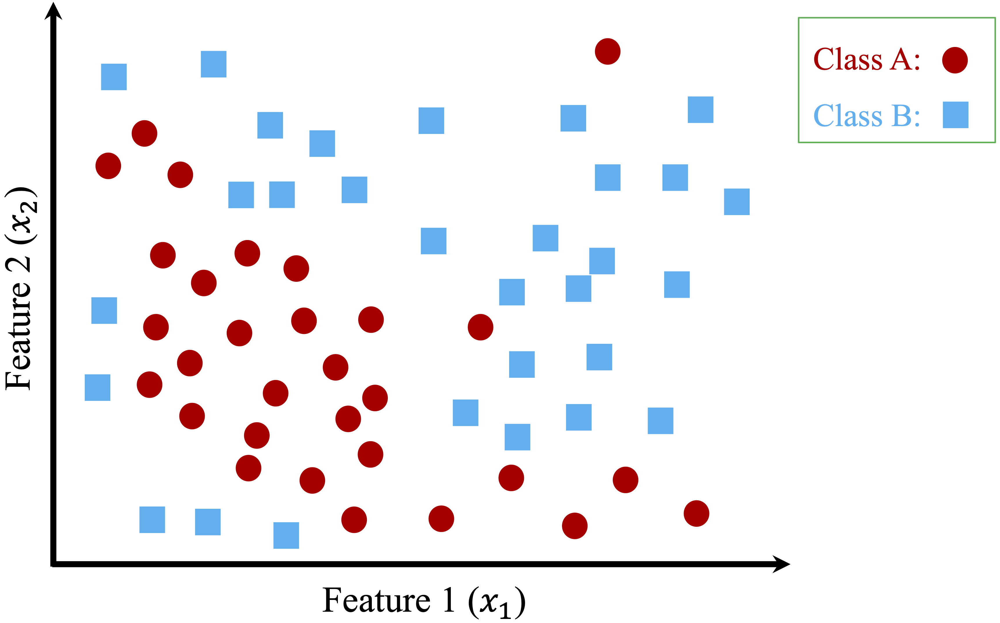
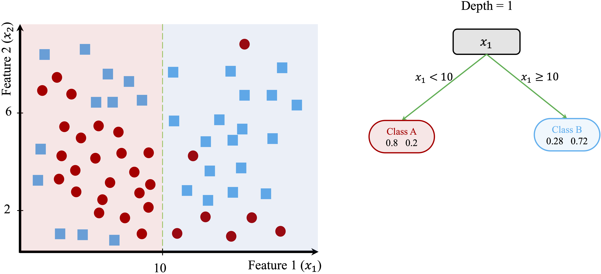
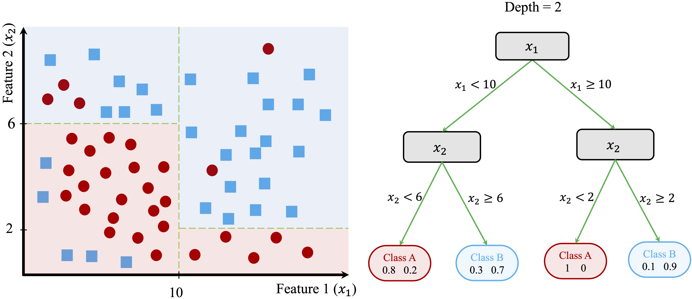
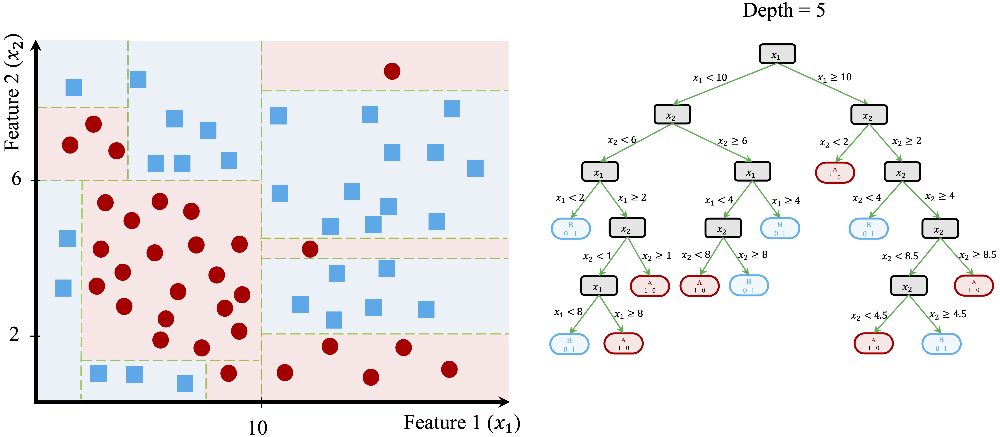

```{r include = FALSE, message = FALSE, warning = FALSE}
library(ggplot2)       # For ggroc plot
library(pROC)          # For ROC plot using "plot.roc" function
```

# Decision Trees and Random Forests {#chapter-tree}  

Imagine a bank evaluating loan applications. Given details such as income, age, credit history, and debt-to-income ratio, how does the bank decide whether to approve or reject a loan? Similarly, how do online retailers recommend products based on customer preferences? These decisions, which mimic human reasoning, are often powered by *decision trees*—a simple yet powerful machine learning technique that classifies data by following a series of logical rules.  

Decision trees are widely used in various domains, from medical diagnosis and fraud detection to customer segmentation and automated decision-making. Their intuitive nature makes them highly interpretable, enabling data-driven decision-making without requiring deep mathematical expertise. However, while individual trees are easy to understand, they are prone to overfitting, capturing noise in the data rather than general patterns. *Random forests* address this limitation by combining multiple decision trees to produce a more accurate and stable model.  

To see decision trees in action, consider the example in Figure \@ref(fig:tree-0), which predicts whether a customer’s credit risk is classified as "good" or "bad" based on features such as `age` and `income`. This tree is trained on the `risk` dataset, introduced in Chapter \@ref(chapter-bayes), and consists of decision nodes representing yes/no questions, such as whether yearly income is below €36,000 (`income < 36e+3`) or whether age is greater than 29. The final classification is determined at the terminal nodes, also known as leaves.

```{r tree-0, echo = FALSE, out.width = "75%", fig.align = 'center', fig.cap = "Decision tree for predicting credit risk based on age and income."}
library(liver)
library(rpart)
data(risk)

formula = risk ~ age + income + mortgage + nr.loans + marital

tree.cart = rpart(formula, data = risk, method = "class")

rpart.plot(tree.cart, type = 4, extra = 104)
```

Decision trees are highly interpretable, making them especially valuable in domains such as finance, healthcare, and marketing, where understanding model decisions is as important as accuracy. Their structured form allows for easy visualization of decision pathways, helping businesses with customer segmentation, risk assessment, and process optimization.

In this chapter, we explore how decision trees and random forests work, their strengths and limitations, and how they can be applied to solve real-world problems. By the end of the chapter, you will learn:  

- The mechanics behind *decision trees* and *random forests*.  
- How to build, evaluate, and fine-tune decision trees using algorithms such as *CART* and *C5.0*.  
- How random forests improve predictive accuracy and generalization through ensemble learning.  

We begin by examining the core principles of decision trees, including how they make predictions and how their performance can be optimized.  

## How Decision Trees Work  

A decision tree classifies or predicts outcomes by systematically dividing a dataset into smaller, more uniform groups based on feature values. Each split refines the classification or prediction, creating a structured, tree-like model. This *divide-and-conquer* approach is widely used in classification and regression due to its intuitive nature and ability to model complex decision-making processes.

At each step, the algorithm selects the feature and threshold that best separate the data. This decision is based on metrics such as the *Gini Index*, *Entropy*, or *Variance Reduction*, depending on the problem type. The tree continues growing until it meets a stopping criterion, such as reaching a predefined maximum depth, forming perfectly homogeneous subsets, or when further splits no longer improve performance.

To see this process in action, consider a simple dataset with two features (\(x_1\) and \(x_2\)) and two classes (Class A and Class B), as shown in Figure \@ref(fig:tree-1). The dataset consists of 50 data points, and the goal is to classify them into their respective categories.

```{r tree-1, echo = FALSE, out.width = "70%", fig.align = 'center', fig.cap = "A two-dimensional toy dataset (50 observations) with two classes (Class A and Class B), used to illustrate how to build Decision Trees."}

```

The process begins by identifying the feature and threshold that best separate the two classes. The algorithm evaluates all possible splits and selects the one that maximizes homogeneity in the resulting subsets. For this dataset, the optimal split occurs at \(x_1 = 10\), dividing the dataset into two regions:

- The left region contains data points where \(x_1 < 10\), with 80% belonging to Class A and 20% to Class B.
- The right region contains data points where \(x_1 \geq 10\), with 28% in Class A and 72% in Class B.  

This first split is illustrated in Figure \@ref(fig:tree-2), where the decision boundary is drawn at \(x_1 = 10\).

```{r tree-2, echo = FALSE, out.width = "100%", fig.align = 'center', fig.cap = "Left: Decision boundary for a tree with depth 1. Right: The corresponding Decision Tree."}

```

Although this split improves class separation, some overlap remains, suggesting that further refinement is needed. The tree-building process continues by introducing additional splits based on \(x_2\), creating smaller, more homogeneous groups.

In Figure \@ref(fig:tree-3), the algorithm identifies new thresholds: \(x_2 = 6\) for the left region and \(x_2 = 8\) for the right region. These additional splits refine the classification process, improving the model’s ability to distinguish between the two classes.

```{r tree-3, echo = FALSE, out.width = "100%", fig.align = 'center', fig.cap = "Left: Decision boundary for a tree with depth 2. Right: The corresponding Decision Tree."}

```

This recursive process continues until the tree reaches a stopping criterion. Figure \@ref(fig:tree-4) shows a fully grown tree with a depth of 5, demonstrating how decision trees create increasingly refined decision boundaries.

```{r tree-4, echo = FALSE, out.width = "100%", fig.align = 'center', fig.cap = "Left: Decision boundary for a tree with depth 5. Right: The corresponding Decision Tree."}

```

At this depth, the tree has created highly specific decision boundaries that closely match the training data. While this deep tree perfectly classifies the training data, it may not generalize well to new observations. The model has likely captured not just meaningful patterns but also noise, a problem known as *overfitting*. Overfitted trees perform well on training data but struggle to make accurate predictions on unseen data.

### Making Predictions with a Decision Tree {-}  

After a decision tree is built, making predictions involves following the decision rules from the root node down to a leaf. Each split refines the prediction until a final classification or numerical estimate is reached.

For classification tasks, the tree assigns a new observation to the most common class in the leaf where it ends up. For regression tasks, the predicted outcome is the average target value of the data points in that leaf.

To illustrate, consider a new data point with \(x_1 = 8\) and \(x_2 = 4\) in Figure \@ref(fig:tree-3). The tree classifies it by following these steps:

1. Since \(x_1 = 8\), the point moves to the left branch (\(x_1 < 10\)).  
2. Since \(x_2 = 4\), the point moves to the lower-left region (\(x_2 < 6\)).  
3. The final leaf node assigns the point to Class A with 80% confidence.  

This step-by-step traversal of the tree ensures that predictions remain interpretable, making decision trees particularly useful in applications where understanding how a prediction was made is as important as accuracy.

### Controlling Tree Complexity {-}  

While decision trees are powerful, they can easily grow too complex, capturing noise rather than meaningful patterns. To improve generalization, various techniques help regulate tree complexity and prevent overfitting.

One approach is **pre-pruning**, which restricts tree growth during training by enforcing stopping criteria. These may include setting a maximum tree depth, requiring a minimum number of samples per node, or enforcing a minimum improvement in information gain at each split. By stopping early, pre-pruning prevents the tree from fitting the data too closely, reducing the risk of overfitting.

Alternatively, **post-pruning** allows the tree to grow fully before simplifying it. Once the tree is built, unnecessary nodes that contribute little to predictive accuracy are removed or merged. This approach often improves interpretability while maintaining performance.

The choice between pre-pruning and post-pruning depends on the dataset and problem at hand. Additionally, the way splits are chosen—using criteria such as *Gini Index*, *Entropy*, or *Variance Reduction*—plays a crucial role in determining tree performance. These will be explored in later sections.

## Classification and Regression Trees (CART)  

The classification and regression trees (CART) algorithm, introduced by Breiman et al. in 1984 [@breiman1984classification], is one of the most widely used methods for constructing decision trees. CART generates binary trees, meaning that each decision node splits the data into exactly two branches. It recursively partitions the training dataset into subsets of records that share similar values for the target variable. This partitioning is guided by a splitting criterion designed to minimize impurity in the resulting subsets. For classification tasks, CART employs measures such as the Gini index or entropy to evaluate splits, while for regression tasks, it minimizes the variance of the target variable.  

The Gini index is commonly used to measure impurity in classification tasks. It is calculated as:  

\[
Gini = 1 - \sum_{i=1}^k p_i^2
\]

where \(p_i\) represents the proportion of samples in the node that belong to class \(i\), and \(k\) is the total number of classes. A node is considered pure when all data points in it belong to a single class, resulting in a Gini index of zero. During tree construction, CART selects the feature and threshold that result in the largest reduction in impurity, splitting the data to create two more homogeneous child nodes.  

The recursive nature of CART can lead to highly detailed trees that fit the training data perfectly. While this minimizes the error rate on the training set, it often results in overfitting, where the tree becomes overly complex and fails to generalize to unseen data. To mitigate this, CART employs pruning techniques to simplify the tree.  

Pruning involves trimming branches that do not contribute meaningfully to predictive accuracy on a validation set. This is achieved by finding an adjusted error rate that penalizes overly complex trees with too many leaf nodes. The goal of pruning is to balance accuracy and simplicity, enhancing the tree's ability to generalize to new data. The pruning process is discussed in detail by Breiman et al. [@breiman1984classification].  

Despite its simplicity, CART is widely used in practice due to its interpretability, versatility, and ability to handle both classification and regression tasks. The tree structure provides an intuitive way to visualize decision-making, making it highly explainable. Additionally, CART works well with both numerical and categorical data, making it applicable across a range of domains.  

However, CART has limitations. The algorithm tends to produce deep trees that may overfit the training data, particularly when the dataset is small or noisy. Its reliance on greedy splitting can also result in suboptimal splits, as it evaluates one feature at a time rather than considering all possible combinations.  

To address these shortcomings, more advanced algorithms have been developed, such as C5.0, which incorporates improvements in splitting and pruning techniques, and random forests, which combine multiple decision trees to create more robust models. These approaches build on the foundations of CART, improving performance and reducing susceptibility to overfitting. The following sections explore these methods in detail.  

## The C5.0 Algorithm for Building Decision Trees  

The C5.0 algorithm, developed by J. Ross Quinlan, is an advanced iteration of earlier decision tree models, including C4.5 and ID3 (Iterative Dichotomiser 3). It introduces improvements in efficiency, flexibility, and accuracy, making it a widely used approach in both academic research and practical applications. While a commercial version is available through [RuleQuest](http://www.rulequest.com/), an open-source implementation is integrated into R and other machine learning tools.

C5.0 differs from other decision tree algorithms, such as CART, in several ways. Unlike CART, which constructs strictly binary trees, C5.0 allows for multi-way splits, particularly for categorical attributes. This can lead to more compact and interpretable trees when dealing with variables that have many distinct categories. Another key distinction lies in how the algorithm evaluates node purity. While CART uses measures such as the Gini index or variance reduction, C5.0 relies on entropy and information gain, concepts derived from information theory.

Entropy measures the degree of disorder in a dataset. Higher entropy indicates greater diversity among classes, while lower entropy suggests more homogeneous groups. The goal of C5.0 is to identify feature splits that reduce entropy, leading to purer subsets at each step of tree construction. The entropy for a variable \(x\) with \(k\) classes is defined as:

\[
Entropy(x) = - \sum_{i=1}^k p_i \log_2(p_i)
\]

where \(p_i\) represents the proportion of samples in class \(i\). A dataset with equal distribution among classes has maximum entropy, whereas a dataset with all samples belonging to the same class has entropy equal to zero. Using this measure, the algorithm calculates information gain, which quantifies the reduction in entropy resulting from a particular split. Given a candidate split \(S\) that divides dataset \(T\) into subsets \(T_1, T_2, \dots, T_c\), the entropy after splitting is computed as:

\[
H_S(T) = \sum_{i=1}^c \frac{|T_i|}{|T|} \cdot Entropy(T_i)
\]

The information gain from the split is then:

\[
gain(S) = H(T) - H_S(T)
\]

where \(H(T)\) represents the entropy before the split. The algorithm evaluates all potential splits and selects the one that maximizes information gain, ensuring that each decision step results in purer subsets.

To illustrate how C5.0 constructs decision trees, consider its application to the `risk` dataset, which classifies a customer's credit risk as good or bad based on features such as `age` and `income`. Figure \@ref(fig:tree-C50) shows a decision tree trained using the `C5.0` function from the `C50` package in R.

```{r tree-C50, echo = FALSE, out.width = "65%", fig.align = 'center', fig.cap = "C5.0 Decision Tree for predicting credit risk based on age and income."}
formula = risk ~ age + income

C50_fit = C5.0(formula, data = risk)

par(mar = c(0, 0, 0, 0))
plot(C50_fit)
```

The tree demonstrates how C5.0 selects splits to separate classes. Unlike CART, which only allows binary splits, C5.0 enables multi-way splits when dealing with categorical features. This flexibility can lead to trees that are more concise and easier to interpret, particularly in datasets where categorical variables play a significant role.

C5.0 has several advantages over other decision tree algorithms. It is computationally efficient, making it well-suited for large datasets, and its ability to handle multi-way splits enables more nuanced decision-making. Additionally, it incorporates feature weighting, prioritizing the most informative predictors, which can improve model accuracy.

However, C5.0 is not without limitations. The trees it generates can become overly complex, particularly when categorical attributes contain many unique values, increasing the risk of overfitting. To mitigate this, pruning techniques can be applied to simplify the tree while preserving accuracy. Another challenge is the computational cost of evaluating multiple splits for categorical variables, which can increase processing time for large datasets, though C5.0's optimizations help reduce this impact.

In summary, C5.0 builds upon earlier decision tree models by leveraging entropy and information gain to construct accurate and interpretable decision rules. Its ability to create multi-way splits makes it particularly effective for categorical data, while its efficiency allows it to scale well. In the next section, we explore random forests, an ensemble learning technique that enhances decision tree models by combining multiple trees for improved accuracy and robustness.

## Random forests: an ensemble approach  

Decision trees are effective models, but they tend to overfit, particularly when grown to their full depth. Random forests address this limitation by combining multiple decision trees into an ensemble, producing a more accurate and robust model. Instead of relying on a single tree, random forests aggregate the predictions of many trees, reducing overfitting and improving performance on complex datasets.

The algorithm introduces two key elements of randomness to enhance model diversity:  

- **Bootstrap aggregation (bagging):** Each tree is trained on a random subset of the training data, created by sampling with replacement. This means some observations appear multiple times in a tree’s training data, while others may be excluded. This diversity ensures that each tree learns slightly different patterns.  
- **Random feature selection:** At each split, the algorithm considers a random subset of features instead of evaluating all features. This decorrelates the trees, forcing them to rely on different combinations of features.

Once the forest is built, the predictions from all trees are aggregated to produce the final output:  

- For classification, the final prediction is determined by majority voting, where each tree votes for a class, and the most common class is selected.  
- For regression, the final output is the average of the predictions from all trees.

The strength of random forests lies in their ability to leverage diversity. Individually, each tree is trained on a limited subset of data and features, making it a weak learner. However, when combined, their collective predictions form a stronger model. By aggregating multiple trees, random forests reduce the risk of errors from any single tree dominating the overall prediction.

Additionally, the randomness introduced through feature selection ensures that no single feature dominates the model, making random forests particularly effective for datasets with correlated or redundant features. This feature-level decorrelation enhances their ability to generalize to unseen data.

### Advantages and limitations of random forests {-}

**Advantages**  

- Reduced overfitting: By averaging predictions from multiple trees, random forests smooth out noise and variance, leading to better generalization.  
- High accuracy: They perform well on both classification and regression tasks, particularly for datasets with non-linear relationships or high-dimensional feature spaces.  
- Feature importance ranking: The algorithm provides feature importance scores, helping to identify the most influential predictors.  
- Robustness: They are resilient to noise and outliers, as the ensemble effect reduces the impact of anomalies on the final prediction.  
- Flexibility: Random forests can handle both numerical and categorical data and adapt well to different types of problems.  

**Limitations**  

- Computational complexity: Training hundreds or thousands of trees can be computationally intensive, especially on large datasets. However, this can be mitigated through parallel processing, as each tree is built independently.  
- Reduced interpretability: While individual decision trees are easy to interpret, the ensemble nature of random forests makes it difficult to understand how individual features contribute to predictions.  
- Potential loss of fine details: Although random forests reduce variance, they may smooth over intricate relationships that a well-tuned single decision tree could capture.

Random forests balance accuracy and robustness, addressing many of the weaknesses of individual decision trees while retaining their strengths. They are particularly effective in scenarios with noisy or high-dimensional data. Their ability to compute feature importance scores also provides valuable insights into the drivers of model predictions, making them useful for both predictive modeling and exploratory data analysis.

Random forests have become one of the most widely used machine learning algorithms due to their versatility, reliability, and strong performance across a variety of applications. In the next section, we apply random forests, along with decision trees, to a case study predicting income levels. This practical example demonstrates how these models work and how they can be evaluated in real-world scenarios.  

## Case Study: Who Can Earn More Than $50K Per Year? {#tree-case-study}

Predicting income levels is an important task in fields such as finance, marketing, and public policy. Banks use income models to assess creditworthiness, employers analyze salary trends for compensation planning, and governments rely on income predictions for taxation and social welfare policies. In this case study, we explore how decision trees and random forests can be applied to classify individuals based on their likelihood of earning more than $50,000 per year.

For this analysis, we use the *adult* dataset, a well-known benchmark dataset sourced from the [US Census Bureau](https://www.census.gov) and available in the **liver** package. This dataset was previously introduced in Section \@ref(Data-pre-adult) as part of the data preparation chapter (\@ref(chapter-data-prep)). It contains demographic and employment-related attributes, such as education, working hours, marital status, and occupation, all of which influence earning potential. The goal is to build a classification model that predicts whether an individual belongs to one of two income groups: `<=50K` or `>50K`, treating `income` as the target variable.

### Overview of the Dataset {-}

The *adult* dataset, available in the **liver** package, provides demographic and employment-related attributes to predict income levels. We can load it directly into R and examine its summary using the following commands:

```{r}
library(liver)

data(adult)

summary(adult)
```

The dataset consists of `r nrow(adult)` records and `r ncol(adult)` variables. The target variable, `income`, is binary, with two categories: `<=50K` and `>50K`. The remaining `r ncol(adult) - 1` variables serve as predictors, encompassing demographic, occupational, and financial characteristics.

The predictors can be categorized as follows:

- **Demographic attributes**  
  - `age`: Age in years (numerical).  
  - `gender`: Gender (categorical, Male/Female).  
  - `race`: Race (categorical, 5 levels).  
  - `native.country`: Country of origin (categorical, 42 levels).  

- **Education and employment details**  
  - `education`: Highest education level attained (categorical, 16 levels).  
  - `education.num`: Years of education (numerical).  
  - `workclass`: Type of employment (categorical, 6 levels).  
  - `occupation`: Job category (categorical, 15 levels).  
  - `hours.per.week`: Weekly hours worked (numerical).  

- **Financial attributes**  
  - `capital.gain`: Income from capital gains (numerical).  
  - `capital.loss`: Losses from investments (numerical).  

- **Household and relationship details**  
  - `marital.status`: Marital status (categorical, 5 levels).  
  - `relationship`: Family role (categorical, 6 levels).  

This dataset provides a diverse set of features that influence income levels, making it suitable for building predictive models. For further details, refer to the [dataset documentation](https://www.rdocumentation.org/packages/liver/versions/1.3/topics/adult).

### Data Preparation {-}

Before building models, we must clean and preprocess the dataset to handle missing values and transform categorical variables. The *adult* dataset includes missing values represented by `"?"`, which need to be addressed. Additionally, categorical variables such as `native.country`, `workclass`, and `race` have multiple levels that can be grouped to improve interpretability.

Since data preparation is covered in detail in Section \@ref(Data-pre-adult) as part of the data preparation chapter (\@ref(chapter-data-prep)), we summarize the necessary preprocessing steps here.

#### Handling Missing Values {-}

The dataset encodes missing values as `"?"`. We first replace them with `NA`, remove unused factor levels, and apply imputation for categorical variables using random sampling from existing categories.

```{r}
library(Hmisc)    # For handling missing values

# Replace "?" with NA
adult[adult == "?"] = NA

# Remove unused factor levels
adult = droplevels(adult)

# Impute missing values using random sampling from existing categories
adult$workclass      = impute(factor(adult$workclass), 'random')
adult$native.country = impute(factor(adult$native.country), 'random')
adult$occupation     = impute(factor(adult$occupation), 'random')
```

#### Transforming Categorical Variables {-}

Some categorical variables contain too many levels, making them difficult to interpret and model efficiently. To simplify these variables, we group related categories.

The dataset originally contains 42 unique country values in `native.country`. We reduce dimensionality by categorizing them into broader regions.

```{r}
library(forcats)  # For categorical variable transformation

Europe = c("England", "France", "Germany", "Greece", "Holand-Netherlands", "Hungary", 
           "Ireland", "Italy", "Poland", "Portugal", "Scotland", "Yugoslavia")

Asia = c("China", "Hong", "India", "Iran", "Cambodia", "Japan", "Laos", 
         "Philippines", "Vietnam", "Taiwan", "Thailand")

N.America = c("Canada", "United-States", "Puerto-Rico")

S.America = c("Columbia", "Cuba", "Dominican-Republic", "Ecuador", "El-Salvador", 
              "Guatemala", "Haiti", "Honduras", "Mexico", "Nicaragua", 
              "Outlying-US(Guam-USVI-etc)", "Peru", "Jamaica", "Trinadad&Tobago")

# Reclassify `native.country` into broader regions
adult$native.country = fct_collapse(adult$native.country, 
                                    "Europe"    = Europe,
                                    "Asia"      = Asia,
                                    "N.America" = N.America,
                                    "S.America" = S.America,
                                    "Other"     = c("South"))
```
The `workclass` variable contains categories that indicate a lack of formal employment. We consolidate `"Never-worked"` and `"Without-pay"` into `"Unemployed"`.

```{r}
adult$workclass = fct_collapse(adult$workclass, "Unemployed" = c("Never-worked", "Without-pay"))
```

To maintain consistency, we simplify the `race` variable.
```{r}
adult$race = fct_recode(adult$race, "Amer-Indian" = "Amer-Indian-Eskimo", 
                                    "Asian" = "Asian-Pac-Islander")
```

These preprocessing steps ensure that the dataset is clean and ready for modeling. In the next section, we partition the dataset into training and testing sets for model evaluation.

### Preparing Data for Modeling {-}

Before training tree-based models, we need to split the dataset into training and testing sets. This step ensures that we can evaluate how well the models generalize to unseen data. We use an 80/20 split, allocating 80% of the data for training and 20% for testing. To maintain consistency with previous chapters, we apply the `partition()` function from the **liver** package:

```{r}
set.seed(6)

data_sets = partition(data = adult, ratio = c(0.8, 0.2))

train_set = data_sets$part1
test_set  = data_sets$part2

test_labels = test_set$income
```

The `set.seed()` function ensures reproducibility by fixing the random seed. We use `train_set` to train the classification models, while `test_set` serves as unseen data for evaluation. The `test_labels` vector contains the true class labels for `test_set`, which we will compare against the model’s predictions. This allows us to assess the performance of the CART, C5.0, and Random Forest models.

In practice, it is important to verify that the training and test sets are representative of the original dataset. One way to do this is by examining the distribution of `income` in both sets. We performed this validation and found the partition to be valid. We do not report it here but refer to Section \@ref(sec-validate-partition) for details on how to validate partitions.

To predict whether an individual's income exceeds $50K, we use the following predictors:  

`age`, `workclass`, `education.num`, `marital.status`, `occupation`, `race`, `gender`, `capital.gain`, `capital.loss`, `hours.per.week`, and `native.country`. 

We exclude `demogweight`, `education`, and `relationship` for the following reasons:  

- `demogweight` is treated as an ID variable and does not provide meaningful predictive information.  
- `education` is removed because `education.num` represents the same information in a numerical format.  
- `relationship` is highly correlated with `marital.status` and does not provide additional independent information.

These selected predictors are used in the following formula:

```{r}
formula = income ~ age + workclass + education.num + marital.status + occupation + race + gender + capital.gain + capital.loss + hours.per.week + native.country
```

This formula will be used to train decision tree models using the CART and C5.0 algorithms, as well as the Random Forest algorithm. In the next section, we demonstrate how to build, evaluate, and compare these models using the *adult* dataset.

### Decision Tree with CART {-}  

To fit a decision tree using the CART algorithm in **R**, we use the [**rpart**](https://CRAN.R-project.org/package=rpart) package (Recursive Partitioning and Regression Trees), which provides a widely used implementation of CART. This package includes functions for building, visualizing, and evaluating decision trees.

If the **rpart** package is not installed, you can install it using the `install.packages("rpart")` command. Then, you can load it into your R session: 
```{r}
library(rpart)
```

The decision tree is built using the `rpart()` function, which constructs a classification tree when `method = "class"` is specified:
```{r}
tree_cart = rpart(formula = formula, data = train_set, method = "class")
```
- The `formula` argument defines the relationship between the target variable (`income`) and the predictors.
- The `data` argument specifies the training dataset.
- The `method = "class"` argument ensures that the model performs classification rather than regression.

#### Visualizing the Decision Tree {-}

To visualize the tree, we use the [**rpart.plot**](https://CRAN.R-project.org/package=rpart.plot) package, which provides tools for graphical representation of **rpart** models. If not installed, it can be added with the `install.packages("rpart.plot")` command. Then, it is loaded as follows:  
```{r}
library(rpart.plot)
```

The tree is displayed using:
```{r out.width = "100%"}
rpart.plot(tree_cart, type = 4, extra = 104)
```
- The `type = 4` argument specifies a split-labeling style where decision rules appear inside the nodes.
- The `extra = 104` argument displays both the predicted class and the probability of the most probable class in each terminal node.

If the tree is too large to fit within a single plot, the structure can also be examined using:
```{r}
print(tree_cart)
```
This prints a text-based version of the tree, showing nodes, splits, and predictions in a scrollable format.

#### Interpreting the Decision Tree {-}

The CART model produces a binary tree with four decision nodes and five leaves. Among the 12 predictors, the algorithm selects three—`marital.status`, `capital.gain`, and `education.num`—as the most relevant for predicting income. The most influential predictor, `marital.status`, appears at the root node, meaning that marital status is the first split in the tree.

The model categorizes individuals into five distinct groups, each represented by a terminal leaf. The blue leaves indicate those predicted to earn less than $50,000 (`income <= 50K`), while the green leaves represent those earning more than $50,000 (`income > 50K`).

As an example, the rightmost leaf corresponds to individuals who are married and have at least 13 years of education (`education.num >= 13`). This group represents 14% of the dataset, with 70% of them earning more than $50,000 annually. The error rate for this leaf is 0.30, calculated as \(1 - 0.70\).

### Decision Tree with C5.0 {-}  

To fit a decision tree using the C5.0 algorithm in **R**, we use the [**C50**](https://CRAN.R-project.org/package=C50) package. If the **C50** package is not installed, you can install it using the `install.packages("C50")` command. Then, you can load it into your R session:  
```{r}
library(C50)
```

The tree is constructed using the `C5.0()` function:  
```{r}
tree_C50 = C5.0(formula, data = train_set) 
```

The `plot()` function can be used to visualize the tree, while the `summary()` function provides a detailed description of the model. Since the tree output is too large to display here, we print a summary of the model using:  
```{r}
print(tree_C50)
```

The output includes key information about the model, such as the function call used to generate the tree, the number of predictors, and the number of observations used for training. It also reports a tree size of 74, indicating that the tree consists of 74 decision nodes—substantially larger than the tree produced by CART in this case.

### Random Forest {-}  

Random forests are implemented in **R** using the [**randomForest**](https://CRAN.R-project.org/package=randomForest) package, which builds classification and regression models based on an ensemble of decision trees with randomly selected inputs. While multiple packages in R support random forest modeling, **randomForest** is one of the most widely used implementations due to its reliability and compatibility with the **caret** package for automated tuning.

If the **randomForest** package is not installed, you can install it using the `install.packages("randomForest")` command. Then, load it into your R session:  
```{r}
library(randomForest)
```

Using the same predictors as in the previous models, we construct a random forest model with 100 decision trees:
```{r}
random_forest = randomForest(formula = formula, data = train_set, ntree = 100)
```
- The `formula` argument specifies the relationship between the target variable (`income`) and the predictors.  
- The `data` argument defines the training dataset.  
- The `ntree = 100` argument sets the number of decision trees in the forest. A higher number of trees generally improves accuracy but increases computation time.

We can evaluate the importance of predictors using the `varImpPlot()` function:
```{r}
varImpPlot(random_forest)
```
This plot ranks predictors based on their contribution to model accuracy. In this case, `marital.status` appears as the most important predictor, followed by `capital.gain` and `education.num`.

To assess how the error rate changes as the number of trees increases, we use:
```{r}
plot(random_forest)
```
This plot shows classification error as a function of the number of trees. The error rate stabilizes after approximately 40 trees, indicating that adding more trees beyond this point does not significantly improve accuracy.

Random forests provide a robust alternative to single decision trees by reducing overfitting and improving predictive performance through aggregation. The next section compares the performance of the CART, C5.0, and Random Forest models using evaluation metrics.

### Prediction and Model Evaluation {-}

After training the models (CART, C5.0, and Random Forest), we evaluate their performance on the test set, which contains individuals unseen during training. The objective is to compare the predicted probabilities with the actual class labels stored in `test_labels`.  

To obtain predicted class probabilities, we use the `predict()` function for each model. For all three algorithms, we specify `type = "prob"` to extract probabilities instead of discrete class labels:

```{r}
prob_cart = predict(tree_cart, test_set, type = "prob")[, 1]
prob_C50 = predict(tree_C50, test_set, type = "prob")[, 1]
prob_random_forest = predict(random_forest, test_set, type = "prob")[, 1]
```  

The `[ , 1 ]` index extracts the probability of the "`<=50K`" class, as class labels are stored in alphabetical order.

#### Confusion Matrix and Classification Errors {-}

A confusion matrix summarizes model performance by displaying the number of true positives, true negatives, false positives, and false negatives. We generate confusion matrices for each model using the `conf.mat.plot()` function from the **liver** package, which provides a graphical representation. The `conf.mat()` function can also be used to display numeric values:

```{r fig.align = 'default', fig.show = "hold", out.width = "33%"}
conf.mat.plot(prob_cart, test_labels, cutoff = 0.5, reference = "<=50K", main = "CART Prediction")
conf.mat.plot(prob_C50, test_labels, cutoff = 0.5, reference = "<=50K", main = "C5.0 Prediction")
conf.mat.plot(prob_random_forest, test_labels, cutoff = 0.5, reference = "<=50K", main = "Random Forest Prediction")
```

```{r echo=FALSE}
conf_cart = conf.mat(prob_cart, test_labels, cutoff = 0.5, reference = "<=50K")
conf_C50  = conf.mat(prob_C50, test_labels, cutoff = 0.5, reference = "<=50K")
conf_rf   = conf.mat(prob_random_forest, test_labels, cutoff = 0.5, reference = "<=50K")
```

The confusion matrices indicate the number of correctly classified instances for each model:

- CART: "`r conf_cart[1, 1]` + `r conf_cart[2, 2]` = `r conf_cart[1, 1] + conf_cart[2, 2]`" correct classifications.  
- C5.0: "`r conf_C50[1, 1]` + `r conf_C50[2, 2]` = `r conf_C50[1, 1] + conf_C50[2, 2]`" correct classifications.  
- Random Forest: "`r conf_rf[1, 1]` + `r conf_rf[2, 2]` = `r conf_rf[1, 1] + conf_rf[2, 2]`" correct classifications.  

Among the three models, C5.0 has the highest accuracy, making the fewest misclassifications.

#### ROC Curve and AUC {-}

The Receiver Operating Characteristic (ROC) curve and the Area Under the Curve (AUC) value provide a comprehensive assessment of the model’s ability to distinguish between income classes across different classification thresholds. These metrics are computed using the **pROC** package. If the **pROC** package is not installed, it can be added using `install.packages("pROC")`. Then, it can be loaded into the R session:
```{r}
library(pROC)
```  

To generate the ROC curve, we compute the true positive rate and false positive rate for different threshold values using the `roc()` function:

```{r}
roc_cart = roc(test_labels, prob_cart)
roc_C50 = roc(test_labels, prob_C50)
roc_random_forest = roc(test_labels, prob_random_forest)
```

We then visualize the ROC curves for all three models using `ggroc()`:

```{r out.width = "90%"}
ggroc(list(roc_cart, roc_C50, roc_random_forest), size = 0.8) + 
    theme_minimal() + ggtitle("ROC Curves with AUC for Three Models") +
  scale_color_manual(values = 1:3, 
    labels = c(paste("CART; AUC=", round(auc(roc_cart), 3)), 
                paste("C5.0; AUC=", round(auc(roc_C50), 3)), 
                paste("Random Forest; AUC=", round(auc(roc_random_forest), 3)))) +
  theme(legend.title = element_blank()) +
  theme(legend.position = c(.7, .3), text = element_text(size = 17))
```
In the ROC plot, the *black* curve represents CART, the <span style="color:red">*red*</span> curve represents C5.0, and the <span style="color:green">*green*</span> curve represents Random Forest. The ROC curves suggest that both C5.0 and Random Forest outperform CART. However, distinguishing between C5.0 and Random Forest based on the ROC curve alone is challenging. Note that in the above ROC plots we also report the AUC values for each model, by using the `auc()` function from the **pROC** package. The AUC values provide further insight:

- CART: AUC = `r round(auc(roc_cart), 3)`,  
- C5.0: AUC = `r round(auc(roc_C50), 3)`, 
- Random Forest: AUC = `r round(auc(roc_random_forest), 3)`,  

Based on AUC values, C5.0 performs slightly better than the other two models, but all three demonstrate comparable accuracy, making them reliable for this classification task.

## Exercises {#tree-exercises}

These exercises test theoretical understanding, interpretation of Decision Trees and Random Forests outputs, and practical implementation in **R** using datasets from the **liver** package.

### Decision Trees: Conceptual Questions {-}  

1. Explain the basic structure of a Decision Tree and how it makes predictions.  
2. What are the key differences between *classification trees* and *regression trees*?  
3. What is the purpose of *splitting criteria* in Decision Trees? Describe the *Gini Index*, *Entropy*, and *Variance Reduction*.  
4. Why are *Decision Trees prone to overfitting*? What techniques can be used to prevent overfitting?  
5. Define *pre-pruning* and *post-pruning* in Decision Trees. How do they differ?  
6. Explain the *bias-variance tradeoff* in Decision Trees.  
7. What are the advantages and disadvantages of Decision Trees compared to *logistic regression* for classification problems?  
8. What is the role of the *maximum depth* parameter in a Decision Tree? How does it affect model performance?  
9. Why might a Decision Tree *favor continuous variables* over categorical variables when constructing splits?  
10. Explain the difference between *CART (Classification and Regression Trees)* and *C5.0 Decision Trees*.  

### Practical Exercises Using the Churn Dataset (Classification Tasks) {-}  

The *churn* dataset contains information about customer churn behavior in a telecommunications company. The goal is to predict whether a customer will churn based on various attributes.

#### Data Preparation and Partitioning  

Load the dataset and partition it into a *training set* (80%) and a *test set* (20%) using the `partition()` function from the **liver** package.

```{r}
data(churn, package = "liver")

set.seed(6)
data_sets = partition(data = churn, ratio = c(0.8, 0.2))

train_set = data_sets$part1
test_set  = data_sets$part2

test_labels = test_set$churn
```

11. Fit a *Decision Tree* using `churn` as the response variable and `day.mins`, `eve.mins`, `intl.mins`, `customer.calls`, and `voice.plan` as predictors.  
12. Visualize the fitted Decision Tree using `rpart.plot()`. Interpret the tree structure and identify the key decision rules.  
13. Identify the *most important predictors* in the Decision Tree.  
14. Compute the *confusion matrix* and evaluate model performance.  
15. Generate the *ROC curve* and compute the *AUC* for the Decision Tree model.  
16. Evaluate the effect of *pruning* on the Decision Tree by adjusting the complexity parameter (`cp`).  
17. Fit a *C5.0 Decision Tree* to the same data and compare its performance with the CART model.  
18. Use the `predict()` function to estimate the probability of churn for a *new customer* with the following attributes:  
    - `day.mins = 200`  
    - `eve.mins = 150`  
    - `intl.mins = 10`  
    - `customer.calls = 3`  
    - `voice.plan = "yes"`  
19. Compare the *confusion matrix and classification accuracy* between CART and C5.0 models.  
20. Implement *cross-validation* to assess model performance.  

### Random Forests: Conceptual Questions {-}  

21. What is the fundamental difference between *Decision Trees* and *Random Forests*?  
22. How does *bagging (Bootstrap Aggregation)* improve Random Forest models?  
23. Explain how *majority voting* works in a Random Forest classification model.  
24. Why does Random Forest tend to *outperform a single Decision Tree*?  
25. How can we determine *feature importance* in a Random Forest model?  
26. Explain the *limitations of Random Forests*.  
27. How does increasing the number of trees (`ntree`) in a Random Forest affect model performance?  

### Practical Exercises Using the Churn Dataset (Random Forests for Classification Tasks) {-}  

#### Fitting and Evaluating a Random Forest Model  {-}

28. Fit a *Random Forest model* using `churn` as the response and `day.mins`, `eve.mins`, `intl.mins`, `customer.calls`, and `voice.plan` as predictors.  
29. Identify the *most important variables* using `varImpPlot()`.  
30. Compare the *accuracy of Random Forest* with the *Decision Tree models (CART and C5.0)*.  
31. Compute the *confusion matrix* for the Random Forest model.  
32. Compute the *ROC curve and AUC* for the Random Forest model.  
33. Adjust the number of trees (`ntree = 200`) and evaluate whether increasing the number of trees improves model accuracy.  
34. Use the `tuneRF()` function to find the optimal value for `mtry` (number of predictors to consider at each split).  
35. Predict churn probabilities for a *new customer* using the Random Forest model.  
36. Perform *feature selection* by training a Random Forest model with *only the top 3 most important features*.  
37. Evaluate whether the *simplified model performs comparably* to the full model.  

### Regression Trees and Random Forests (redWines Dataset) {-}  

The *redWines* dataset contains wine quality scores (`quantity`, a score between 0 and 10) and 11 chemical attributes. The goal is to predict `quantity` using regression trees and Random Forests.

#### Data Preparation and Partitioning  {-}

Load the dataset and partition it into a *training set* (80%) and a *test set* (20%) using the `partition()` function from the **liver** package.

```{r}
data(redWines, package = "liver")

set.seed(6)
data_sets = partition(data = redWines, ratio = c(0.8, 0.2))

train_set = data_sets$part1
test_set  = data_sets$part2

test_labels = test_set$quantity
```

#### Conceptual Questions {-}  

38. How does a *regression tree* differ from a *classification tree*?  
39. How is the *Mean Squared Error (MSE)* used to evaluate regression trees?  
40. Explain why *Random Forest regression is generally preferred over a single regression tree*.  

#### Practical Exercises Using the redWines Dataset {-}  

41. Fit a *regression tree* predicting `quantity` based on all 11 predictors.  
42. Visualize the tree and interpret the splits. What are the most important variables?  
43. Compute the *Mean Squared Error (MSE)* of the regression tree.  
44. Fit a *Random Forest regression model* to predict `quantity` and compare its performance with the single regression tree.  
45. Compare the *MSE of the Random Forest model* with that of the regression tree.  
46. Identify the *top 3 most important features* in the Random Forest model.  
47. Use the trained Random Forest model to predict wine quality for a *new observation* with the following attributes:  
    - `fixed.acidity = 8.5`  
    - `volatile.acidity = 0.4`  
    - `citric.acid = 0.3`  
    - `residual.sugar = 2.0`  
    - `chlorides = 0.08`  
    - `free.sulfur.dioxide = 30`  
    - `total.sulfur.dioxide = 100`  
    - `density = 0.995`  
    - `pH = 3.2`  
    - `sulphates = 0.6`  
    - `alcohol = 10.5`  

48. Use *cross-validation* to compare the Random Forest model with the regression tree.  
49. Interpret whether Random Forest significantly improves prediction accuracy compared to the single Decision Tree.  
